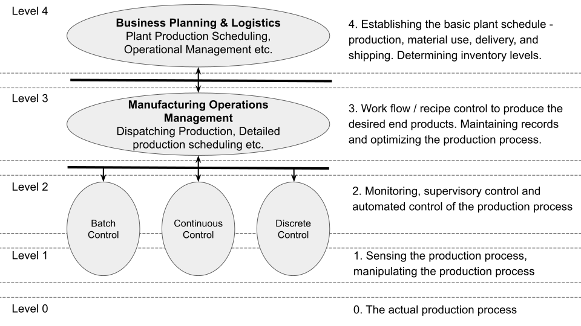
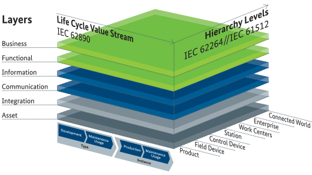
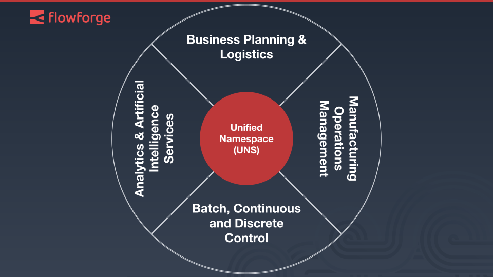

A few years ago, I wrote an [article](https://www.linkedin.com/pulse/iiot-circle-marian-raphael-demme/), in German, detailing my understanding of how the Automation Pyramid, a widely adopted reference model for the IT landscape of manufacturing firms, is essentially hindering digital transformation. Now, as conversations around the Unified Namespace (UNS) and particular frameworks continue to evolve, I revisit my earlier notions, review the latest updates to reference frameworks and update my article.
<!--more-->
## The Pyramid’s Dilemma

The Automation Pyramid is grounded in the standard [ISA-95](https://www.isa.org/products/ansi-isa-95-00-01-2010-iec-62264-1-mod-enterprise), which aligns with [IEC 62264](https://www.iso.org/standard/57308.html) and [DIN EN 62264](https://www.beuth.de/en/standard/din-en-62264-1/207270059). It delineates the functional hierarchy within a manufacturing enterprise. Over 25 variations of the Automation Pyramid exist in academic literature, all of them fundamentally mapping to the same core concept, tracing back to the [Computer-integrated manufacturing](https://en.wikipedia.org/wiki/Computer-integrated_manufacturing) (CIM)-Pyramid of the 1970s. Although ISA-95 does not explicitly refer to a pyramid, it introduces five functional hierarchical levels often visualized as a pyramid.

A notable critique of ISA-95 is the absence of some operational functions and hierarchical levels commonly seen in manufacturing, leading to a rigidity that limits its applicability. This inflexibility has been acknowledged in a more recent framework, called the ["Reference Architectural Model Industry 4.0"](https://www.isa.org/intech-home/2019/march-april/features/rami-4-0-reference-architectural-model-for-industr) RAMI 4.0 ([IEC PAS 63088](https://www.beuth.de/en/norm/pd-iec-pas-63088/272832590)). As a result, the authors' introduced a ["Smart Grid Architecture Model"](https://syc-se.iec.ch/wp-content/uploads/2019/10/Reference_Architecture_final.pdf) (SGAM) with three primary dimensions: Life Cycle & Value Stream ([IEC 62890](https://www.vde-verlag.de/iec-standards/248992/iec-62890-2020.html)), Hierarchy Levels ([IEC 62264](https://www.iso.org/standard/57308.html) and [IEC 61512](https://www.vde-verlag.de/iec-standards/216764/iec-61512-4-2009.html)), and six main layers displaying the functional architecture of the asset and the separation into physical and digital world.

{ width="800" height="600" style="display: block; margin: 0 auto" }

However, my primary critique revolves around another issue – the structure and proposed communication methodology. Models based on layers, where each tier represents a functional area and could be covered by one or more applications, almost always lead to three fundamental problems:

### Problem 1: Information Loss and Transaction Costs

In the traditional model, data collection flows upward from Levels 0 to 4, while planning goes downward from Level 4 to 0. Information traversing from Level 0 to Level 4 has to pass through at least four stages. Despite theoretical lossless transmission of information, the practical scenario inevitably results in some degree of information loss between levels. The result is that the original information from Level 0 arrives at Level 4 late, altered, or not at all.

**Example:** In a manufacturing plant, multiple sensors at Level 0 detect a sudden event. By the time this information passes through intermediary layers (e.g. PLC, SCADA, MES) to reach Level 4 where a planning decision can be made, it is delayed and distorted due to the multiple transitions. The factory might suffer damage before proper actions are taken because the original data didn't arrive on time or not at all. 

### Problem 2: The Expense of One-to-One Connections 

The Automation Pyramid is based on diffrent layers. Consequently, one-to-one connections between IT systems become a necessity for data transfer between levels. For example, Level 3 IT systems need at least two connections to the adjacent levels. This can lead to thousands of one-to-one interfaces between IT systems, incurring exorbitant costs for projects and maintenance.

**Example:** In a semiconductor company, the Manufacturing Execution System (MES) serves as a critical intermediary in the Automation Pyramid. It must be integrated both with PLCs at the lower level for real-time control and with the ERP system at a higher level for business planning. This complex integration leads to the creation of numerous one-to-one connections. Furthermore, in implementing Industry 4.0 use cases like analytical applications, the MES data is often required, creating even more connections. The multitude of connections complicates the system, making changes extremely difficult and maintenance intensive. This inflexibility becomes a barrier to adaptability and growth, hindering the efficient digital transformation of the manufacturing process.

### Problem 3: AI's Dependence on Data 

Artificial intelligence (AI) requires extensive, well-organized data. Given the current architecture, data would have to be  collected and prepared from case to case for each individual system and leves. This would invariably lead to numerous new one-to-one connections, offering no flexibility. Hence, AI and the Automation Pyramid can only collaborate in a significantly restricted manner.

**Example:** A car manufacturing firm aims to leverage a neural network for predictive maintenance. Within the constraints of the existing Automation Pyramid's architecture, the positioning for such an application is non-existent. To train the neural network and subsequently analyse the data, a consolidation of varying hierarchical data is essential, such as sensory input, maintenance records, production scheduling plans, etc. Under the current architecture, the introduction of this application precipitates the creation of a multitude of new one-to-one connections. Consequently, it underscores the pressing need to rethink the structural paradigms.

## IIoT Circle and Unified Namespace

To overcome the limitations of traditional industrial data architecture, a paradigm shift towards a modern distributed architecture is necessary. Rather than allowing data to exist in silos within and across layers of the technology stack, data should be made accessible in a unified manner, creating a single, centralized repository. This approach facilitates a single centralized source for all enterprise systems to access the required data for their operations. This framework, which I have been calling the IIoT Circle, modernizes the original idea of the Automation Pyramid. A "Unified Namespace" operates as the core element that processes, and permits data streams to be loaded and exported from other systems. All other applications communicate exclusively through the Unified Namespace, requiring only a single interface to be maintained per application. 

In essence, Unified Namespace serves as the main data exchange hub within an organization. It structures, organizes, and maintains a real-time flow of data from a variety of sources, becoming the indisputable source of truth across the business. It simplifies data integration, eliminating the frequently convoluted, layered approach of traditional data systems.

### Single Source of Truth 

The Unified Namespace breaks down the linear and deterministic data structure, which creates data silos restricted to their specific systems. Instead, Unified Namespace centralizes data from across the entire organization. This results in a 'single source of truth' - a consolidated, current, and comprehensive overview of the organization's data.

### The Organizational Structure 

Unified Namespace organizes data using a semantic hierarchy, similar to a meticulously arranged file share system. It can use the [ISA-95 part 2](https://www.isa.org/products/ansi-isa-95-00-02-2018-enterprise-control-system-i) or the RAMI 4.0 Hierarchy Level standards to structure the hierarchy. This data organization facilitates navigation, management, and decision-making.

### The Pub-Sub Approach

The Publish-Subscribe (Pub-Sub) model facilitates communication that decouples the sender (publisher) from the receiver (subscriber), providing an efficient communication protocol to avoid one-to-one connections. It offers flexibility and scalability as it allows for one-to-many and many-to-one communications, enabling data to flow freely between systems.

## A Necessity for Open Source

Moreover, in this discourse on the Unified Namespace, we cannot overlook the role of open-source. Owning foundational digital infrastructure, such as the Unified Namespace, is a necessity for any corporation embarking on its digital transformation journey. This ownership provides a solid foundation, allowing companies to chart their destinies. To avoid the constraining bounds of vendor lock-in, which can significantly limit a company's digital capabilities; open-source or self-developed software offers the best recourse. By its nature, open-source promotes transparency, collaboration, and freedom of use. These aspects are fundamental in fostering innovation and continuous improvement. As exemplified by the [MING Stack](https://flowforge.com/blog/2023/02/ming-blog/), open source software can be and should be incorporated into every level of the hierarchy.

## Summary – Advancing Current Standards

The lag of standards behind the latest innovation is an open secret, a problem rooted in the nature and development of these standards. However, maintaining and updating these standards remains crucial as many people adhere to them.

ISA-95 Part 6 mentions a Messaging Service Model (MSM) and proposes a "publish-subscribe" model as an option for transactions. This is a great step in the right direction. My recommendation for ISA-95 is to further develop Part 6 to clearly delineate the implementation pattern of the Unified Namespace. Additionally, ISA-95 Part 1 should make explicit references to the communication pattern detailed in Part 6 and transition from a layer model to a cycle, with the Unified Namespace as an integral part of the framework. 

RAMI 4.0's Communication Layer is rather skeletal. It suggests the use of OPC-UA for everything in manufacturing, from "Product" to "Work Center". For "Enterprise" and "Connected World", it states "still undecided". My improvement suggestion is to define the "Communication Layer" new and to be more technology-agnostic. Be more explicit about what needs to be done and more flexible about how to do it.

---

#### Article and Video Recommendations about the Unified Namespace

- [Videos from Walker Reynolds about UNS](https://youtu.be/PB_9HIgSCWc) - The term "Unified Namespace" was coined by Walker Reynolds of 4.0 Solutions. You can learn more about it by watching his YouTube videos on the topic.
- [HiveMQ's UNS Blog Article](https://www.hivemq.com/article/what-is-unified-namespace-uns-iiot-industry-40/)
- [Integrating the Unified Namespace into Your Enterprise Architecture: An Architect's Guide](https://learn.umh.app/blog/integrating-the-unified-namespace-into-your-enterprise-architecture-an-architects-guide/) - A very concrete implementation guide for UNS by United Manufacturing Hub.