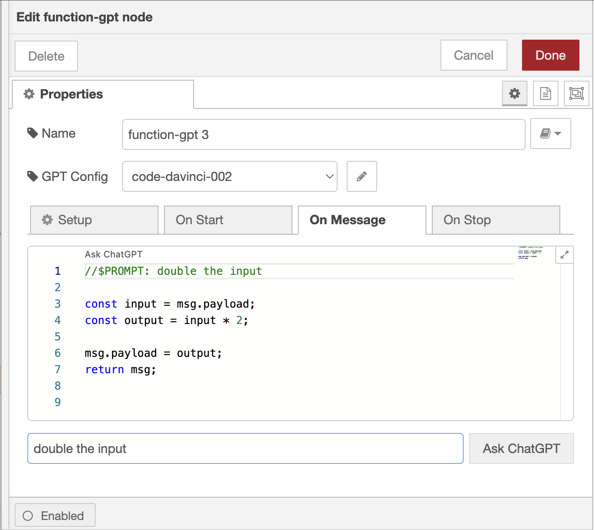

ChatGPT has the potential to have a significant impact on the Node-RED community. It is a powerful language model that can be used to generate flows, interpret them, and provide documentation, maybe soon even write the flow! The combination of ChatGPT, or generative AI at large, with Node-RED can significantly improve the developer experience with Node-RED. In this post we’ll review what the community has already built.

<!--more-->

## How generative AI like ChatGPT is used for Node-RED

### Function node <3 ChatGPT

ChatGPT, and other models, can write code for you, much like [GitHub CoPilot](https://github.com/features/copilot) or [GitLab Duo](https://about.gitlab.com/gitlab-duo/). As Node-RED is ‘low-code’ the ability for generative AI to write the required code for you creates a paradigm shift to ‘no-code’!

At FlowFuse we’ve written about this [before](/blog/2023/05/chatgpt-nodered-fcn-node/), and published a [plugin](https://github.com/FlowFuse/node-red-function-gpt). This node allows flow developers to be more productive and efficient. While this works only for the function node, there’s countless other possibilities to describe a flow in text and import a ChatGPT generated flow that are on the horizon!

### Flow Interpretation

When developing larger projects with multiple tabs, it’s important to understand what each tab contributes to the full project. This problem is compounded when the flows are developed by a team or the time between the flow was last updated is higher.

[Kazuhito-san](https://www.linkedin.com/in/kazuhitoyokoi/) wrote a module for Node-RED to interpret the flow, nodes, and their order into a well structured documentation. Through a click of a button it's generated by the well-known OpenAI
model. This is especially interesting as it's thus able regenerate it when changes were made by the developers.

It’s a plugin that requires very little setup, and can be found in the [flow library](https://www.npmjs.com/package/node-red-contrib-plugin-chatgpt).

### Lots of plugins

The ecosystem of Node-RED has always been a fast adopter of new technology. There's
nodes for [ChatGPT](https://flows.nodered.org/node/node-red-contrib-chatgpt),
[Google's Bard](https://flows.nodered.org/node/node-red-contrib-bard), and many
more. These plugins genernally let you build on top of these models, and don't
nessecairly improve the developer experience. It's however a great source of
inspiration!

### Further discussion

These were three examples of how generative AI is used in the Node-RED community. Please let us know if you're using ChatGPT or other AI models with Node-RED? And what would be the killer feature for Node-RED and AI?
