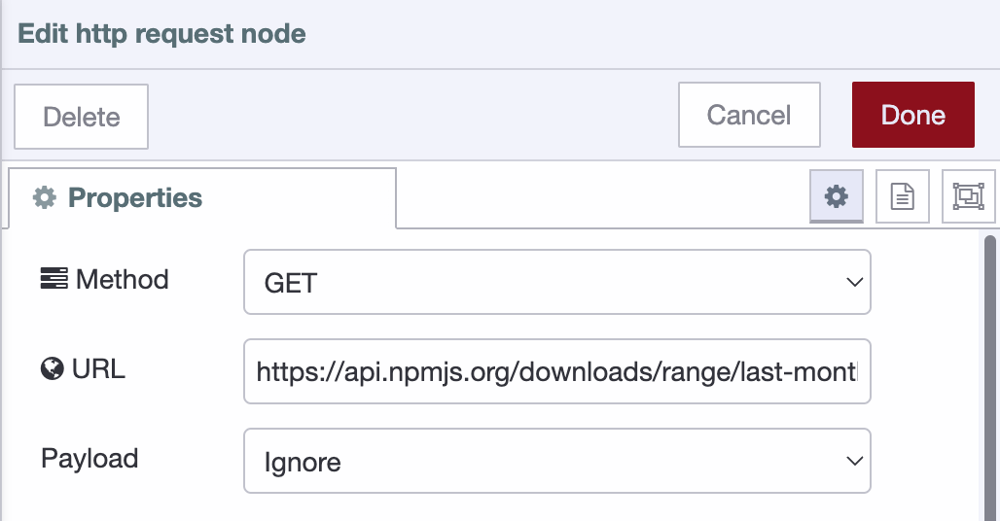
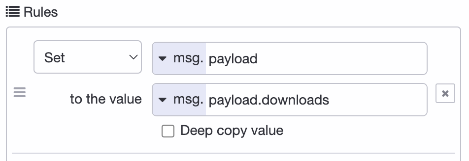
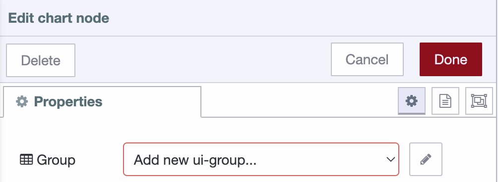
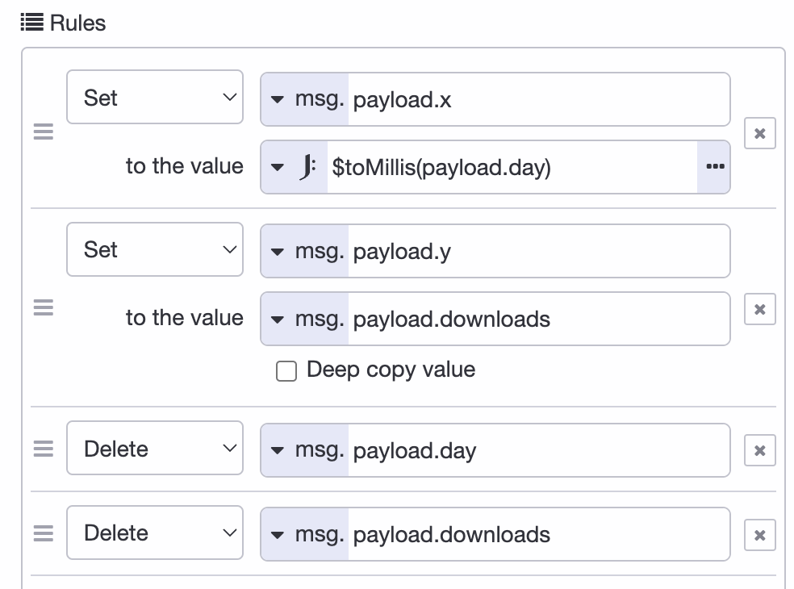
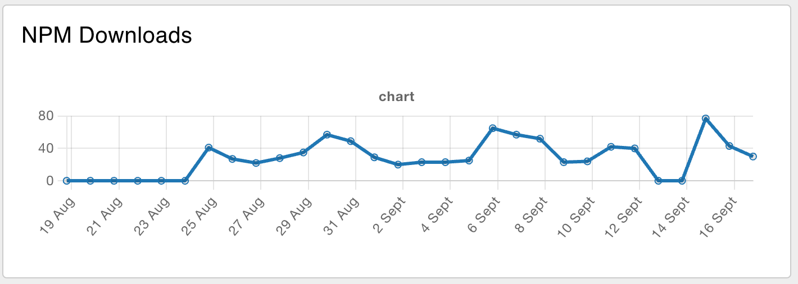

There are many different ways to get data for a Node-RED dashboard. One common
way is to use a REST API.

A REST API is a set of web services that allow developers to interact with a
server and its resources. To get data from a REST API, you can use the HTTP
nodes in Node-RED to send HTTP requests to the API and receive the data in
the response. In this post we'll guide you through the process.

<!--more-->

First, let's consider what data we want to get. For a dashboard chart it's nice
if there were at least two dimensions to it. For this guide we'll create a chart
of the number of downloads for a certain NPM package.

### Getting some data

Reading the data for a package is done through a `HTTP GET` request, for example:
`https://api.npmjs.org/downloads/range/last-month/@flowforge/node-red-dashboard`.

A simple flow to achieve this would be:

<iframe width="100%" height="225px" src="https://flows.nodered.org/flow/7c2dd3ccde70746a40ef8f5aa58c591c/share?height=100" allow="clipboard-read; clipboard-write" style="border: none;"></iframe>

Where we paste the URL from above into the settings panel:

When running this flow you'll see a blob of text in the `Debug` pane. This is a
great first start, but a blob isn't useful for the rest of the flow.

We need to parse the data as JSON. While the [JSON node](/node-red/core-nodes/json)
would work, the HTTP request node can do this natively. Let `a parsed JSON object`
the `Return` settings of the HTTP request node.

So now we got the data, and a little more than we need, so let's change the
message output to keep only what we're interested in; `payload.downloads`. To
do this, we'll use the [change node](/node-red/core-nodes/change).

## Building the Dashboard

Follow the [Dashboard getting started guide](/blog/2024/03/dashboard-getting-started/) to get up and running.

Now we drag in the `chart` node that's available after installing the dashboard
package and make sure it' input comes from the configured `change` node. Before
hitting the deploy button the dashboard itself needs configuring:

First add configuration for the `ui-group`: 

To setup the `ui-group` correctly you'll need to add configuration for the `ui-page`: .

To create the UI page it requires another 2 config settings, `ui-base`, and the theming through `ui-theme`.

The default theme is great, so just accept that, and save all dialogs to continue the chart creation.

### Normalizing the data

The data for the chart needs to be changed before we can show it. The messages should have a `x` and `y` key. So let's prepare the data with
a combination of the [Split](/node-red/core-nodes/split) and change node.

The Split node with the default configuration allows to 30 elements of the array
to be mapped individually. The change node will set the `payload.x` and `payload.y`
on the message:

Connect the change node output to a new chart node, and voila:

## Keeping the data up-to-date

While we created a chart and it has some data, there's one more thing to explain.
How can the data be kept up-to-date? It's straight forward to have the `Inject`
node [run every night](/node-red/core-nodes/inject/#run-a-flow-daily-at-midnight),
but the chart would now have multiple data points
for the same day. This paints multiple lines on top of each other. While that works,
the hover of the chart will display the duplication and it's wastefull.

So before we update the chart we need to send a message to the chart where the
[payload is `[]`](https://dashboard.flowfuse.com/nodes/widgets/ui-chart.html#removing-data).
That way the chart is emptied first, and right afterwards it will
receive the new data to write.

<iframe width="100%" height="500px" src="https://flows.nodered.org/flow/47f4cda247f2f2e0172ab61c795308bb/share" allow="clipboard-read; clipboard-write" style="border: none;"></iframe>