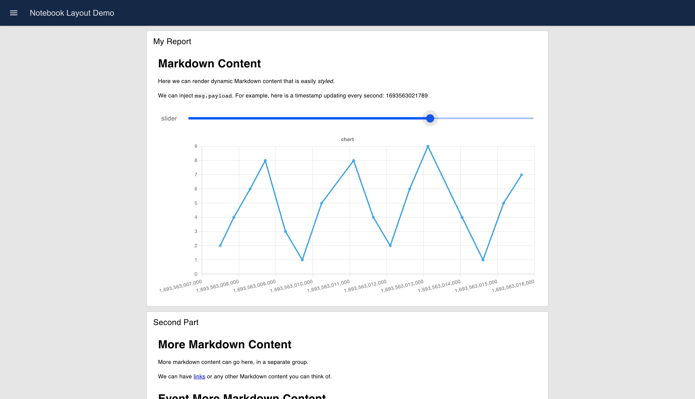
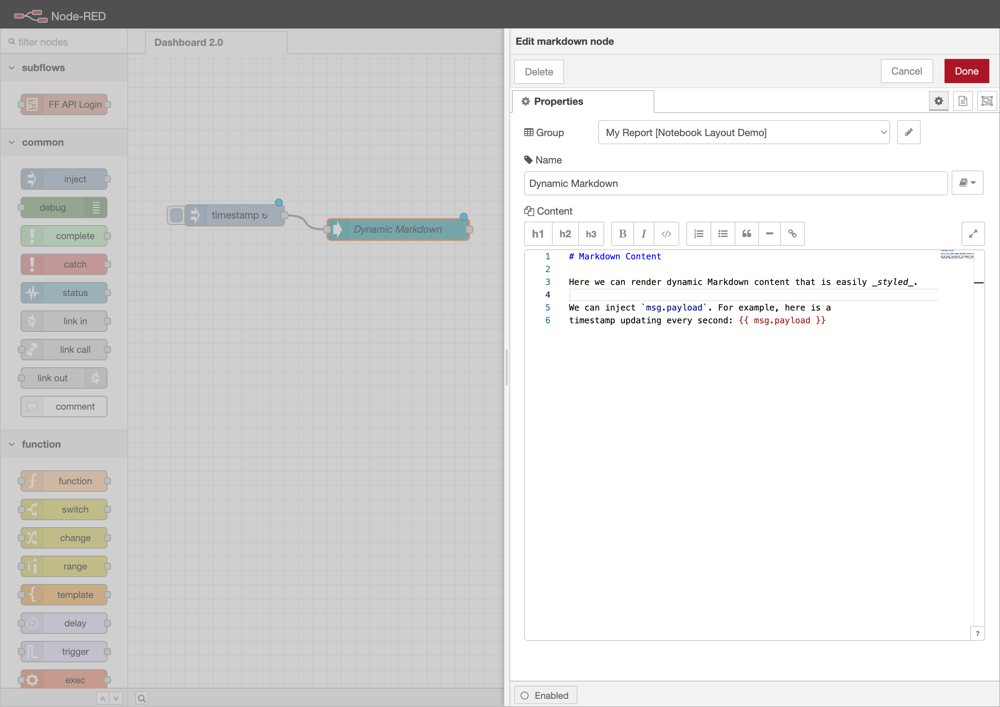
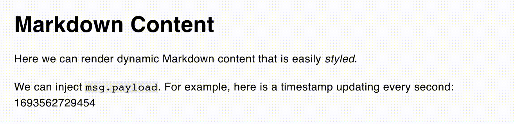
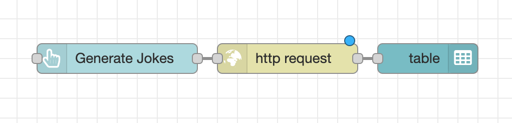
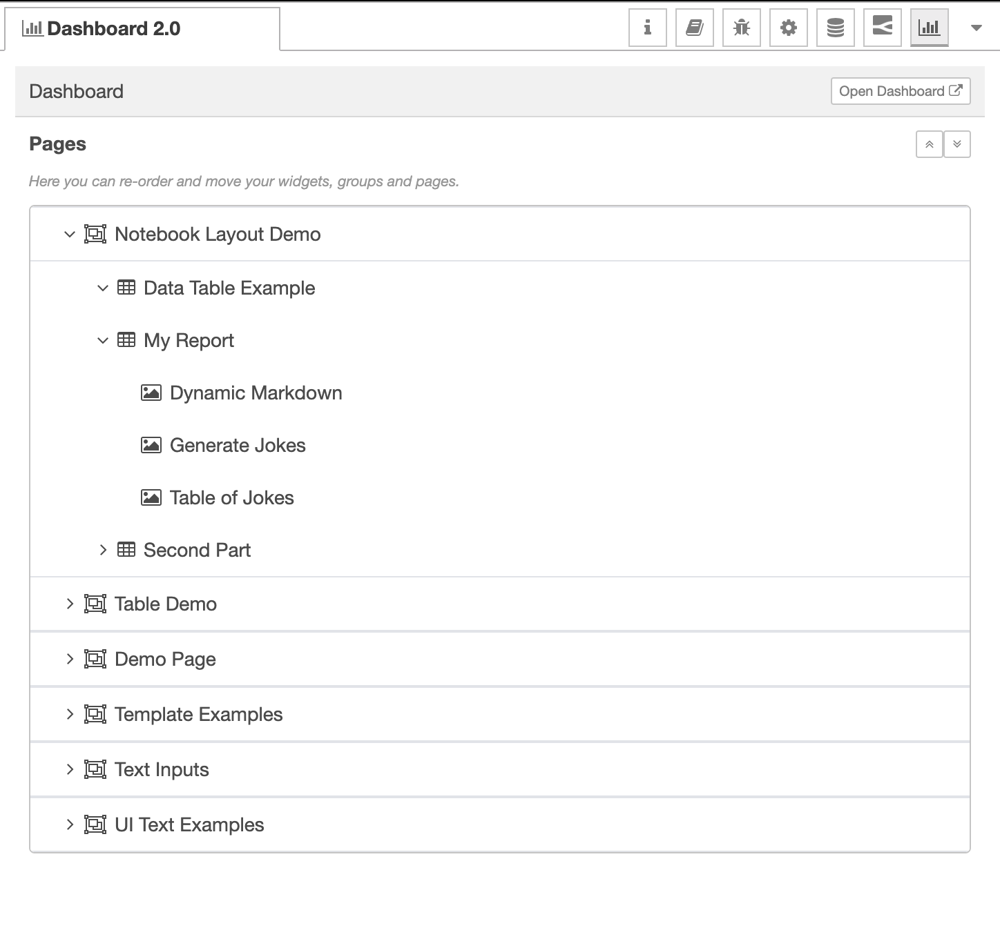
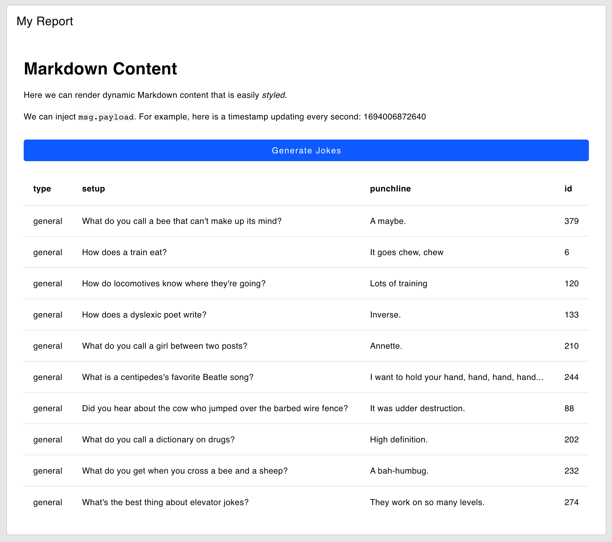

Whilst we're still busy backporting through the existing Dashboard 1.0 features, we did want to highlight some new features we've built in Dashboard 2.0 released this week.

<!--more-->

In our v0.4.0 release, we've introduced a new "Notebook" layout, alongside a new Table widget.

The Notebook layout is designed to allow users to create Dashboards structured like a Notebook (most often seen with the likes of [Jupyter Notebooks](https://jupyter.org/) or [ObservableHQ](https://observablehq.com/)).

Here we will deepdive into the Notebook layout, and show how, alongside our new **Markdown Node** ([docs](https://dashboard.flowfuse.com/nodes/widgets/ui-markdown.html)), **Table Node** ([docs](https://dashboard.flowfuse.com/nodes/widgets/ui-table.html)) and others, it's becoming easier to create dynamic and interactive Dashboards.

_Note: If you're not familiar with Markdown, it's a simple markup language that allows you to format text. You can learn more about it [here](https://www.markdownguide.org/cheat-sheet/)._

## Dashboard Hierarchy

As a quick introductory note ahead of our below guide, each Dashboard is structured accordingly:

- **Widget**: An individual functional block, e.g. button, chart, slider
- **Group**: A collection of widgets that render together
- **Page**: A single page/tab in your Dashboard. Each page can have it's own Layout, in this case we'll use "Notebook"
- **UI**: Contains a collection of pages, deployed from Node-RED, provides the basic side navigation to switch between Pages.

## Building a Notebook



To get started, drop your first widget (in this case, we'll add a `ui-markdown`) onto the Node-RED canvas. This in turn will prompt us to create our first Group/Page/Dashboard which we can name and configure accordingly.

Let's add the following Markdown to our first widget:

```md
# Markdown Content

Here we can render dynamic Markdown content that is
easily _styled_.


We can inject `msg.payload`. For example, here is a
timestamp updating every second: {{ msg.payload }}

```

The joy of `ui-markdown` in Dashboard 2.0 is _dynamic_ content, i.e. content that can be updated by passing messages to the `ui-markdown` node. We can wire an `inject` node, set it up to repeat every second, and connect it to `ui-markdown`. Now, our Markdown content will automatically update show this value.



Resulting in:



## Adding More Widgets

Because the Notebook is _just_ a layout, we can still wire together any of the available widgets and existing nodes and display them accordingly.

Let's wire a `ui-button`, HTTP Request, and `ui-table` node. When we click the button, it will perform the HTTP request, and then render the response in the table.

For this, we're going to use the Random Jokes API, and in particular, a call to `https://official-joke-api.appspot.com/jokes/ten` which will return 10 random jokes.



We can also re-order the widgets on the page using the Dashboard 2.0 sidebar (as you could in Dashboard 1.0).



The above effort results in the following output in our Notebook:



## What else is new in 0.4.0?

The above demonstrates just a few of the new features in the 0.4.0 Release, but we've also added [other fixes and improvements](https://github.com/FlowFuse/node-red-dashboard/releases/tag/v0.4.0). In particular, I want to call out Steve's great work on implementing custom class injection, the first of our new ["Dynamic Properties"](https://dashboard.flowfuse.com/user/dynamic-properties.html), of which there will be more (e.g. visibility, disabled, etc.) to come.

As always, thanks for reading and your interested in Dashboard 2.0. If you have any feature requests, bugs/complaints or general feedback, please do reach out, and raise issues on our relevant [GitHub repository](https://github.com/FlowFuse/node-red-dashboard).

- [Dashboard 2.0 Activity Tracker](https://github.com/orgs/FlowFuse/projects/15/views/1)
- [Dashboard 2.0 Planning Board](https://github.com/orgs/FlowFuse/projects/15/views/4)