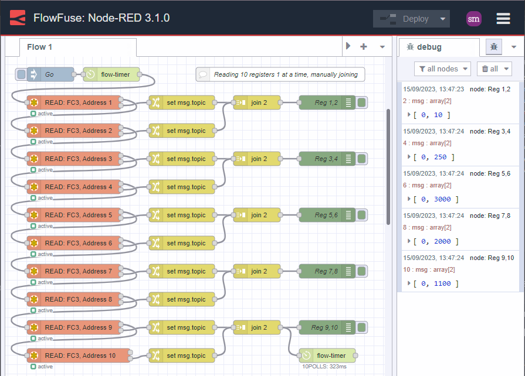
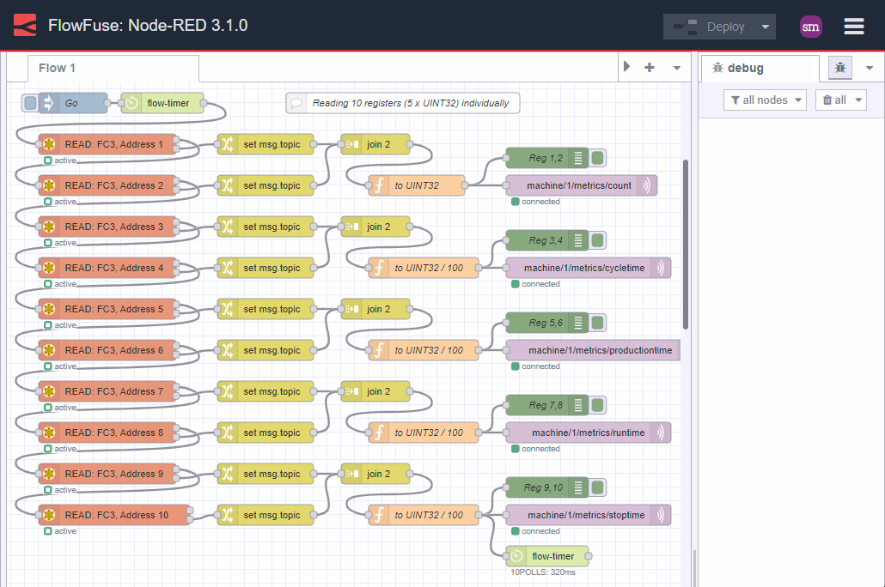
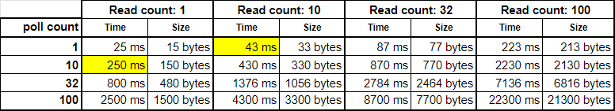
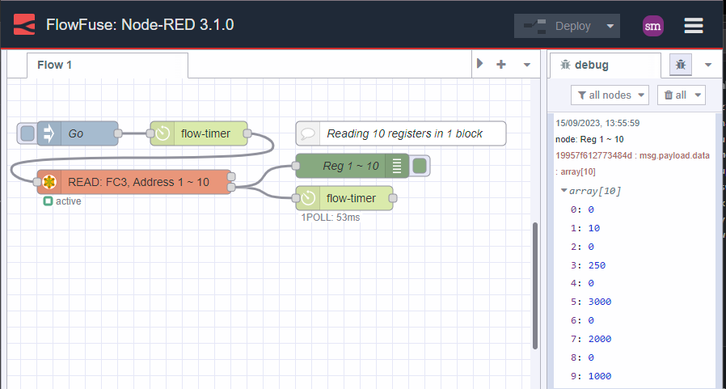
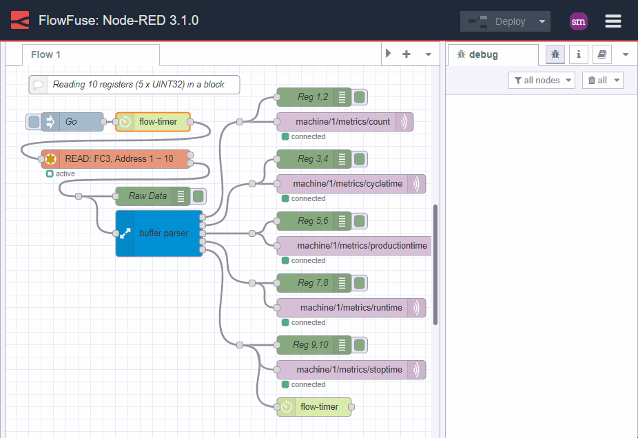
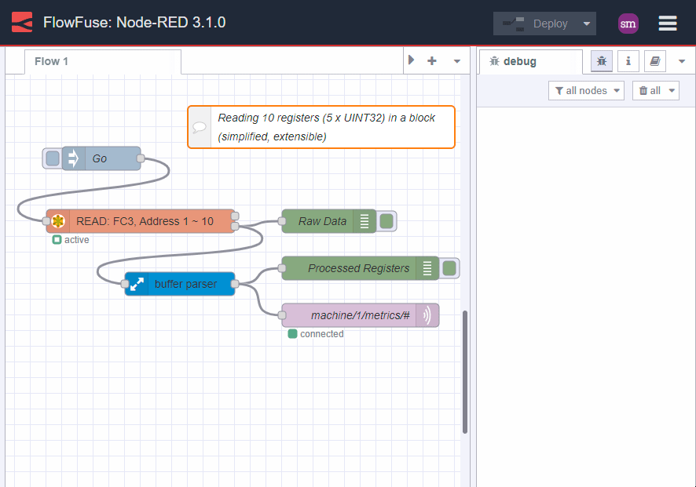

In [part 1 of this series](/blog/2023/09/modernize-your-legacy-industrial-data/), I introduced the topic of working with legacy industrial data from the likes of Modbus and older, non IIoT protocols and putting it to work in an IIoT world. We looked at some of the challenges and how Node-RED with `node-red-contrib-buffer-parser` node can help. 

In this article, I will dive a little deeper into the topic and discuss some of the finer details. I hope to demonstrate a smarter approach that can make a huge difference to data accuracy, performance and maintainability while significantly reducing developer time. Not only that, ending with a no-code solution.

<!--more-->

## Obtaining Industrial Data

In order to convert the legacy data to a format more suited to IIoT we first need to _grab_ that data.

Node-RED has core nodes that can help you and many more contribution nodes exist that provide access to a wide range of industrial devices. To give you an idea, `node-red-contrib-modbus`, `node-red-contrib-s7comm`, `node-red-contrib-omron-fins`, `node-red-contrib-mcprotocol`, `node-red-contrib-df1` and `node-red-contrib-cip-st-ethernet-ip` are just some of the PLC data access nodes available.

But getting the data is just the beginning, it's the methods and considerations you need to make that can make the difference between success and failure. Read on...

## Data consistency

An often overlooked aspect of working with legacy industrial data is the consistency of the data being read. In the context of this article, consistency means that the multiple values that make up a related data set are read in a way that they are all valid to one another at the point in time it was read.

Let's take a look at a simple example. We have a process PLC recording production metrics and wish to get this data from its Modbus interface for reporting and decision making. The PLC has 5 values that we need to read:

| Register | Value | Description            | Data Type  |
| -------- | ----- | ---------------------- | ---------- |
| 1, 2     | 10    | Part Count             | UINT32     |
| 3, 4     | 2.5   | Cycle Time (sec)       | UINT32/100 |
| 5, 6     | 30    | Production Time (sec)  | UINT32/100 |
| 7, 8     | 20    | Run Time (sec)         | UINT32/100 |
| 9, 10    | 11    | Stoppage Time (sec)    | UINT32/100 |

In the above data sample, we can see the total production time is 30 seconds and the run time is 20 seconds. The expectation is that the Stoppage Time should be 10 seconds. However, as we can see, Stoppage Time in this sample is 11 seconds. That is because this data is not consistent.

### Why is the data inconsistent?

The most common reason for the data inconsistency is that the data is being read from the PLC while the PLC is running. The data is changing as it is being read.

Typically this happens when a developer, unfamiliar with the protocol or end device, begins by reading the data individually. Here is how this journey might look:

_Image 1: individual reads_

That is a lot of nodes and a lot of duplication!

What is worse, is that the developer continues down this path and begins converting the data ready for publishing to MQTT. Here is how this might evolve:

_Image 2: individual reads with data processing_

Yippie! We have the data, it works, we publish it to MQTT, job done. Right?

Unfortunately, no. The data is inconsistent.

### So whats the big deal?

Inconsistent data is not useful data and errors can get compounded over time. This leads to bad decisions being made and a loss of confidence in the data. Ultimately, this leads to the data being ignored and the opportunities to make improvements are lost. Loss of improvements means loss of money!

Not only that, from a developer or maintainers perspective, it has many problems:
1. Lots of error prone manual configuration (yes, I made several mistakes while creating the example)
2. Hard coded register addresses
3. Duplication
4. Inextensible - what if we need to read more registers?
5. Inconsistent data - as discussed above
6. Slow - each read takes time
7. Inefficient use of network bandwidth - each read requires a request and response packet

### How can we make the data consistent?

The most obvious solution is to stop the PLC before reading the data.
However, I am faily certain your boss will not be super pleased with stopping the manufacturing process.
The next best thing is for the PLC to sample and store the data in an internal memory buffer, waiting, unchanging, to be collected. Unfortunately, this too is not always possible either due to limited in-house skills, locked down PLCs or simply because the PLC does not have the memory to store the data.

The next best thing to do is to read relative data as quickly as possible and in one block.

### A quick side-bar (timing is ... everything)

In many protocols, including Modbus, data must be polled. Each poll, depending on many factors, can take a number of milliseconds.

Lets say, on a relatively quiet serial network, a single register poll takes 25 milliseconds (assume 9600 baud, 1 byte/ms, request packet size 8 bytes, response packet size 7 bytes, 10ms latency for the PLC to receive, process and respond to the request)
* If we read 10 registers individually, then the time taken to read the 10 registers is 250 milliseconds.
* If we actually needed a more realistic number of registers, say 32, then the time taken to read them individually is a whopping 800 milliseconds. In the world of PLCs, that is an eternity.

Now, lets look at that from a different approach. If we were to read the 32 registers in one go, the time taken based on the above constants would be 87 milliseconds. That is over 9 times faster than reading the registers individually. The improvements don't stop there either, the number of total bytes transferred on your network is reduced by 84% and, more importantly, the data is consistent since it was read from the same scan of the PLC scan.

_Image 3: A comparison of individual reads vs block reads_

OK, back to the topic at hand.

## Getting the data in a more consistent way

Here is the same example as above but this time we are reading the data in one go:

_Image 4: Getting data in one block_

Note how much simpler this is? Not only that, it is easier to maintain, faster, more extensible and most importantly, the data is consistent.

Great, lets move on.

## Processing the data in readiness for IIoT: MQTT

Now that we have good data, we need to process it in readiness for IIoT. In this example, we are going to publish the data to an MQTT broker as individual topics. This is a common approach as it allows the data to be easily consumed by other systems and applications. Using `node-red-contrib-buffer-parser` we can easily convert the data into more meaningful formats.

The first, instinctive approach is to fan out the data and process it individually:

_Image 5: block reads, individual processing_

This may be fine for a handful of registers but it soon becomes unwieldy and unmaintainable.

But lets be smarter about this. We know that the data is consistent and we know that we can read it in one go. So, lets process it in one go too:

_Image 6: block reads, smart processing, no-code solution_

## Node-RED in Production

Node-RED is a powerful tool widely used in IoT and IIoT industries, including manufacturing, automotive, textiles, and building management. It excels at collecting, transforming, visualizing, and analyzing data. While integrating Node-RED into production environments offers numerous benefits, it often involves complex tasks such as deploying the server, managing security, and ensuring scalability. These initial setup challenges can be overwhelming and time-consuming.

FlowFuse simplifies these tasks by providing a unified platform for managing all Node-RED instances. It enhances collaboration, ensures security, and supports scalability, making deployment and management more efficient. With features like [snapshots](/docs/user/snapshots/), team collaboration tools, one-click deployment, and [multi-factor authentication](/docs/user/user-settings/#security), FlowFuse streamlines the process and enhances the operational capabilities of Node-RED in production settings.

**[Sign up]() now for a free trial and experience FlowFuse's features**

## Wrap up

I hope this article has given you some food for thought and some ideas on not only simplifying your journey to IIoT but also the pitfalls to avoid along the way.

A parting thought, there are times when the data is not contiguous. There are ways to deal with this too but that is for another day.

P.S. I will post the flows used for the examples above in the comments below. If you have any questions or comments, please reach out there too.
