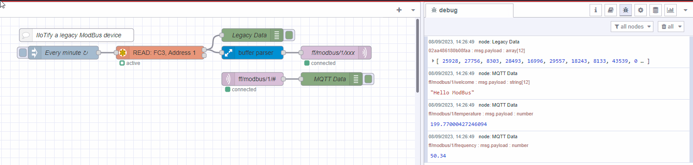
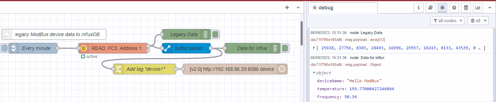
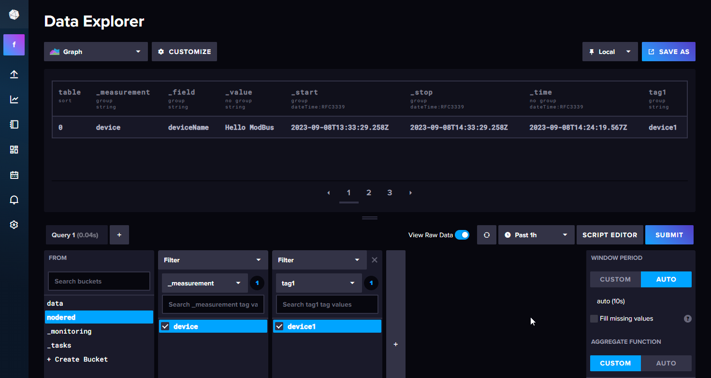
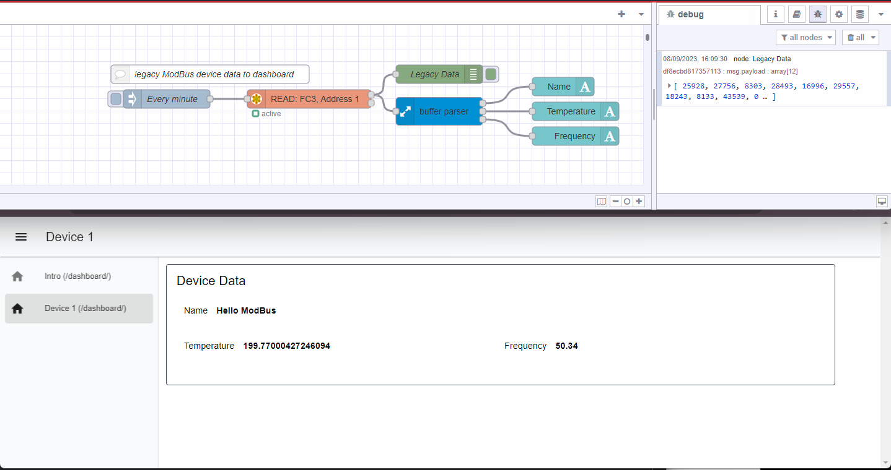

In today's rapidly evolving industrial landscape, the ability to collect, analyse, and act upon data is more critical than ever.
The Industrial Internet of Things (IIoT) has ushered in a new era of connectivity and automation, but what about the wealth of data locked away in legacy industrial protocols like Modbus?
How can we unlock and make sense of this valuable information in _any_ data, e.g. serial comms with no protocol, Siemens S7, Omron Fins, Mitsubishi MC-Protocol, or Allen Bradley DF1, etc.
in the IIoT era? That's where tools like Node-RED and `node-red-contrib-buffer-parser` come into play.

<!--more-->

### Legacy Industrial Data: Modbus

Modbus is one of the most widely used industrial protocols. Originally developed in the late 1970s, it has been a popular choice for industrial communication ever since. However, its data format can be challenging to work with in the context of modern IIoT applications. Modbus typically represents data in 16-bit unsigned registers, making it necessary to convert this data into more usable formats like Signed integer, Float, Signed and Unsigned Long, String, or even individual bits.

### A short primer on data types

Before we dive into how to make sense of Modbus data, let's take a quick look at some of the common data types we have to deal with.

#### 16-bit unsigned

16-bit unsigned data is an integer that can only be positive. It can represent values from 0 to 65535. For example, the number 12345 is represented as `0x3039` in hexadecimal or `0011000000111001` in binary.

#### 16-bit signed

16-bit signed data is an integer that can be positive or negative. It can represent values from -32768 to 32767. For example, the number -12345 is represented as `0xCFC7` in hexadecimal or `1100111111000111` in binary.

#### 32-bit data

32-bit data, like 16-bit data can mean many things. It could be signed or unsigned, or even a floating point number. For example, the number 12345 is represented as `0x00003039` in hexadecimal or `00000000000000000011000000111001` in binary. Typically, 32-bit data is represented as two 16-bit registers. Therefore, when dealing with 32-bit data, you need to combine two 16-bit registers to get the full value.

#### Endianness

Endianness, particularly in the context of data communications, refers to the order of bytes and how they are stored or transmitted. There are two types of endianness: big-endian (BE) and little-endian (LE). In big-endian, the most significant byte is first, while in little-endian, the least significant byte is first. For example, the number 12345 is represented as `0x3039` in a big-endian word and `0x3930` in little-endian word.  This can often cause confusion and complicate the process of converting Modbus data into more usable formats.

### Node-RED and node-red-contrib-buffer-parser to the rescue

Node-RED is an open-source flow-based development tool for visual programming. It's particularly well-suited for IIoT applications because of its versatility and extensive library of nodes. One such node, `node-red-contrib-buffer-parser`, provides a solution to the legacy data conversion challenge.

This powerful Node-RED module allows you to parse a Buffer of bytes or an Array of integer data (which, by no coincidence, the popular module `node-red-contrib-modbus` outputs), and convert it into various data types. It can output pretty much any data type, including byte-swapped data, WORD swapped data, masked/shifted/scaled data, and even individual bits.

Here's a quick overview of how it works:

1. **Data Parsing**: Start by setting up a Modbus READ node in Node-RED to retrieve data from your industrial device. Then, use the buffer parser node to parse the Modbus data.

1. **Data Conversion**: With the buffer parser, you can easily convert the 16-bit unsigned data into more meaningful formats. Whether you need to translate it into Float, Long, String, or even extract specific bits, this tool makes the process straightforward.

1. **Publishing to MQTT, influxDB, a dashboard, an IIoT system**: Once your data is in a usable format, Node-RED enables you to publish it to many places. MQTT (Message Queuing Telemetry Transport), a popular protocol for IIoT communication is a perfect example. This makes your data accessible to other IIoT systems and applications for further analysis and action.

### Unlocking the Potential of Legacy Data

By leveraging Node-RED and buffer parser, you can bridge the gap between legacy industrial protocols and the IIoT world. This means you can extract valuable insights from your existing infrastructure without the need for costly hardware upgrades or replacements.

In the era of the Industrial Internet of Things, making sense of your industrial data is no longer a daunting challenge. With the right tools approach, you can unlock the full potential of your legacy data and drive efficiency, productivity, and innovation in your industrial processes. Yey!

### 3 quick demos of Node-RED and the buffer parser node in action

Here are 3 quick demonstrations that barely scratch the surface of possibilities:

#### Example 1: Modbus to MQTT
Converting an array of 16-bit unsigned integers to String, Float and a scaled integer and passing them to an MQTT broker in 4 nodes!

#### Example 2: Modbus to InfluxDB
Converting an array of 16-bit unsigned integers to String, Float and a scaled integer for publishing to influxDB!

#### Example 3: Modbus data on a dashboard
Converting an array of 16-bit unsigned integers to String, Float and a scaled integer for publishing to a dashboard!

### Learn More

We will be publishing follow-up blog posts with more details, best practices and examples on how to use Node-RED to make sense of your industrial data. In the meantime, you can learn more about these tools by visiting the following links:
* [Node-RED blog posts](/blog/node-red/)
* [Node-RED videos](https://www.youtube.com/playlist?list=PLpcyqc7kNgp09XeRx_cae1fEIOloPqM1C)
* [Buffer Parser Node](https://flows.nodered.org/node/node-red-contrib-buffer-parser) 
