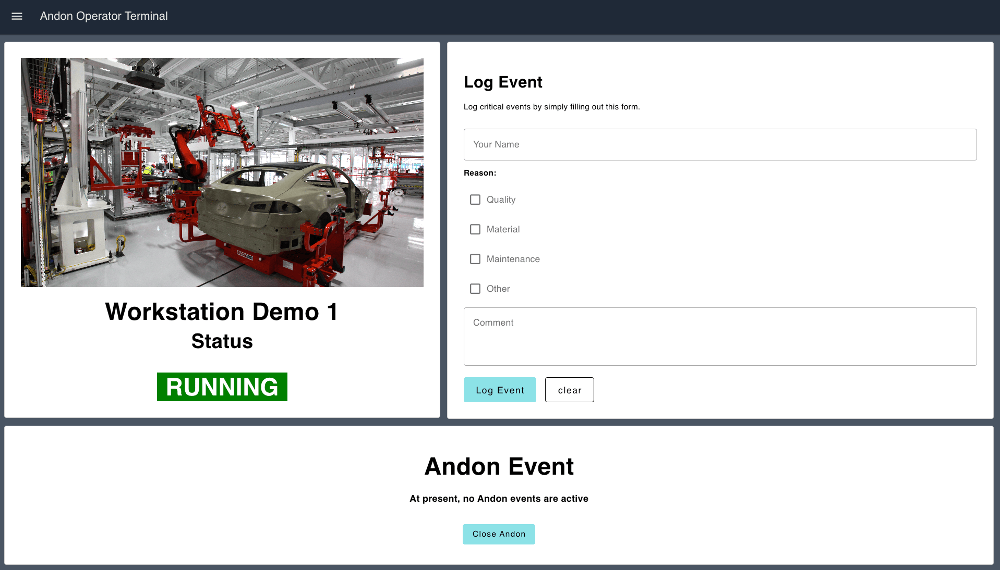
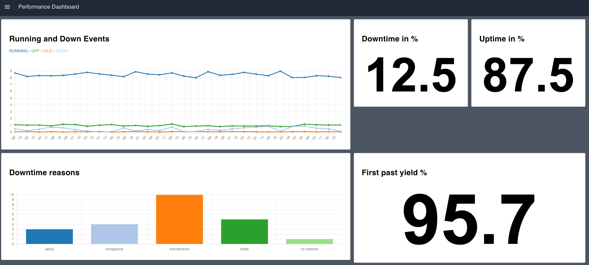
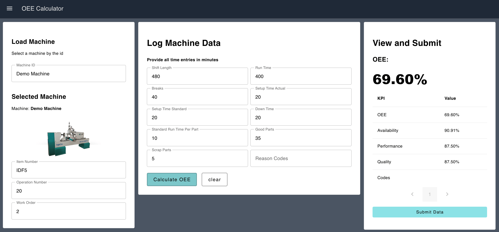

Starting today, FlowFuse Blueprints are available on FlowFuse Cloud. Additionally, upon request, all our Teams and Enterprise Self-Hosted customers gain access to this collection. But what exactly are FlowFuse Blueprints?

<!--more-->

## FlowFuse Blueprints

FlowFuse Blueprints aim to make the Node-RED experience more accessible for newcomers, while also offering a treasure trove of fresh ideas for seasoned Node-RED users. When setting up a new Node-RED instance, you now have the option to choose a blueprint tailored for specific use cases. For example, our "ANDON Operator Terminal" blueprint can be selected, and it will automatically configure the Node-RED instance, sparing you the need to start from scratch. While these templates are powerful out-of-the-box, they're also fully customizable, allowing you to tweak them to suit your unique requirements. Ultimately, blueprints speed up the learning curve for new users and expedite the solution-building process for experienced ones.

### How to use Blueprints?

All our FlowFuse Cloud users can select a Blueprint directly while creating a new Node-RED instance. Self-hosted customers can request access to our blueprints via a [support ticket](https://flowfuse.com/support/).

## The first three Blueprints

In the coming weeks, we'll be releasing a multitude of blueprints tailored for diverse use cases. However, we decided to start with with three foundational manufacturing applications designed with the [Node-RED Dashboard 2.0](https://dashboard.flowfuse.com/).

### ANDON Operator Terminal
The Andon Operator Terminal is designed to be at the start of an Andon process, allowing end-users to report any issues with the cell to a supervisor.

### Performance Overview Dashboard
The Performance Overview Dashboard Blueprint provides a real-time snapshot of key performance metrics, delivering a comprehensive overview of manufacturing operations for a specific station or entire line.

### OEE Calculator
If automatic calculations are not feasible, the OEE Calculator Blueprint enables end-users to manually input production data to compute the Overall Equipment Effectiveness (OEE) for a given machine.

