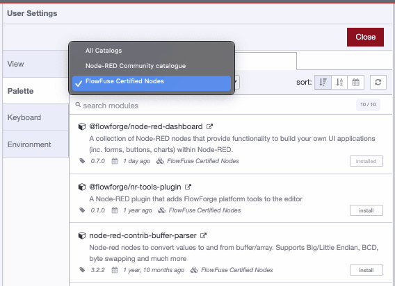

We are thrilled to introduce a new feature for our Teams Tier customers - **Certified Nodes for Node-RED**. This new offering is designed to reinforce your flows's robustness by granting you access to Node-RED nodes that stand up to our rigorous quality and security standards.

<!--more-->

## What is a certified node?

A certified node is a module from the Node-RED library that undergoes a certification process, ensuring it adheres to standards that address three core pillars:

**Quality**

- Testing phases for each node.
- Operational reliability and compatibility.

**Security**

- Proactive resolution of potential vulnerabilities.
- Revocation of certification for nodes falling short on security, with prompt notifications to affected customers.

**Support**

- Ambitious aim towards effective issue resolution.
- Assistance for troubleshooting.

## How to use certfied nodes?

Accessing certified nodes is straightforward—they're integrated directly within your Node-RED palette manager, simplifying selection and implementation. All new instances since October 26, 2023, have automatic access to the catalogue. If you want to add Certified Nodes to one of your existing instances, just [contact us](https://flowfuse.com/support/).

## What kind of Nodes are included?

Our initial roll-out includes a curated assortment of certified nodes. We're continuously expanding our library, with upcoming weeks bringing a wider array of options. Should you find a gap in your desired functionalities, we encourage you to reach out. Your feedback drives our journey forward, influencing the nodes we introduce next.

- 
- 
- 

