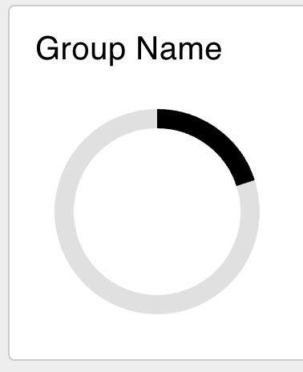
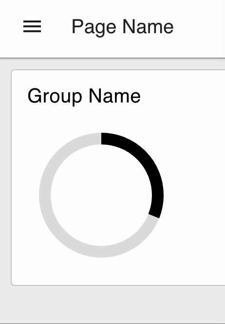

Vuetify is a library of UI components using Vue. This saves the developers of
Dashboard 2.0 a lot of time, but it can also help you, the end-user. As Vuetify
is now included, it can be used to include _any_ of their components. So in this
post we're going to use a few of these to teach you how to use any of them.

<!--more-->

Let's install the [Dashboard 2.0 package](https://dashboard.flowfuse.com/getting-started.html) if you want to follow along. When that's done, let's figure
out how to build custom components on dashboards.

## Custom components

While going through the list of components on [Vuetify](https://vuetifyjs.com/en/components/)
there's several examples that aren't natively implemented in Dashboard 2.0.
One example we'll use in a dashboard in this post is the
[Progress circular](https://vuetifyjs.com/en/components/progress-circular/) to
build a count down timer.

The documentation explains which elements one can change, in this case the size and
width. Having set those to the values you'd want in your dashboard, the HTML is
generated for you, in my case it's:

```html
<v-progress-circular model-value="20" :size="128" :width="12"></v-progress-circular>
```

### Using the template node

Like the [template core node](/node-red/core-nodes/template), the dashboard package
comes with [a template node of its own](https://dashboard.flowfuse.com/nodes/widgets/ui-template.html).
If we take the HTML from the Vuetify docs pages and copy it in a template node
the spinner will show up on the dashboard.



## Dynamic templates

While a custom element on a page is cool, and shows you can inject arbitrary HTML
on a Dashboard, it's even better if we could make the element dynamic. So let's
start with a first dynamic element. The quickest way to get that done is have
an [`Inject`](/node-red/core-nodes/inject) node output a random number every second.

So let's hook up an Inject, with `msg.payload`'s output being a JSONata expression 
`$round($random() * 100)` to generate a random number. And let's make sure it
sends a message every second.

Then we need to update the template node to the following snippet:

```html
<v-progress-circular v-model="msg.payload" :size="128" :width="12"></v-progress-circular>
```

The difference is subtle, but important. Instead of hard-coding the `model-value`
to 20, the tag has changed name and it's set to `msg.payload`. The latter makes
the value dynamic.

Changing `model-value` to `v-model` is due to leaking implementation details of
Dashboard 2.0. It uses VueJS to provide, among other features, easy updating of
components. If components are dynamic, _always use `v-model`_. This allows VueJS
to pick up changes made dynamically.




### Finishing the count down timer

This is mostly a programmers job, but it's not hard, so let's get to it. A button
would be great to reset the timer, and for the sake of this post we can hardcode
the deadline to 1m from the button press.

When dragging in a button node, connect it to a [change](/node-red/core-nodes/change)
node. In the change node set the flow variable `flow.deadline` to the timestamp. The
Inject node from earlier needs updating to inject the `flow.deadline`. All that's
left is calculating how many seconds passed, and normalizing 60 seconds to the
range between 0-100.

The complete flow is:

```json
[{"id":"ce9bb8f74e3fc934","type":"ui-template","z":"24065a0aadb305e3","group":"8fa772a709ae3316","dashboard":"e5a3f4cdb11e5e3b","page":"5bedf7f49d5a6037","name":"Progress spinner","order":0,"width":0,"height":0,"format":"<v-progress-circular v-model=\"msg.payload\" :size=\"128\" :width=\"12\"></v-progress-circular>\n","storeOutMessages":true,"fwdInMessages":true,"resendOnRefresh":true,"templateScope":"local","className":"","x":810,"y":80,"wires":[[]]},{"id":"8f3e6631414aa096","type":"inject","z":"24065a0aadb305e3","name":"Inject deadline","props":[{"p":"payload"}],"repeat":"1","crontab":"","once":true,"onceDelay":0.1,"topic":"","payload":"deadline","payloadType":"flow","x":140,"y":80,"wires":[["293cd6f9d727fa02"]]},{"id":"bd9032719d24a53d","type":"ui-button","z":"24065a0aadb305e3","group":"8fa772a709ae3316","name":"","label":"Reset","order":0,"width":0,"height":0,"passthru":false,"tooltip":"","color":"","bgcolor":"","className":"","icon":"","payload":"","payloadType":"date","topic":"deadline","topicType":"msg","x":170,"y":140,"wires":[["61ef83d8b06ff626"]]},{"id":"61ef83d8b06ff626","type":"change","z":"24065a0aadb305e3","name":"","rules":[{"t":"set","p":"deadline","pt":"flow","to":"","tot":"date"}],"action":"","property":"","from":"","to":"","reg":false,"x":350,"y":140,"wires":[[]]},{"id":"293cd6f9d727fa02","type":"change","z":"24065a0aadb305e3","name":"Secs since reset","rules":[{"t":"set","p":"payload","pt":"msg","to":"($millis() - msg.payload)/1000","tot":"jsonata"}],"action":"","property":"","from":"","to":"","reg":false,"x":340,"y":80,"wires":[["9742da7e74fd3cd2"]]},{"id":"9742da7e74fd3cd2","type":"range","z":"24065a0aadb305e3","minin":"0","maxin":"60","minout":"0","maxout":"100","action":"clamp","round":false,"property":"payload","name":"Seconds to percentages","x":570,"y":80,"wires":[["ce9bb8f74e3fc934"]]},{"id":"8fa772a709ae3316","type":"ui-group","name":"Group Name","page":"5bedf7f49d5a6037","width":"6","height":"1","order":"","disp":true},{"id":"e5a3f4cdb11e5e3b","type":"ui-base","name":"UI Name","path":"/dashboard"},{"id":"5bedf7f49d5a6037","type":"ui-page","name":"Page Name","ui":"e5a3f4cdb11e5e3b","path":"/","layout":"grid","theme":"8240fbe7c09bc81c"},{"id":"8240fbe7c09bc81c","type":"ui-theme","name":"Theme Name","colors":{"surface":"#ffffff","primary":"#0094ce","bgPage":"#eeeeee","groupBg":"#ffffff","groupOutline":"#cccccc"}}]
```
