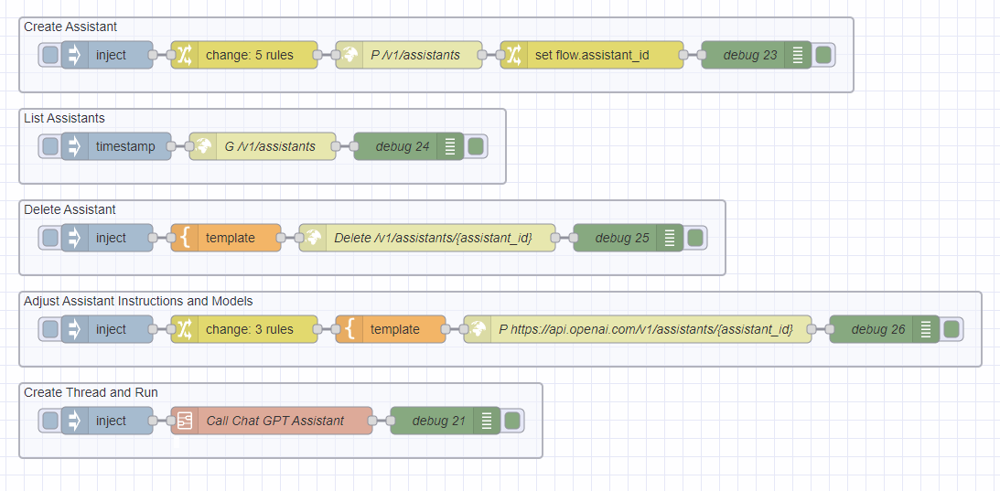

## Introduction to the World of GPTs and AI Assistants

In the ever-evolving landscape of artificial intelligence, Generative Pre-trained Transformers (GPTs) have emerged as groundbreaking tools. These advanced AI models, developed by OpenAI, are capable of understanding and generating human-like text, offering vast possibilities across numerous applications. GPTs learn from various internet texts, enabling them to respond to queries with human-like understanding.

Among the most intriguing developments in this field are AI Assistants. These are specialized applications of GPTs, accessible through an API, designed to enhance and streamline various tasks. Tasks that include code interpreter, functions, retrieval, and leveraging uploading files to interact with. Unlike traditional GPTs, which primarily focus on generating text, AI Assistants can interact, comprehend, and assist in real-time, making them invaluable in industries ranging from manufacturing to finance to healthcare.

<!--more-->

[TLDR: Give me the Flows](https://flows.nodered.org/flow/073548c276832e804f037f3212014e60)

## Node-RED and AI Assistants

The integration of Node-RED with AI Assistants brings a unique set of advantages. By leveraging Node-RED's user-friendly platform, developers and citizen developers can easily harness the power of AI Assistants. This integration allows for creation of bespoke solutions tailored to specific industry needs, ranging from automated customer service to advanced data analytics. The real-world impact is substantial – imagine a manufacturing line where real-time data is seamlessly integrated with a prescriptive AI-driven decision-making prompt, enhancing efficiency and reducing downtime.  In healthcare, it provides patients with real-time updates to their personal data and provides contextual information, while in retail, it could enhance customer engagement through personalized interactions. The future shaped by these technologies is one where automation and intelligence converge, leading to unprecedented levels of efficiency and innovation in various sectors.

## Experience the Integration Firsthand

We invite you to explore the possibilities firsthand. Try out the flows we've created and share your feedback. This is your getting started package. In the provided flows, you can do the following:

1. **Create Assistant**: This flow creates a new assistant. It starts with an inject node that sets the assistant's name, instructions, tools, and model. The HTTP request node then sends a POST request to the OpenAI API to create the assistant. The assistant's ID is stored in the flow context for later use.

2. **List Assistants**: This flow lists all the assistants that have been created. It starts with an inject node that triggers the flow. The HTTP request node sends a GET request to the OpenAI API to retrieve the list of assistants. The results are then displayed in the debug node.

3. **Delete Assistant**: This flow deletes an assistant. It starts with an inject node that sets the assistant's ID. The template node constructs the URL for the HTTP request node, which sends a DELETE request to the OpenAI API to delete the assistant. The results are then displayed in the debug node.

4. **Adjust Assistant Instructions and Models**: This flow adjusts the instructions and model of an assistant. It starts with an inject node that sets the assistant's ID, new instructions, and new model. The change node prepares the payload for the HTTP request node, which sends a POST request to the OpenAI API to update the assistant. The results are then displayed in the debug node.

5. **Create Thread and Run**: This flow creates a new thread and runs it. It starts with an inject node that sets the assistant's ID and the message to be sent. The subflow node then handles the creation of the thread, sending of the message, and retrieval of the response. The results are then displayed in the debug node.

How do you envision leveraging this integration in your day-to-day operations or within your industry? Your insights are valuable in shaping the future of our industry. Begin your journey [here.](https://flows.nodered.org/flow/073548c276832e804f037f3212014e60)

## Embracing the Future of AI and Automation

Integrating Node-RED with OpenAI's Assistants is a testament to the ever-evolving landscape of technology. It represents a step towards a future where powerful AI tools are within reach of a wider audience, enabling the creation of bespoke, flexible, and resilient applications across industries. By embracing this integration, we open doors to innovation and efficiency previously unimagined.

*Always consult with management before uploading company data to public services like ChatGPT.*

