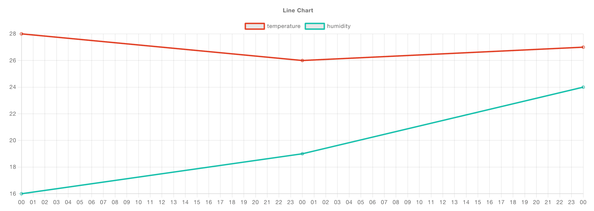

It's been a little while since we've done an update, since we last posted we've moved into the 0.7.x releases for Dashboard 2.0. With these we're making big strides in improving the UX for charting your data, as well as starting to focus on migration paths from Dashboard 1.0 to 2.0.

<!--more-->

## Package Name Changes

Firstly a bit of news regarding the `npm` package we publish. Inline with our own [company name change](https://flowfuse.com/blog/2023/08/flowforge-is-now-flowfuse), we've had to update Dashboard 2.0's npm package, and so, we've changed from `@flowforge/node-red-dashboard` to `@flowfuse/node-red-dashboard`.

In the short term, we'll be keeping @flowforge available on the Node-RED Palette Manager, but it will be removed soon, and the associated NPM Package will be put into a "deprecated" mode.

### NPM Package Migration

Unfortunately, this migration from `@flowforge/` to `@flowfuse/` requires a little bit of manual work, and isn't as easy as just clicking "update" in the Node-RED Editor.

In any case, there is no need to update your flow in this migration, you'll just need to uninstall `@flowforge/node-red-dashboard` and install `@flowfuse/node-red-dashboard` instead.

#### Running Locally

If you're running Node-RED locally, or in your own infrastructure, you'll need to manually uninstall the old package:

```bash
npm uninstall @flowforge/node-red-dashboard
```

and re-install the new one:

```bash
npm install @flowfuse/node-red-dashboard
```

#### Running in FlowFuse

Navigate to your Instance > Settings > Palette, and then change the `@flowforge/node-red-dashboard` entry to `@flowfuse/node-red-dashboard` (the latest version as of this post is `0.7.2`).

Restart your instance, and the new package will automatically install.

## Dashboard 1.0 to 2.0 Migration Guide

As part of our mission to ensure a smooth transition from Dashboard 1.0 to Dashboard 2.0, we have published a first draft of a [Migration Guide](https://dashboard.flowfuse.com/user/migration.html).

As a starting point, we have comprehesively covered the Dashboard 1.0 widgets and their associated properties. We've then detailed which properties are already supported, which have partial support, and where appropriate, we do not support and _why_ (most of the time, it's just because we haven't got round to it yet!)


We fully appreciate that the migration path is not yet complete, and we that we are missing some features and properties, but please know that we are working hard to ensure that as many of the features from Dashboard 1.0 are available in Dashboard 2.0. We will be updating this guide as we progress. 

We will also be adding "event" and "dynamic properties" sections to the guide, to detail how you can update and control elements via runtime messages (e.g. dynamically change the label of a button), and how this differs (if at all) from Dashboard 1.0.

Whilst we aren't quite there yet, this guide offers a comprehensive breakdown on our progress in backporting all of the properties from Dashboard 1.0

### Automated Script

An ambitious plan that we have is to also provide a [Migration Script](https://github.com/FlowFuse/node-red-dashboard/issues/261). Any feedback, ideas or concerns are most welcome as comments on the issue.

Whilst this will never provide 100% perfect migration, we hope to be able to provide a script that can be run against your flows to automatically convert as much as possible from Dashboard 1.0 to 2.0. In most cases, as you can see in the Migration guide, we match most properties 1:1, so this should do a lot of the heavy lifting for you.

## Updates to UI Chart

### Key Mapping

One of the core purposes of Node-RED Dashboard has always been to provide low-code access to charting your data. With the 0.7.x releases we've made some big improvements to the UI Chart node to make it easier to use and more powerful. 

In Dashboard 1.0, it was common place to have to regularly re-format your own data into `{x, y}` structure to be chart-friendly. In `0.7.0` we've introduced the concept of **key mapping**, where you can specify which keys in your data object should be used for the x and y axes. This means you can now pass in data in the format you want to use, and the chart will do the rest.

For example, when rendering a chart of our weekly npm downloads, we have a data structure:

```json
[{
    "day": "YYYY-MM-DD",
    "downloads": 128
}, {
    "day": "YYYY-MM-DD",
    "downloads": 256
}, {
    "day": "YYYY-MM-DD",
    "downloads": 512
}]
```

Rather than having to pipe this into a `function` node and re-map the properties to `{ x, y }`, we can now use the `ui-chart`'s key mapping properties:


Resulting in the following chart:


### Multiple Lines

Note above, another new option has been added to define _"Series"_. In Dashboard 1.0 this was fixed as `msg.topic` at all times, and defined which line/series data points rendered too. Now, this is configurable, and can even be set as a `key:` type too, whereby each data point being treated individually, and grouped based on a given key/property.

Another great new feature here is the type `JSON` for this property. We can provide a _list_ of series labels, and the chart will render each value from a single data point as separate lines.

For example, if we consider the data:

```json
[{
    "day": "2023-10-23",
    "temperature": 28,
    "humidity": 16
}, {
    "day": "2023-10-24",
    "temperature": 26,
    "humidity": 19
}, {
    "day": "2023-10-25",
    "temperature": 27,
    "humidity": 24
}]
```

We can provide a series: `["temperature", "humidity"]` like so:


Which would result in the following plot:



We appreciate this offers a new way of working with data in Dashboard, but hopefully, once you've tried it, you'll find it much easier to work with, and see the value it brings when working with your own data sets.

## What else is new in 0.7.x?

Whilst we focussed this article on the migration paths and new UI Chart features, we did also squeeze quite a lot more into the 0.7.x releases too with plenty other fixes and improvements:

- [Re-architecture of Server-side State Management](https://github.com/FlowFuse/node-red-dashboard/pull/279)
- [Y Axis Min/Max Options](https://github.com/FlowFuse/node-red-dashboard/pull/327)
- ["Focus" button for widgets added to Sidebar](https://github.com/FlowFuse/node-red-dashboard/pull/320)
- [No more "blue screen" and improved error reporting](https://github.com/FlowFuse/node-red-dashboard/pull/310)
- [Better route handling](https://github.com/FlowFuse/node-red-dashboard/pull/301)


You can also read the more comprehensive release notes for each release here:

- [0.7.0 Release Notes](https://github.com/FlowFuse/node-red-dashboard/releases/tag/v0.7.0)
- [0.7.1 Release Notes](https://github.com/FlowFuse/node-red-dashboard/releases/tag/v0.7.1)
- [0.7.2 Release Notes](https://github.com/FlowFuse/node-red-dashboard/releases/tag/v0.7.2)

## Follow our Progress

As always, thanks for reading and your interested in Dashboard 2.0. If you have any feature requests, bugs/complaints or general feedback, please do reach out, and raise issues on our relevant [GitHub repository](https://github.com/FlowFuse/node-red-dashboard).

- [Dashboard 2.0 Activity Tracker](https://github.com/orgs/FlowFuse/projects/15/views/1)
- [Dashboard 2.0 Planning Board](https://github.com/orgs/FlowFuse/projects/15/views/4)