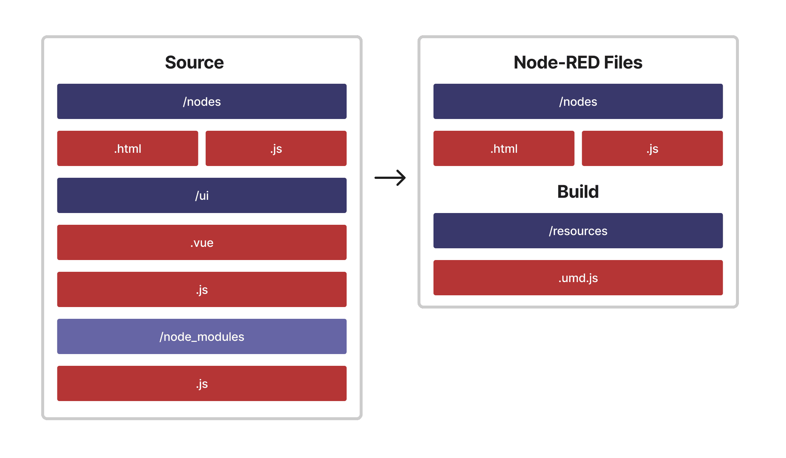

As a developer, sometimes you have to hold up your hands and realise something you've spent two weeks building needs to be thrown away and restarted.

<!--more-->

Having shipped the [third-party widget support for Dashboard 2.0](/blog/2023/10/dashboard-integrations/) in line with Dashboard 1.0's approach, we then had the [feedback](https://github.com/FlowFuse/node-red-dashboard/issues/307) that the way Dashboard 1.0 did things really wasn't good, and asking us to consider re-building the process to make the developer experience of working with Dashboard 2.0 far more seamless.

So, that's exactly what we've done with the `0.8.0` release, amongst a few other things.

Reminder: all new releases of Dashboard are now under the <code style="background-color: transparent;">@flowfuse</code> namespace, so you'll need to update to use <code style="background-color: transparent;">@flowfuse/node-red-dashboard</code>, and not <code style="background-color: transparent;">@flowforge</code>.

## Migrating our Build Pipeline

Without getting _too_ technical, as part of this work in supporting third-party widgets, we overhauled our build pipeline for Dashboard 2.0. This pipeline is responsible for taking our source code, and compiling it into a format that then gets deployed by Node-RED when running Dashboard.

Previously, we used ***Webpack***, but now, we've switched over to ***Vite***. This is a newer build tool, and is much faster than Webpack. It's also what we've now updated out [Example Node](https://github.com/FlowFuse/node-red-dashboard-2-ui-example) to use too.

So now, when working with a third-party widget, Vite builds up all of your code, wraps it into a single `umd.js` file, and Node-RED then serves that file up for Dashboard 2.0 to load in.

We've also re-written our ["Building Third Party Widgets"](https://dashboard.flowfuse.com/contributing/widgets/third-party.html) guide to reflect this change.

## Debugging Dashboard

A new feature we've added in `0.8.0` is also for those developing Dashboard's core and third-party widgets. You can now navigate to `/dashboard/_debug` to explore the full configuration that Dashboard receives from Node-RED.

This is particularly useful when you're trying to debug why a widget isn't loading, showing the correct data, or generally isn't behaving as you expect. 

Note in the above example, where we can see that the `ui-dropdown` has had it's options overriden by `msg.options` on injection.

You can read more about the debugging view [here](https://dashboard.flowfuse.com/contributing/widgets/debugging.html)

## What else is new in 0.8.0?

Whilst we focussed this article on the build pipeline overhaul, changes to third-party wdgets and debugging Dashboard, we did also squeeze quite a lot more into the 0.8.0 releases too with plenty other fixes and improvements:

- [Dynamic setting of msg.options for UI Dropdown](https://github.com/FlowFuse/node-red-dashboard/pull/345)
- ["Date" type for UI Text Input](https://github.com/FlowFuse/node-red-dashboard/pull/346)
- [Finer grain controls of Text Input event emissions](https://github.com/FlowFuse/node-red-dashboard/pull/365)
- [Control over when UI Slider emits events](https://github.com/FlowFuse/node-red-dashboard/pull/367)
- [Improved documentation for Bar Charts](https://github.com/FlowFuse/node-red-dashboard/pull/364)

You can also read the more comprehensive release notes for the release here:

- [0.8.0 Release Notes](https://github.com/FlowFuse/node-red-dashboard/releases/tag/v0.8.0)

## Follow our Progress

As always, thanks for reading and your interested in Dashboard 2.0. If you have any feature requests, bugs/complaints or general feedback, please do reach out, and raise issues on our relevant [GitHub repository](https://github.com/FlowFuse/node-red-dashboard).

- [Dashboard 2.0 Activity Tracker](https://github.com/orgs/FlowFuse/projects/15/views/1)
- [Dashboard 2.0 Planning Board](https://github.com/orgs/FlowFuse/projects/15/views/4)