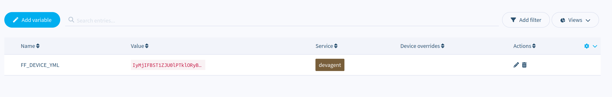

As part of the FlowFuse Staff Summit this year in Barcelona we met up with Marc Pous from [Balena Io](https://www.balena.io/). Balena is a platform for managing fleets of Edge Devices and it felt like the perfect fit for deploying the FlowFuse Device Agent.

<!--more-->

To do this you install the Balena OS on the devices, this is a stripped down Linux distribution that includes a client that connects back to Balena's platform and creates a VPN tunnel. As well as the Balena client it includes Docker and users can select containers to push to the devices.

These Docker container are hosted on Balena's own container registry and are built by doing a git push to Balena's git server.

A GitHub repository with all the required files [has been published](https://github.com/FlowFuse/balena-device-agent), a one click deploy button to allow you to quickly try this out.

## Building FlowFuse Device Agent for Balena

We already build a FlowFuse Device Agent Docker container so it was pretty simple to modify the existing `Dockerfile` for Balena.

```docker
FROM balenalib/%%BALENA_MACHINE_NAME%%-alpine-node

RUN mkdir /opt/flowfuse-device
RUN npm install -g @flowfuse/device-agent

COPY entrypoint.sh /usr/src/entrypoint.sh

ENTRYPOINT ["/usr/src/entrypoint.sh"]

CMD ["flowfuse-device-agent"]
```

There were 2 main changes from the default Device Agent [`Dockerfile`](https://github.com/FlowFuse/device-agent/blob/main/docker/Dockerfile)

 1. Change the base image to Balena's image, this is because the `Dockerfile` is actually a template that can be used to build images optimized for all Balena's supported hardware platforms (We currently build the FlowFuse Device Agent containers for AMD64, ARMv7 and ARM64)

 2. Adding a custom `entrypoint.sh`. This is to ensure that the hostname seen in the container matches the Balena device name, making it easier to match it up with what is seen in the FlowFuse application. It also generates the configuration file from the passed in environment variable (see [below](#configuring-devices))

As well as the `Dockerfile` there is also a `docker-compose.yml` because Balena applications can be made up of multiple services packaged as container. In this case we just need a single container but the compose file contains all the information about what ports to expose and what volumes need creating to persist state.

## Configuring Devices

The FlowFuse Device agent can be configured in 2 ways.


 1. You can provide a configuration file that is provided by the FlowFuse application when you create a new Device. This file contains the unique identifiers for the Device and details of where to find the FlowFuse Application. This file can be provided to a Balena device by adding a device specific environment variable as described [below](#environment-variable).

 2. You can provide a fleet of devices with a configuration file that contains details of where to find the FlowFuse application and a Provisioning token. Multiple Devices can all have the same Provisioning token and this will cause them to connect to the FlowFuse application on first start up and create a new Device bound to an existing team (and optionally an Application or Instance). This file can be passed to Balena devices by way of a Fleet wide environment variable as described [below](#environment-variable). 
 You can create a Provisioning Token file under the Team -> Settings page on the Devices tab.

### Environment Variable

Because the `device.yml` file is multi line it needs to be base64 encoded, you can do this with the following

```bash
$ base64 -w 0 device.yml
```

You can then use the Balena console to create either a device specific or a fleet wide environment variable called `FF_DEVICE_YML`.


