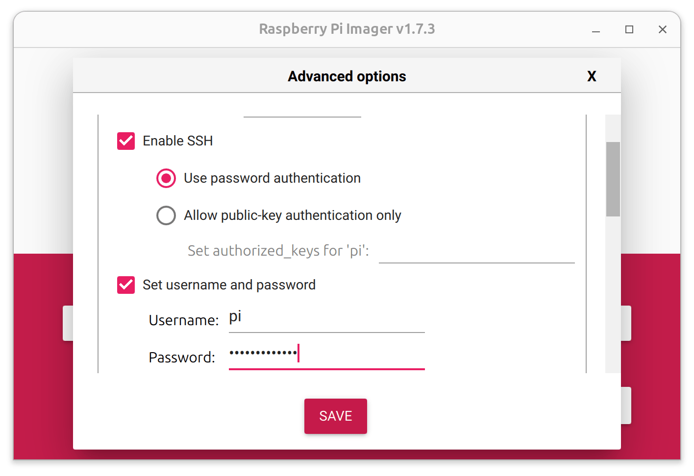

Since the Raspberry Pi 5 was recently announced I pre-ordered it to use with 
Node-RED and FlowFuse for a data collection job in my home. During this time I've had the pleasure of installing both the Raspberry Pi OS and the FlowFuse
Device Agent on this new hardware. It's a rather fast experience if and when you understand what steps to follow.

<!--more-->

In my case I was going to only ever use my Raspberry Pi 5 in headless mode, which
means it won't have an attached keyboard, mouse, or monitor. A few years ago this
was challenging as it needed a lot of fiddling either before starting the Pi, or
what I usually did; boot it with monitor and perifirals to set it up in a way it
would work without.

These days it's much easier to achieve a headless Pi right from the get go when
you use the [official Raspberry Pi Imager](https://www.raspberrypi.com/software/).
When you've installed the imager, select the correct version of the software
(64 bits) and the inserted SD-card.


**Before** you click Write, you'll need to update the settings if you're going
to be using the headless mode. Wifi needs to be configured, SSH enabled, and
authentication setup is required too.



When this is all done, the OS and the configuration will need to be written to
the SD-card. This will take about 10 minutes. When it's done, eject the SD-card
and put it in the Raspberry Pi. Afterwards you can boot the device.

When the device is powered, it can take a minute or so to show up in your
network. I was able to connect to it through ssh using a terminal:

```sh
ssh pi@raspberrypi.local
```

As general hygene items I updated the repositories, and installed the updates now
available for the system:

```sh
sudo apt-get update
sudo apt-get upgrade -y
```

## Installing the Agent

The FlowFuse Device Agent is a software agent that runs on a Raspberry Pi. It manages
all things about Node-RED that's going to run later on the same device. Think
about the Node-RED version and upgrades, setup and management of the process,
access controls, and much more.

You can read [the full documentation](/docs/hardware/raspbian/) on how to
install the agent, though it comes down to:

```sh
bash <(curl -sL https://raw.githubusercontent.com/FlowFuse/device-agent/main/service/raspbian-install-device-agent.sh)
```

This installs a Node.JS runtime, the agent, and sets up the Pi to run the FlowFuse
agent every time it boots up, and restart it if it ever crashes.

### Configuration of the agent

To have FlowFuse Cloud know what devices belong to me we need the device to
be configured with a token to identify itself. The token is obtained when you
register a new device to you team. The FlowFuse documentation explain
[how to setup a team](/docs/user/introduction/#working-with-devices).

When registering a device you'll get an YAML file, which should be copied to
`/opt/flowforge/device.yml`. I've just copy-pasted this file, though SCP or the
web interface from the device is available.

When you reboot the raspberry pi it should now start the agent automatically fully configured. The device will then ping back to FlowFuse and is available
for work to be done!