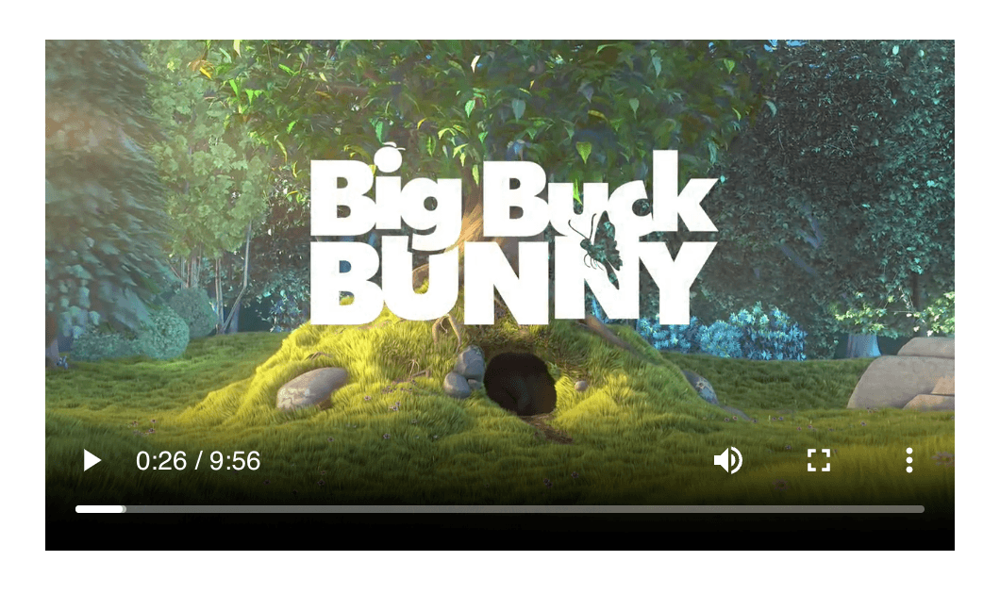
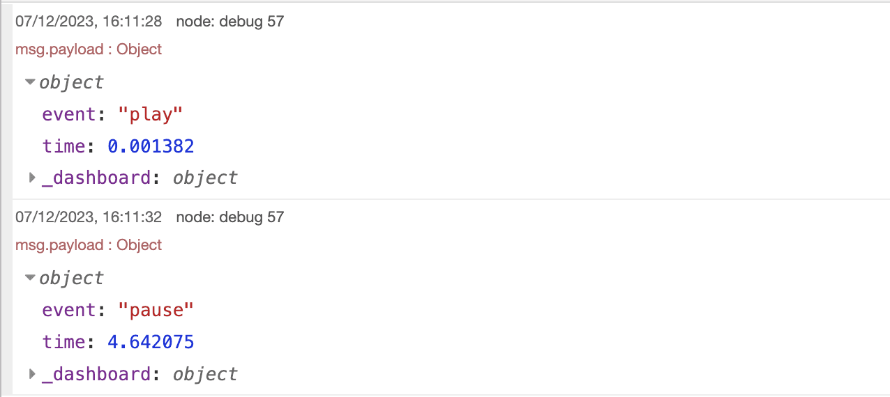

Dashboard 2.0 just got _a lot_ more powerful with our new updates to the `ui-template` node. New features added to the node include:

- Support for a full Vue component  to be defined using the VueJS Options API.
- Running of raw JavaScript within `<script />` tags
- Loading of external dependencies through `<script />` tags

<!--more-->

In this article we're going to deepdive into an example of how you can use this new functionality to build a custom video player.

We're going to aim for 3 key features:

1. Emit events into Node-RED when a user plays/pauses the video
2. Allow for the video to be played/paused from within Node-RED
3. Allow the user to seek to a specific point in the video from within Node-RED

<div style="background-color: #fff4b9; border:1px solid #ffc400; color: #a27110; padding: 12px; border-radius: 6px; font-style: italic;">Reminder: all new releases of Dashboard are now under the <code style="background-color: transparent;">@flowfuse</code> namespace, so you'll need to update to use <code style="background-color: transparent;">@flowfuse/node-red-dashboard</code>, and not <code style="background-color: transparent;">@flowforge</code>.</div>

## Building a Vue Component

With Dashboard 2.0, we switched over our underlying front-end framework to VueJS. We're aware that not everyone coming into Dashboard 2.0 will be familiar with VueJS.

We have a more detailed guide [here](https://dashboard.flowfuse.com/nodes/widgets/ui-template.html#building-full-vue-components), but we'll also give a quick overview of the elements from Vue "component" that we'll use here:

```html
<template>
    <!-- Our HTML content will go here -->
</template>

<script>
export default {
  name: 'MyComponent',
  methods: {
    // JS methods we want to use across our component will go here
  },
  mounted () {
    // Code we want to run when our component is loaded will go here
  },
  unmounted () {
    // Code we want to run when our component is unloaded will go here
  }
}
</script>

<style>
    /* We can define custom CSS here too */
</style>
```

Some quick gotchas to note:

- `<div>{{ msg }}</div>` - is an example of how you render variables into the HTML.
- `<div v-if="myVar"></div>` - lets you conditionally show/hide content based on a variable.
- `<div v-for="item in items"></div>` - lets you loop over an array of items and render them into the HTML.
- `<div @click="myMethod"></div>` - lets you bind a method to an event, in this case, when the user clicks on the div.
- `<div :class="{ 'my-class': isActive }"></div>` - `:` is a way to define a "bound" property. In this case, the class `my-class` will be applied when `isActive` is true.
- `console.log(this.myVar)` - when you're writing code inside the `<script />` tags, you can access Component variables and methods using `this`.

### Built-in Extras

In addition to building a component from scratch, we'll also utilize some built-in features of `ui-template` too. These will be:

- **Variables:**
    - `id` - The unique ID for this node in Node-RED
    - `msg` - The message that was most recently received into the node
    - `$socket` - The underlying SocketIO connection to Node-RED. Use this to listen to any incoming events, and send new ones back.
- **Functions:**
    - `send(payload)` - Send a message back to Node-RED

As above, we have more detailed documentation on these features [here](https://dashboard.flowfuse.com/nodes/widgets/ui-template.html#built-in-functionality).

## Building the Video Player

### Defining the Content (HTML)

We're going to start by adding a basic HTML video player:

```html
<template>
    <video ref="my-video" style="width: 100%" controls @play="onPlay" @pause="onPause">
        <source src="http://commondatastorage.googleapis.com/gtv-videos-bucket/sample/BigBuckBunny.mp4" type="video/mp4">
        Your browser does not support the video tag.
    </video>
</template>
```

A few things of importance to note here:

- `ref` is Vue's replacement for `document.getElementById()`. This is copied to each instance of the component, meaning we can call `this.$refs['my-video']` to access the video element, and this doesn't break when duplicating the widget multiple times in Dashboard.
- `style=""` is required here to ensure the video fills the group/wrapper that it is contained within.
- `@play=` is Vue's way of binding onto the standard `onplay` event listener available on HTML video players. We'll define the `onPlay` method in the next section.
- `@pause=` is our event listener for when the video is paused by the user. As with `onPlay`, we'll define this shortly.

With _just_ the above defined, we end up with a standard video player rendered:



### Defining the Behaviors (VueJS)

Now we begin to build our Vue component. Referring back to our earlier set of features, we'll tackle these one at a time.

#### 1. Emitting Events to Node-RED on Play/Pause

We can use `methods` to define our `onPlay` and `onPause` functions that are called `@play`/`@pause` respectively.

```html
<script>
export default {
  name: 'MyVideoPlayer',
  methods: {
    capture (eventType) {
        // let's define our own function that can be called onPlay/onPause
        // this prevents duplicated code across the two methods

        // get the Video's DOM element
        const video = this.$refs['my-video']

        // send a msg to Node-RED using built-in "send" fcn
        this.send({
            // specify which action is taking place
            event: eventType,
            // use Vue's $refs to get the video's currentTime
            time: video.currentTime
        })
    },
    onPlay () {
        this.capture('play')
    },
    onPause () {
        this.capture('pause')
    }
  }
}
</script>
```

With this functionality in place, we can wire the `ui-template` node to a `debug` node, and see the following when we play/pause the video:



#### 2. Remote control of play/pause from Node-RED

We can use the built-in `$socket` variable to listen for incoming events from Node-RED. When Dashboard 2.0's nodes receive a `msg` inside Node-RED, they send a `msg-input:<node-id>` event to the Dashboard client. We can listen for this event and then call the `play()` and `pause()` methods on the video element, depending on any properties of that message, in this case, the `msg.payload.event` value.

```html
<script>
export default {
  name: 'MyVideoPlayer',
  methods: {
    // ...
  },
  mounted () {
    // listen for incoming msg's from Node-RED
    // note our topic is "msg-input" + the node's unique ID
    this.$socket.on('msg-input:' + this.id, (msg) => {
        // get the Video's DOM element
        const video = this.$refs['my-video']

        // if the event is "play", call the video's play() method
        if (msg.payload?.event === 'play') {
            video.play()
        }

        // if the event is "pause", call the video's pause() method
        if (msg.payload?.event === 'pause') {
            video.pause()
        }
    })
  },
  unmounted () {
    // make sure we remove our listeners when the widget is destroyed
    this.$socket.off(`msg-input:${this.id}`)
  }
}
</script>
```

#### 3. Seeking to a specific point in the video from within Node-RED

With the `on('msg-input')` listener in place, we can now extend our handler to handle seeking to a specific point in the video.

```html
<script>
export default {
  name: 'MyVideoPlayer',
  methods: {
    // ...
  },
  mounted () {
    // ...
    this.$socket.on('msg-input:' + this.id, (msg) => {
        // ... other handlers

        // if the event is "seek", call the video's currentTime() method
        if (msg.payload?.event === 'seek') {
            video.currentTime = msg.payload.currentTime
        }
    })
  },
  unmounted () {
    // ...
  }
}
</script>
```

and with that, we now have a Dashboard 2.0 widget to display a video, that can be controlled from Node-RED, and logs details of user activity back into Node-RED.

Other features available with the UI Template are detailed in the online documentation, and include:

- [Loading External Dependencies](https://dashboard.flowfuse.com/nodes/widgets/ui-template.html#loading-external-dependencies)
- [Running raw JavaScript](https://dashboard.flowfuse.com/nodes/widgets/ui-template.html#writing-raw-javascript)

## Follow our Progress

You can also read the more comprehensive release notes for `v0.10.0` release here:

- [0.10.0 Release Notes](https://github.com/FlowFuse/node-red-dashboard/releases/tag/v0.10.0)

As always, thanks for reading and your interest in Dashboard 2.0. If you have any feature requests, bugs/complaints or general feedback, please do reach out, and raise issues on our relevant [GitHub repository](https://github.com/FlowFuse/node-red-dashboard).

- [Dashboard 2.0 Activity Tracker](https://github.com/orgs/FlowFuse/projects/15/views/1)
- [Dashboard 2.0 Planning Board](https://github.com/orgs/FlowFuse/projects/15/views/4)