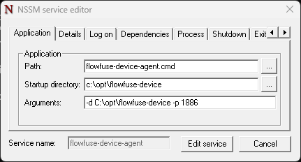

FlowFuse's device agent allows you to manage and run your Node-RED instances on
your own hardware such as a Raspberry Pi or Windows computer. This can be very useful where an
application you've written needs to run flows with direct access to hardware sensors.

In this article, we're going to explain the steps to configure our device agent to run as a service in Windows
using the [nssm](https://nssm.cc/) utility.

<!--more-->

## Why run the device agent as a service?

The standard process for running FlowFuse's device agent is to start it on the
command line using the command `flowfuse-device-agent`. This works fine for testing
but for long-term installations it's useful to run the device agent as a service.
Once running as a service, the device agent will continue to run even if you
log off or the computer is restarted and no user is logged in.

## Summary

The aim of this how-to is to install the FlowFuse device-agent as a service on a Windows computer.

There will be two main parts to this:
1. Install the device-agent
2. Setup the device-agent to run as a Windows service

Additionally, two user accounts will be needed for this configuration:
1. A **user** account that will be used to run the device-agent (typically, non-admin account)
2. An **admin** account that can run elevated commands and will be used to setup the service

We will create a directory for the device-agent files and set the permissions on that directory so that the **user** account can read and write files in that directory. 
_This will be `c:\opt\flowfuse-device`_

To make the device-agent run as a service, we will (in this example), use [nssm](https://nssm.cc/) but you are free to choose an alternative tool to run the device agent as a service.

Finally, we set the service to run under the **service** account.

_NOTE: The instructions in this how to were written on **Windows 11 Pro 22H2**_


### TIP: Using domain accounts
If the account is a domain account, append the domain name to the **user** e.g. `user@domain` whenever the **user** name is used in the instructions below.

### TIP: Launching an elevated command prompt window (e.g. as the admin user)

```bash
powershell -Command "Start-Process 'cmd' -Verb runAs
```

### TIP: Launching an elevated powershell prompt window (e.g. as the admin user)

```bash
powershell -Command "Start-Process 'powershell' -Verb runAs
```

## Pre-requisites

### Install Node.js
The device-agent requires Node.js to be installed. You can download the latest version from https://nodejs.org/en/download/. 

It is recommended to install the LTS version and to check the "Automatically install the necessary tools" option. This is especially important if you intend on using any nodes that require native modules (like serialport).

### Create a New Windows User

If you need to create a new **user** account follow these [instructions](https://support.microsoft.com/en-us/windows/create-a-local-user-or-administrator-account-in-windows-20de74e0-ac7f-3502-a866-32915af2a34d#:~:text=Select%20Start%20%3E%20Settings%20%3E%20Accounts%20and,other%20user%2C%20select%20Add%20account.).

## Prepare the device-agent files directory
As the admin user, open an [elevated](#tip%3A-launching-an-elevated-command-prompt-window-(e.g.-as-the-admin-user)) command prompt, create the files directory and setup access permissions.

```bash
# In an elevated command prompt
mkdir c:\opt
mkdir c:\opt\flowfuse-device
# grant full access to the service account that will run the device-agent
icacls c:\opt\flowfuse-device /grant "user":F /T
```
_where `"user"` is the service account (not the admin account)_

## Install nssm
`nssm` can simply be downloaded and executed from any path.
We will download it to the `c:\opt` directory, extract the files and copy the 64 bit version to the current directory.

### `cmd` version [elevated](#tip%3A-launching-an-elevated-command-prompt-window-(e.g.-as-the-admin-user)) command prompt
```bash
# starting in the device-agent files directory
cd c:\opt
# download the nssm zip file
curl -LJO https://nssm.cc/release/nssm-2.24.zip
# extract the files
tar -xf nssm-2.24.zip
# copy the 64 bit version to the current directory
copy nssm-2.24\win64\nssm.exe .
# clean up
del nssm-2.24.zip
rmdir /s /q nssm-2.24
```


### `powershell` version [elevated](#tip%3A-launching-an-elevated-powershell-prompt-window-(e.g.-as-the-admin-user)) powershell prompt
If you don't have `cURL` installed, then powershell can be used to download the file. Here is how to do it:

```powershell
# starting in the device-agent files directory
cd c:\opt
# download the nssm zip file
Invoke-WebRequest -Uri https://nssm.cc/release/nssm-2.24.zip -OutFile nssm-2.24.zip
# extract the files
Expand-Archive -Path nssm-2.24.zip .
# copy the 64 bit version to the current directory
Copy-Item -Path .\nssm-2.24\win64\nssm.exe -Destination .
# clean up
Remove-Item -Path nssm-2.24.zip
Remove-Item -Path nssm-2.24 -Recurse
```

### Manual download
If you prefer, you can download the nssm zip file manually from [https://nssm.cc/release/nssm-2.24.zip](https://nssm.cc/release/nssm-2.24.zip) and extract the files to the `c:\opt` directory. Then copy the 64 bit version to the current directory.

Ultimately, you should end up with a file named `nssm.exe` in the `c:\opt\` directory.


## Install and configure the device-agent

As the **service** account, to do so open a command prompt window and run the following and authenticate:

```bash
runas /user:{serviceuser} cmd
# e.g. runas /user:winserv cmd
```
_where `{serviceuser}` is the service account (not the admin account)_

### Check the users npm global path is set in the Users Environment Variables

NOTE: The recommended flowfuse-device-agent instructions will result in the flowfuse-device-agent being installed in the NPM global directory.  And the instructions to launch the device-agent expect the NPM global directory to be in your user path.  This section will instruct you to a) find the NPM global path, then b) check the user’s path setting and, if necessary c) add the NPM global path to your user path.

First, make a note of the path currently set for npm global. You can do this by running the following command:
```bash
npm config get prefix
```

Next, ensure the `Path` Variable under the "User variables for _user_" contains the npm global path that we obtained in the previous step. 
Use the below command, to check the user’s `Path` setting.  If it is not present, edit the path to include it.

```bash
# This commands opens the environment variables editor, 
# look for the "Path" variable under "User variables for user",
# and ensure it contains the npm global path
rundll32 sysdm.cpl,EditEnvironmentVariables
```

If you did have to add the npm path to the users `Path` variable, you will need to **restart** the command prompt for the change to take effect and relogin as **user**.

### Install the device agent
Note: you may have already installed the device-agent, however, **we strongly recommend** you do this step again as the service account and ensure that account has the latest version.

```bash
npm i -g @flowfuse/device-agent
```

### Link the device-agent to your flowfuse team
First, we must run the device-agent and link it to our FlowFuse team.  This will generate a "device configuration" details that we will use to configure the device-agent.
Below is how to run the device-agent with the UI enabled.  This will allow you to configure the device-agent via its web UI.

```bash
flowfuse-device-agent --ui --ui-port 8080 --ui-user admin --ui-pass admin -d c:\opt\flowfuse-device -p 1880
```

The device-agent will now be running and you can access the UI at [http://127.0.0.1:8080](http://127.0.0.1:8080) with the user and password both "admin" (you can change these in the command line if required).
_NOTE: These credentials are temporary and only valid during the device setup_

Proceed to configure the device-agent and link it to your flowfuse team. Full instructions can be found [here](
/docs/device-agent/register).
Once you have linked the device-agent to your team, you can stop it by pressing `ctrl+c` in the command prompt window.

## Create the device-agent service
As the admin user, open an elevated command prompt see [TIP](#tip%3A-launching-an-elevated-command-prompt-window-(e.g.-as-the-admin-user)) above

### Install device-agent as a service
```bash
cd c:\opt
.\nssm.exe install flowfuse-device-agent "flowfuse-device-agent.cmd"
.\nssm.exe set flowfuse-device-agent AppDirectory "c:\opt\flowfuse-device"
.\nssm.exe set flowfuse-device-agent Description "FlowFuse Device Agent"
# set the AppParameters (cli options) to tell the agent where its home directory is
# in our case, this is c:\opt\flowfuse-device and is set with the -d option
.\nssm.exe set flowfuse-device-agent AppParameters "-d c:\opt\flowfuse-device -p 1880"
```

### Check the service is installed

Run the following command to check the service is installed:
```bash
services.msc
```
(look for a service named `flowfuse-device-agent').

Alternatively, you can use the `sc` command:
```bash
sc query flowfuse-device-agent
```

### Set the user account that will run the service
Some things are easier to edit in the UI, so we will edit the service via the NSSM UI.
```bash
nssm edit flowfuse-device-agent
```



In the UI, you can edit the service name, description, startup type, etc.
The most important thing to check is the `Application` tab. This includes the path to the flowfuse-device-agent.cmd and its arguments.
Select the "Log on" tab, select "This account" and enter the service account name and password that will run the device-agent.
Click the "Edit Service" button to save the changes.

Now you have a service that will run the device-agent as the **service** account 🎉


### Controlling the service

You can start the service with the command:

```bash
sc start flowfuse-device-agent
```

You can check the current status with the command:

```bash
sc query flowfuse-device-agent
```

You can stop the service with the command:

```bash
sc stop flowfuse-device-agent
```

### Further reading

If you'd like to learn about windows services via the `sc` command you can access
the help text by running `sc` from a command prompt.

