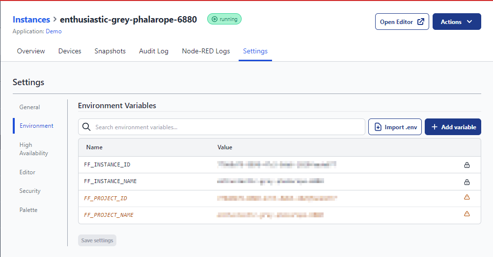
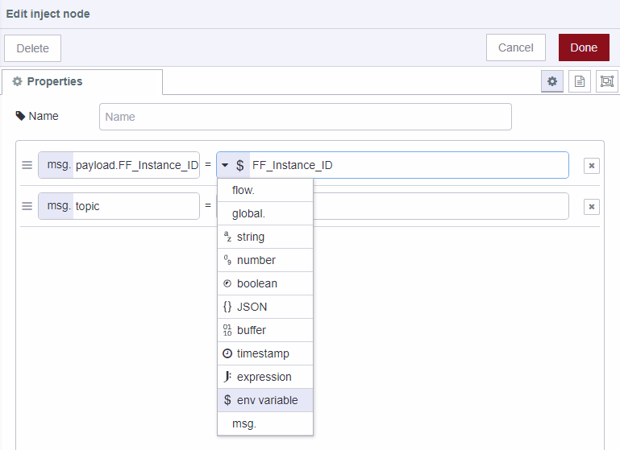

In the dev world there are many features people are accustomed to that make mass deployment much easier.  Environment variables are one of those features that FlowFuse brings to Node-RED that enables ease of use for citizen programmers to take DevOps to the next level.

<!--more-->

Environment variables are dynamic values which affect the processes or programs on a computer. In FlowFuse, they play a pivotal role by allowing developers to change the behavior of their Node-RED flows without altering the code. This is particularly useful in managing different instances, such as switching between development and production settings or connecting to different hardware and services.  

Let’s use wind turbines as an example.  The company has decided to transition from using an internal SQL database for storing all of their historical data.  They have purchased FlowFuse and already have it installed and running at all of their locations.  They have decided to move to a new cloud offering.  The data is coming from a local controller whose purpose is to collect telemetry data from the system.  The system is pretty simple but there are a couple of devices specific variables that change from wind turbine to wind turbine.  We will use controller IP and turbine name for this example.  All other variables are the same.  This is where environmental variables come in.  Configure each of the instances with the controller IP and Turbine name.  In the Node-RED link the variables with of type **env variable**.  This pulls the contents from that variable and brings it into the flow for use.  Once configured, any updates that need to be adjusted across all instances, like pointing to the new cool Cloud Storages, can be rolled out with a few simple clicks rather than going to each system to do the updates. 

To set up Environment Variables:
1. Navigate to Instances and **select** an instance.
2. Go to setting
3. Select **Environment** on the left
4. Click **Add Variable** to create a new variable and give it a name.
5. Click **Save** Settings

To use an Environment Variable:
1. In this example we will pull in an inject node
2. Create a name for the variable
3. Select type of variable and choose “env variable”
4. Type in the name of the variable to pull from FlowFuse.  In this case we specified FF_Instance_ID

<!-- [Access to the GPT - Node-RED builder by FlowFuse](https://chat.openai.com/g/g-V5Kyn4omE-node-red-builder-by-flowfuse-v1-0-2) -->

