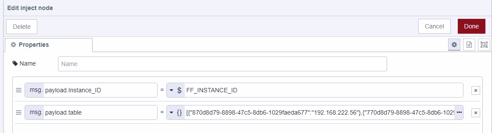
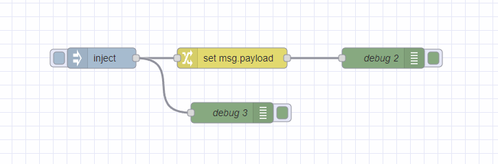

In the dev world there are many features people are accustomed to that make mass deployment much easier.  Environment variables are one of those features that FlowFuse brings to Node-RED that enables ease of use for citizen programmers to take DevOps to the next level.

<!--more-->


Environment variables are dynamic values which affect the processes or programs on a computer. In FlowFuse, they play a pivotal role by allowing developers to change the behavior of their Node-RED flows without altering the code. This is particularly useful in managing different instances, such as switching between development and production settings or connecting to different hardware and services.  In this example though, we are going to leverage the default Environment Variable, **FF_Instance_ID**, to do a one shot on start up to set a flow variable to be used later on in your code.

Let’s use wind turbines as an example.  They already have FlowFuse and running at all of their locations.  The company has decided upgrade their historian solutions to a new edge device at each turbine at each turbine.  As you guessed though, the ip address for this edge device isn't the same for each turbine.  This is where environmental variables come in.  Configure each of the instances with the device IP.  We will leverage the default FF_DEVICE_id **env variable**.  We will use this variab


**AHHHHHHH FF_DEVICE_ID VS FF_INSTANCE_ID**

To set up Environment Variables:
1. Navigate to Instances and **select** an instance.
2. Go to setting
3. Select **Environment** on the left
4. Click **Add Variable** to create a new variable and give it a name.
5. Click **Save** Settings


To use an Environment Variable:
1. In this example we will pull in an inject node
2. Create a name for the variable
3. Select type of variable and choose “env variable”
4. Type in the name of the variable to pull from FlowFuse.  In this case we specified FF_Instance_ID


5. We will also create a variable under msg.payload.table with this object
``` 
[
    {
        "870d8d79-8898-47c5-8db6-1029faeda677": "192.168.222.56"
    },
    {
        "770d8d79-8898-47c5-8db6-1029faeda677": "192.168.222.55"
    }
] 
```
6. Lastly, tick **Inject once after .1 seconds, then**
7. For repeat, keep that on none.



Next we will add a change node to leverage a jsonata lookup call.
1. Wire in a change node
2. Create a Set rule to set flow.payload
3. Configure the input to be of type jsonata
4. paste the below code in:
```
$lookup(msg.payload.table, msg.payload.Instance_ID)
```
5. click **Done**
6. Add a couple of debug node in and your flow should look like this:



Now you might be wondering why I would leverage a lookup over just hardcoding the variable in.  At the time of writing this article nodes have to be restarted for new environment variable to be used, and that requires going to each device and manually loading in each new variable and restarting.  This is clearly an acceptable way to go about doing this.  It just depends on the envirnment you are setting this up for.  If you have 100s to setup, that can become very time consuming.  In some cases, being able to change code accross the board and doing a single snapshot target is prefereable.  I took this approach, because there might be a time where many variable need to be taken in and write all those varible in each environment my be too time consuming.

## Conclusion

Environment variables are a powerful feature in FlowFuse, offering flexibility and control over how your Node-RED flows interact with different environments and services. By understanding and utilizing these variables effectively, you can significantly streamline your development and deployment processes. We invite you to share your experiences or raise questions in the comments below to further explore the practical applications of environment variables in FlowFuse.


<!-- [Access to the GPT - Node-RED builder by FlowFuse](https://chat.openai.com/g/g-V5Kyn4omE-node-red-builder-by-flowfuse-v1-0-2) -->

