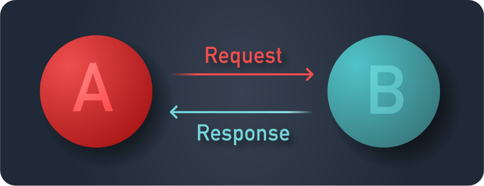
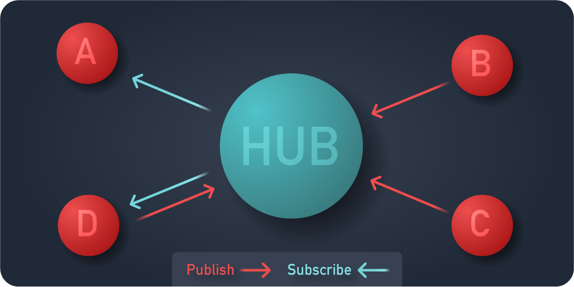

As your organization is generating more data there’s key architectural
decisions to be made to ensure the full value can be unlocked and you’re
leveraging not just the tip of the iceberg. The [Unified Namespace (UNS)](/solutions/uns/)
provides a blueprint to allow data to be consumed by many data-consumers.
FlowFuse helps you manage this migration and the operationalization of your
data.

<!--more-->

To facilitate a many to many connection between data producers and data consumers, there are two changes to be made to your architecture:
1. Data transport through a hub-and-spokes model
1. Set structure of the Data

## Hub and spokes model replaces Point to Point

Traditionally, for example web servers serving web pages, the client requests a
page from a server. This is a point to point connection between those two parties.

For the same data to be transmitted to a new data consumer, the consumer needs
to make another request to obtain the data. This works great when you know what
data you need for building your solution, and if you know where to get it.

However, in manufacturing it’s not always possible to know up front who will
need your data. Some machines are built and placed years before another machine
would like to interact with the generated data. There might be many consumers
for the same data set. Lastly; consumers might not know when to fetch new data
points, and thus will try on a cycle or need another mechanism to understand if
new data is available. Also, there are many challenges in point-to-point connections. 
For a deeper explanation, read [Why point-to-point connection is dead](/blog/2024/11/why-point-to-point-connection-is-dead/).

This is why a hub and spoke model should be employed. For each data source or
data producer, a connection is made to a central hub; generally called a broker.

## Structured data

When many producers are connected to many data consumers, but not directly,
the data producer needs to provide insight into what the events can be and will
contain. It cannot, nor should even if it could, tailor the event’s data structure
for a consumer so there’s decoupling on an architecture level. Structured data
makes information, without structure the consumer receives mere bytes.

This means that a schema for each event should be created and maintained. A
schema which both the producer and consumer can read and validate each event
against. As such a common Schema Definition Language (SDL) is chosen to provide
clarity of how the data is structured, how it can be parsed, and in some cases
also what it means for the developer.

## How Node-RED Fits In

Node-RED excels in implementing a Unified Namespace with its flexible and powerful capabilities. It can act as both a central hub and a data consumer within a hub-and-spokes model, simplifying the integration of various data sources and consumers. By leveraging Node-RED's extensive library of nodes and its easy-to-use flow-based programming interface, organizations can efficiently manage data ingestion, transformation, and distribution.

Node-RED also supports structured data through its support for JSON, XML, and other standard formats, allowing for clear and consistent data schemas. With its built-in nodes for MQTT, HTTP, and other protocols, Node-RED can seamlessly integrate with existing systems, enabling real-time data exchange and visualization. This makes it an ideal tool for operationalizing the Unified Namespace, ensuring that data flows efficiently and is readily available to all relevant stakeholders.

Read this article to learn how you can build your Unified Namespace using Node-RED and FlowFuse: [Building a Unified Namespace with FlowFuse](/blog/2024/11/building-uns-with-flowfuse/)

You can also watch this webinar that explores the core concepts of the Unified Namespace, explains why it is essential for Industry 4.0, and demonstrates how FlowFuse and HiveMQ can be used together to build a scalable Unified Namespace.

<lite-youtube videoid="z62O5RrOK8o" params="rel=0" style="margin-top: 20px; margin-bottom: 20px; width: 100%; height: 480px;" title="YouTube video player"></lite-youtube>

### How FlowFuse Can Help

While Node-RED is highly effective for implementing UNS, managing and deploying it can be complex. FlowFuse provides a unified platform that simplifies deployment with one-click operations, secure management, and scalable Node-RED applications. It also includes features that enhance collaboration, alongside offering centralized management of all Node-RED instances to ensure streamlined operations and increased efficiency.

**[Sign up]({{ site.onboardingURL }}) now for a free trial and experience FlowFuse's features**
