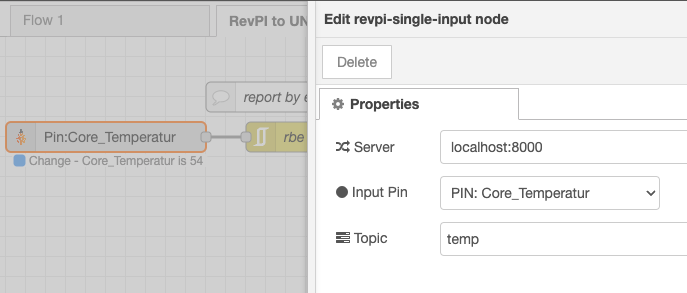
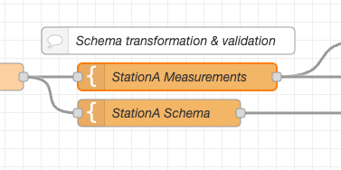
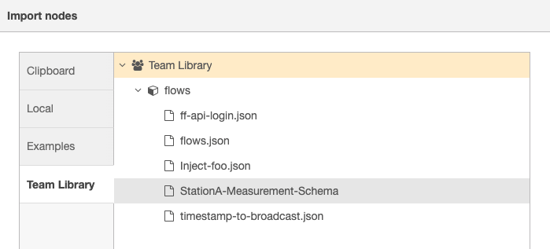
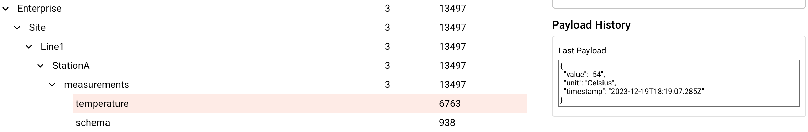

In the realm of industrial manufacturing, the concept of a Unified Namespace (UNS) emerges as a pivotal instrument for enhanced communication within a manufacturing network framework. Predicated on an event-driven architectural model, this approach advocates for the universal accessibility of data, irrespective of the immediate presence of a data consumer. 
<!--more-->
This paradigm allows for a flexible role allocation within the network, where nodes can dynamically switch between being data producers and consumers, contingent upon the fluctuating requirements of the system at any specific juncture. For those unfamiliar with UNS, I recommend revisiting my [previous article](https://flowfuse.com/blog/2023/08/isa-95-automation-pyramid-to-unified-namespace/) on the subject.

This article aims to explain the process of data modeling for your UNS, highlighting the role of tools like the FlowFuse Team Library in schema management.

**Overview of Steps:**
1. [Connection to your Operational Technology (OT) equipment](#step-1---connection-to-your-operational-technology-(ot)-equipment)
2. [Structuring your payload](#step-2---structuring-your-payload)
3. [Building your Topic Hierarchy](#step-3---building-your-topic-hierarchy)
4. [Connection to your Unified Namespace](#step-4---connection-to-your-unified-namespace)

## Step 1 - Connection to your Operational Technology (OT) equipment

The journey begins with establishing connections to OT equipment, which may include Programmable Logic Controllers (PLCs), Historian databases, and sensors. It is essential to facilitate compatibility with a diverse array of protocols. In this context, Node-RED emerges as a pivotal tool, bolstered by its expansive community-generated catalog featuring over 4500 nodes.

In my example, the focus is on integration with a RevolutionPi. To achieve this, the FlowFuse Device Agent was deployed on a RevolutionPi (see our [documentation](https://flowfuse.com/docs/hardware/raspbian/)), and specific RevolutionPi nodes were installed. These nodes enable direct interaction with all interfaces of the PLC and are available through the [Node-RED library](https://flows.nodered.org/node/node-red-contrib-revpi-nodes). Subsequent steps involved acquiring temperature data directly from the PLC.



For optimal data accuracy and integrity, it is recommended to timestamp data at the point of origin. In our scenario, the PLC outputs lack inherent timestamping. Consequently, I integrated a timestamp at the data acquisition stage within Node-RED, which runs on the same hardware.

A general recommendation is the imperative of maintaining data integrity during transmission from OT systems to the message broker. This is particularly salient in regulated sectors such as pharmaceuticals, where standards like GxP mandate the preservation of unaltered data during transfer to the UNS.

## Step 2 - Structuring your payload

The payload is the core of transmitted data. Transforming the payload for mutual intelligibility between sender and receiver, even within the same protocol, is sometimes necessary. Standardizing payload formats ensures consistent data storage and transmission. I recommend including schema type information with the data to cater to diverse use cases.

Utilizing FlowFuse and Node-RED can enforce schema consistency. Node-RED's template node lets you define JSON schemas for your flows, while the FlowFuse Team Library facilitates schema sharing and consistency across your organization.

In my example, I use a very simple JSON schema as a structure for measurements for `StationA`:
```json
{
    "$schema": "Enterprise/Site/Line1/StationA/measurements/_schema",
    "title": "Measurement Schema for StationA",
    "type": "object",
    "properties": {
        "value": {
            "description": "The actual value being measured",
            "type": "number"
        },
        "unit": {
            "description": "The unit of the measurement value",
            "type": "string"
        },
        "timestamp": {
            "description": "The timestamp of the measurement in ISO 8601 format",
            "type": "string"
        }
    },
    "required": [
        "value",
        "unit",
        "timestamp"
    ]
}
```
Example Data:
```json
{
    "value": msg.payload,
    "unit": "Celsius",
    "timestamp": msg.timestamp
}
```


The FlowFuse Team Library acts as my schema registry within my organization, allowing me to reuse my schemas and ensure consistency.



## Step 3 - Building your Topic Hierarchy

Your topic hierarchy should reflect your physical plant structure or align with existing asset naming systems. This approach improves data visibility and eases navigation for OT engineers. Many enterprises opt for the [ISA-95 part 2](https://www.isa.org/products/ansi-isa-95-00-02-2018-enterprise-control-system-i) model to structure their topics.

In our example, we follow the structure of: Enterprise/Site/Line1/StationA



## Step 4 - Connection to your Unified Namespace

Finally, transfer your data to the UNS, using protocols like MQTT or Kafka, depending on your UNS setup. While MQTT can handle up to 256 MB per payload, Kafka's default is 1MB, expandable to 10MB. These capacities suffice for most data types. In our example, we'll employ MQTT.

## Conclusion

In conclusion, implementing a Unified Namespace (UNS) with efficient data modeling is a transformative step for any industrial manufacturing setup. By leveraging tools like FlowFuse Team Library, Node-RED, and protocols such as MQTT or Kafka, organizations can achieve a harmonious data ecosystem where information flows seamlessly across various nodes. As illustrated through practical examples, including the integration with a RevolutionPi, the importance of standardizing data schemas, maintaining data integrity, and structuring topic hierarchies cannot be overstated. Embracing these practices not only enhances operational efficiency but also paves the way for more advanced analytics and machine learning applications. 

### The complete Node-RED flow

<iframe width="100%" height="225px" src="https://flows.nodered.org/flow/f6c783c6e9c1863145e0c63418eb5fe5/share?height=100" allow="clipboard-read; clipboard-write" style="border: none;"></iframe>
