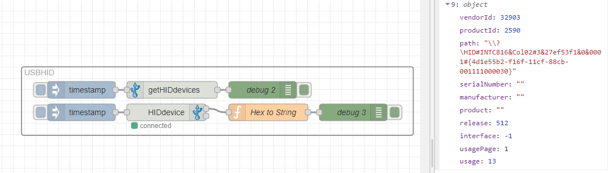
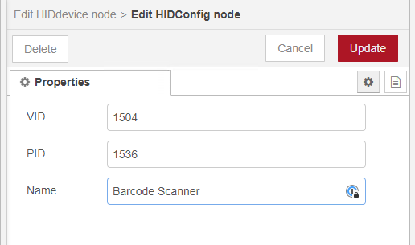
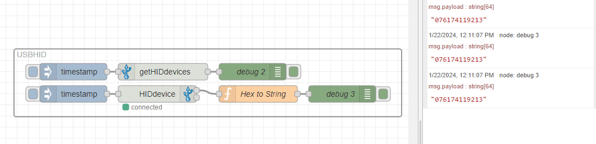

Barcode scanners, functioning as Human Interface Devices (HID) similar to keyboards, offer versatile programming options. In our case, we used one to trigger a Node-RED flow, keeping the process straightforward and efficient.

<!--more-->

# Windows Setup

We revitalized an older project for this purpose, ensuring it's up-to-date. For Windows users, the setup is straightforward. Start by importing the project via the palette manager. Import these [flows](https://flows.nodered.org/flow/3e08565bc0e024e81325dc028c5da792) to get started.  This initial flow identified as **getHIDdevices** will detect all devices connected to your Node-RED environment. Locate your barcode scanner and note its **Product ID** and **Vendor ID**.

Next, configure the **HIDdevice** node: replace the default **PID** with your scanner’s Product ID, and the **VID** with its Vendor ID. 

Test your barcode scanner; you should observe an event being triggered in Node-RED.

# Linux Setup

Linux users might face a slightly more complex setup, as access to communication ports isn't always granted by default, and specific drivers are needed for optimal node functionality. For this, we recommend following the detailed instructions available in the project's [GitHub](https://github.com/gdziuba/node-red-contrib-usbhid) repository.

# Conclusion

With FlowFuse, integrating tools like barcode scanners into Node-RED becomes a quicker experience, enhancing your operational efficiency and data management capabilities.
