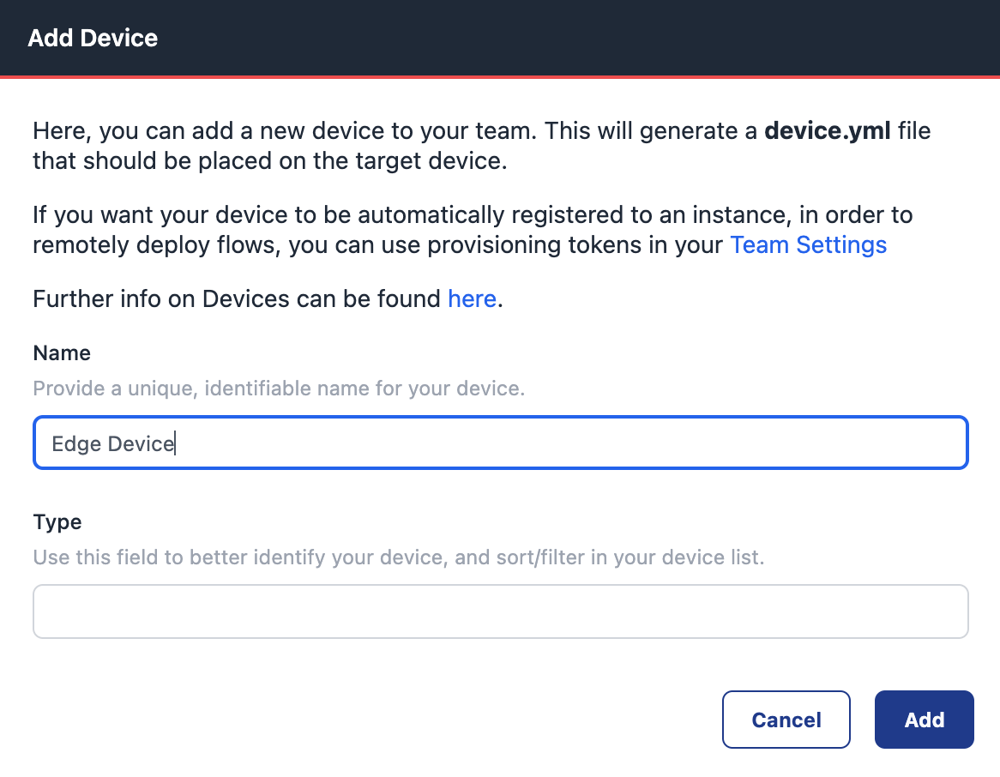
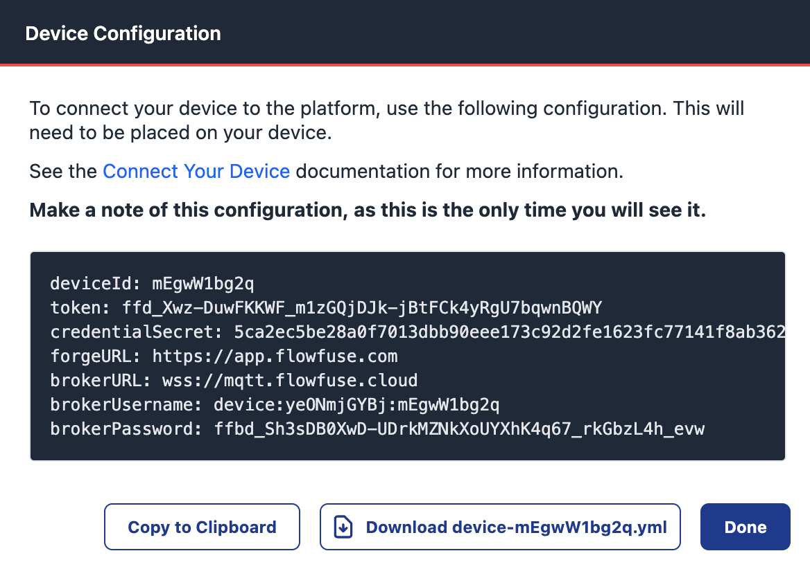

While cloud computing has revolutionized data access and analysis, not all data can be accessed from the cloud. In many scenarios, data collection from the edge – the location where data is generated – is essential for real-time decision-making or process observability.

<!--more-->

FlowFuse enables data to be collected through Node-RED. Data can be processed locally on the edge or sent on to other services. FlowFuse doesn’t rely on continuous connections to the cloud, making it a good choice for locations with unreliable internet connectivity. Use cases like real-time monitoring of critical systems, proactive maintenance, and improved operational efficiency are now possible to implement.

## Installing the FlowFuse agent

To manage the capturing of data on the edge we’re going to first install the FlowFuse agent. It’s installed on your device to manage the communication between the edge device and the FlowFuse server, manage the installation of Node-RED, its execution environment, and facilitate communication between devices and the cloud.

The device agent can run anywhere you can run a Docker container or Node.JS runtime (version 16.0+) can be installed.


### Registering a device on FlowFuse

For the edge device to know what it’s supposed to do, it needs to listen to the FlowFuse commands. The agent's configuration is provided by a `device.yml` file from FlowFuse. Go to the team you’d like to add an edge device to, and select “Devices” on the left-hand menu, followed by the “Add Device” button.



FlowFuse will prompt you to add a name (required), and a type (not required). When you’ve clicked `Add` you’ll get a new dialog to download the required file.



### Install the FlowFuse agent through Docker

If your device supports it, the fastest way to run the FlowFuse agent is with containers. Assuming you’ve already got Docker installed, there are two steps to follow: first, move the device YAML file downloaded from FlowFuse to the edge device and save it in `/opt/flowfuse/device.yml`. Start the agent by running:

```
docker run --mount type=bind,src=/path/to/device.yml,target=/opt/flowfuse-device/device.yml -p 1880:1880 flowfuse/device-agent:latest
```

Note that for production cases, ensure the container is restarted on reboot. Docker can do this for you, [please follow their guide](https://docs.docker.com/config/containers/start-containers-automatically/).


### Install the FlowFuse agent with npm

To install the agent through NPM, you’ll need a Node.JS version of 18.0 or later. Open a command prompt and run: `npm install -g @flowfuse/device-agent`.

This will install the FlowFuse Device Agent as a global npm module, making the flowfuse-device-agent command available in any directory on your system.

Once the installation is complete, you must configure the Device Agent to connect to your FlowFuse instance. In this guide, you’ve previously downloaded the `device.yml` file that’s needed now. On Linux or Mac, move the file to `/opt/flowfuse-device/device.yml`, and for Windows-based systems, move the file to `c:\opt\flowfuse-device\device.yml`.

Afterward, start the agent with: `flowfuse-device-agent`.

This will launch the Device Agent and connect it to your FlowFuse instance. The Device Agent will wait for instructions on which flows to run.

### Programming flows for the edge

Now the agent is running, the FlowFuse platform will show it has contacted back to the platform and is ready to do some work. First, add it to the application and start the developer mode. That enables the device editor and provides you secure access to the editor anywhere in the world for everyone in the FlowFuse team with the right access role.

When the development is done, be sure to create a snapshot of the developed flows to create a point-in-time backup, or to roll the snapshot out to many other devices later.
