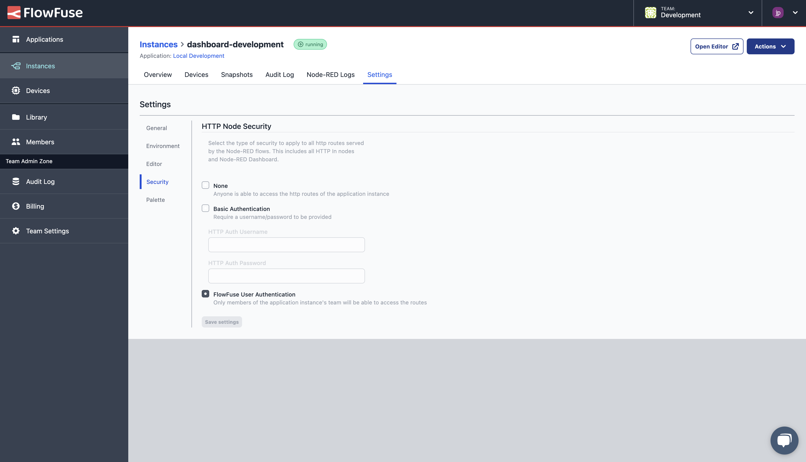

This week has seen the release of the [first major version of Node-RED Dashboard 2.0](/blog/2024/01/dashboard-2-ga), with it, we've made available a new FlowFuse-exclusive feature, personalised multi-user dashboards.

This new feature will allow you to build dashboards that provide unique data to each user, build admin-only views, and track user activity, to name but a few. We're really excited to see what the Node-RED Community and our FlowFuse customers can do with such a powerful and flexible framework.

<!--more-->

## Personalised Multi User Dashboards

The original Node-RED Dashboard was built with a "single source of truth", no matter how many users interacted with the dashboard, each user would always see the same data. This is great for prototyping, or hobby projects, but as you scale up your Node-RED usage, you'll want to be able to have unique dashboard experiences for each user.

### Getting Started

To enable multi-user dashboards, you'll need to be using FlowFuse, then complete two steps:

#### Step 1: Enable "FlowFuse User Authentication"

All instances on FlowFuse can be configured with _"FlowFuse User Authentication"_ in the "Security" Settings. This option requires any user that wants access to your Editor or dashboard to be authorized by FlowFuse first.

{data-zoomable}
<figcaption class="-mt-6 mb-4 text-center"><b>"Screenshot of the 'Security' settings available for any Instances running in FlowFuse"</b></figcaption>

#### Step 2: Install FlowFuse's User Addon

Once the "FlowFuse User Authentication" option has been enabled on your instance, you can then install our plugin, `@flowfuse/node-red-dashboard-2-user-addon`, through the "Manage Palette" option in the Node-RED Editor.

Once enabled, any messages emitted by a Dashboard 2.0 node will contain a new `msg._client.user` object, e.g:

```js
{
    "userId": "",   // unique identifier for the user
    "username": "", // FlowFuse Username
    "email": "",    // E-Mail Address connected to their FlowFuse account
    "name": "",     // Full Name
    "image": ""     // User Avatar from FlowFuse
}
```

Then, when running Node-RED Dashboard 2.0 on FlowFuse, you'll have a new sidebar option in the Node-RED Editor, which allows you to control which node types allow for "client constraints". 

{data-zoomable}
<figcaption class="-mt-6 mb-4 text-center"><b>A screenshot of the new 'FF Auth' options available in Node-RED to allow for client constraints on different node types.</b></figcaption>

In the original Node-RED Dashboard, this was _always_ enabled for the `ui-notification` and `ui-control` nodes, whereby you could include `msg.socket` data and it would only then send that message to the specified client. For Dashboard 2.0 we've extended this concept so that as a Node-RED Developer, you can now include `msg._client.user` data in any message sent to a Dashboard 2.0 node. Under the covers, our FlowFuse-exclusive plugin will then automatically filter messages to only send to the relevant user's connection.

Utilising this feature, below you can see an example where we send data to a `ui-template` to render a custom table for each user. Under the covers this is a `ui-event` node (triggered on a page view), which then uses the `msg._client.user` object to make a REST API call to retrieve a list of todo items for that specific user. We then wire the response into the `ui-template`, which has been configured to "Accept Client Constraints", and so only sends this data to User 2's dashboard.

{data-zoomable}
<figcaption class="-mt-6 mb-4 text-center"><b>Example of a dashboard that displays user-specific content.</b></figcaption>

Note too that we're also utilising the new [Teleport](https://dashboard.flowfuse.com/nodes/widgets/ui-template.html#teleports) option available in a `ui-template` which allows us to define content to show in the top-right of the dashboard, in this case, a little _"Hi {username}"_ message.

### Examples

#### Rendering Logged In User Data

In the previous example, you may have noticed that we're also displaying a welcome to the authenticated user on our dashboard, this means that we have access to the full User object within any `ui-template` that we render too.

{data-zoomable}
<figcaption class="-mt-6 mb-4 text-center"><b>The "Admin" view that is only made available to users registered as an "admin".</b></figcaption>

Under the covers, we're appending our `user` object to the `msg` object, via the SocketIO `auth` option. We make the `socketio` object available via a computed `setup` variable, this means that we can access this data in any `ui-template` node, and render like so:


```html
<template>
    <div>
        <h1>Hi, {{ setup?.socketio?.auth?.user?.name }}!</h1>
    </div>
</template>
```


To enable custom user-by-user content in a `ui-template` though, we must allow it to "Accept Client Constraints". This means that if a `.msg._client.user` value is included in any messages sent to a `ui-template` node, then the underlying SocketIO message will be filtered to only send to the relevant user's connection, and no others.

#### Admin Only Views

With this new functionality we can also now show/hide content based on the authenticated user. 

We recently introduced the option to [set default visiblity & interaction states](https://github.com/FlowFuse/node-red-dashboard/pull/484). This was partly introduced because it's a good practice to set the default "Visibility" option for any admin-only pages to "Hidden", and then use a `ui-control` node to show the content only to the relevant admins.

<iframe width="100%" height="100%" src="https://flows.nodered.org/flow/2fe8e6f1e7002f1ff6a9195ad1a153b6/share" allow="clipboard-read; clipboard-write" style="border: none; margin-bottom: 12px;"></iframe>

Let's breakdown the above flow:

1. We wire a `ui-event` node (which emits each time a user views a page) into a switch node
2. Our switch node checks the `user.username` against a known list of admin users and branches "admin:" and "non-admin" users
3. For admin users, the `change` node defines a message for our `ui-control` node to dynamically show content, in this case an "Admin" page, when appropriate.

```json
{
    "pages":{
        "show": ["Admin View"]
    }
}
```

All events going into `ui-control` are automatically filtered based on the `msg._client.user` object, so only the Admin users will receive the message to show the "Admin View" page, resulting in:

{data-zoomable}
<figcaption class="-mt-6 mb-4 text-center"><b>The "Admin" view that is only made available to users registered as an "admin".</b></figcaption>

Further extensions of this could also check `ui-event` in case a non-admin user tries to access the `/admin` page directly, in which case we can utilise `ui-control` to navigate the user away from the page immediately. See the [ui-control documentation](https://dashboard.flowfuse.com/nodes/widgets/ui-control.html#navigation) for more details on this.

## Upcoming Webinar

If you're interested in learning more about Dashboard 2.0 and in particular multi-user Dashboards, we're hosting a webinar on Thursday, 29th February. You can find out more information [here](/webinars/2024/node-red-dashboard-multi-user/)

## Follow our Progress

We aren't stopping here, we'll continue to push Dashboard 2.0 forward with future development, and you can track that progress on our GitHub Projects:

- [Dashboard 2.0 Activity Tracker](https://github.com/orgs/FlowFuse/projects/15/views/1)
- [Dashboard 2.0 Planning Board](https://github.com/orgs/FlowFuse/projects/15/views/4)
- [Dashboard 1.0 Feature Parity Tracker](https://github.com/orgs/FlowFuse/projects/15/views/5)

 If you have any feature requests, bugs/complaints or general feedback, please do reach out, and raise issues on our relevant [GitHub repository](https://github.com/FlowFuse/node-red-dashboard).

## How to get started

### FlowFuse Cloud

The Personalised Multi-user Dashboard plugin, `@flowfuse/node-red-dashboard-2-user-addon`, is available in our [Certified Nodes](https://flowfuse.com/certified-nodes/) catalogue, accessible to our Teams and Enterprise customers. You just have to go to the Node-RED Palette Manager of your Node-RED instance and select the Certified Nodes catalogue. Every instance created from today onwards automatically comes with the necessary configuration. Already created instances need to be manually restarted.

For your devices, we provide the necessary configuration and access token upon request, so that your Node-RED devices can also benefit from a Personalised Multi-user Dashboard.

### FlowFuse Self-Hosted

For all our Teams and Enterprise Self-Hosted customers who also want to use the Certified Nodes and the Multi-User Dashboard, we provide all necessary configurations upon request to get started.

Alternatively, if you're looking to elevate your Node-RED infrastructure, [book in a chat with us](/contact-us) to talk about how FlowFuse can help.