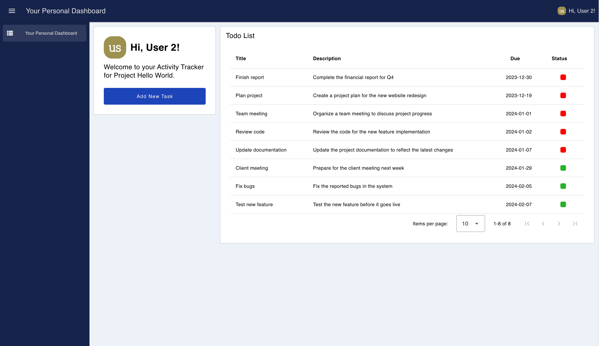

Back in [June 2023](/blog/2023/06/dashboard-announcement/) we announced that FlowFuse would be investing time into building out the next generation of Node-RED Dashboard, the incredibly popular UI framework for Node-RED.

We followed this up with the [first release](/blog/2023/07/dashboard-0-1-release/) (`0.0.1`) in July, just one month later, and today, we are pleased to announce that we have reached a major milestone in this journey, with the release of our first major version (`1.0.0`) of Node-RED Dashboard 2.0.

<!--more-->

We've shared plenty of updates in that timeframe, detailing feature parity with the original Node-RED Dashboard, as well as some of the new features we've added to the new Dashboard, such as Markdown, Mermaid Charts and new Layout Options, so we won't cover too much of that here, but if you've not seen many of them, here are a few to get you started:

- [Dynamic Markdown, Tables & Notebooks](/blog/2023/09/dashboard-notebook-layout/)
- [UI Chart Improvements](/blog/2023/11/dashboard-0-7/)
- [Building a Custom Video Player](/blog/2023/12/dashboard-0-10-0/)

We also have [rich documentation]((https://dashboard.flowfuse.com/)) for Dashboard 2.0 too, detailing all of the available nodes, how to contribute to the project and details on how Dashboard 2.0 is built.

## Multi User Dashboards

A big step forward for us with this major release is the introduction of a new, FlowFuse-exclusive feature, Multi User Dashboards.

The original Node-RED Dashboard was built with a "single source of truth", no matter how many users interacted with the Dashboard, they would always all see the same source of data, the same data in a chart, the same value on a slider. This is great for prototyping, or hobby projects, but as you scale up your Node-RED usage, you'll want to be able to have unique Dashboard experiences for each user.

{data-zoomable}
<figcaption class="-mt-6 mb-4 text-center"><b>Example of a Dashboard that displays user-specific content.</b></figcaption>

This new feature is enabled by default for all FlowFuse Cloud Instances with FlowFuse Authentication Enabled, and provides access to a `user` object for all Dashboard generated events in Node-RED. This object contains information about the user who triggered the event, including their username, email address, and a unique ID. You can then use this however you like, showing/hiding elements based on the user, loading user-specific data, or just tracking user activity.

Note also that we're also utilising the new [Teleport](https://dashboard.flowfuse.com/nodes/widgets/ui-template.html#teleports) option available in a `ui-template` which allows us to define content to show in the top-right of the Dashboard, in this case, a little _"Hi {username}"_ message.

### Getting Started

To enable multi-user Dashboards, you'll need to be using FlowFuse Cloud, and have an instance with "FlowFuse User Authentication" enabled in the "Security" Settings, this will require any user that wants access to your Editor or Dashboard to be authorized by FlowFuse first.

Once enabled, any messages emitted by a Dashboard 2.0 node will contain a new `msg._client.user` object, e.g:

```json
{
    "userId": "",   // unique identifier for the user
    "username": "", // FlowFuse Username
    "email": "",    // E-Mail Address connected to their FF account
    "name": "",     // Full Name
    "image": ""     // User Avatar from FF
}
```

### Admin Only Views

With this new data, one thing we could do is show/hide content based on the authenticated user. 

We recently introduced the option to [set default visiblity & interaction states](https://github.com/FlowFuse/node-red-dashboard/pull/484), and a good practice here is to set the default "Visibility" option for any admin-only pages to "Hidden", and then use a `ui-control` node to show the content to the relevant admins.

<iframe width="100%" height="100%" src="https://flows.nodered.org/flow/2fe8e6f1e7002f1ff6a9195ad1a153b6/share" allow="clipboard-read; clipboard-write" style="border: none;"></iframe>

Here, we wire a `ui-event` node (which emits each time a user views a page) into a switch node, check the `user.username` against a known list of admin users, and then branch to a `change` node and define a message for our `ui-control` node to dynamically show content, in this case an "Admin" page, when appropriate:

```json
{
    "pages":{
        "show": ["Admin View"]
    }
}
```

All events going into `ui-control` are automatically filtered based on the `msg._client.user` object, so only the Admin users will receive the message to show the "Admin View" page, resulting in:

{data-zoomable}
<figcaption class="-mt-6 mb-4 text-center"><b>The "Admin" view that is only made available to users registered as an "admin".</b></figcaption>

### Showing Logged In User

As you can see above, we're displaying a welcome to the authenticated user on our Dashboard, this means that we have access to the full User object within any `ui-template` that we render too.

{data-zoomable}
<figcaption class="-mt-6 mb-4 text-center"><b>The "Admin" view that is only made available to users registered as an "admin".</b></figcaption>

Under the covers, we're appending our `user` object to the `msg` object, via the SocketIO `auth` option. We make the `socketio` object available via a computed `setup` variable, this means that we can access this data in any `ui-template` node, and render like so:

```html
<template>
    <div>
        <h1>Hi, {{ setup?.socketio?.auth?.user?.name }}!</h1>
    </div>
</template>
```

To enable custom user-by-user content in a `ui-template` though, we must allow it to "Accept Client Constraints". This means that if a `.msg._client.user` value is included in any messages sent to a `ui-template` node, then the underlying SocketIO message will be filtered to only send to the relevant user's connection, and no others.

{data-zoomable}
<figcaption class="-mt-6 mb-4 text-center"><b>A screenshot of the new 'FF Auth' options available in Node-RED to allow for client constraints on different node types.</b></figcaption>

## Follow our Progress

We aren't stopping here, we'll continnue to push Dashboard 2.0 forward with future development, and you can track that progress on our GitHub Projects:

- [Dashboard 2.0 Activity Tracker](https://github.com/orgs/FlowFuse/projects/15/views/1)
- [Dashboard 2.0 Planning Board](https://github.com/orgs/FlowFuse/projects/15/views/4)
- [Dashboard 1.0 Feature Parity Tracker](https://github.com/orgs/FlowFuse/projects/15/views/5)

 If you have any feature requests, bugs/complaints or general feedback, please do reach out, and raise issues on our relevant [GitHub repository](https://github.com/FlowFuse/node-red-dashboard).