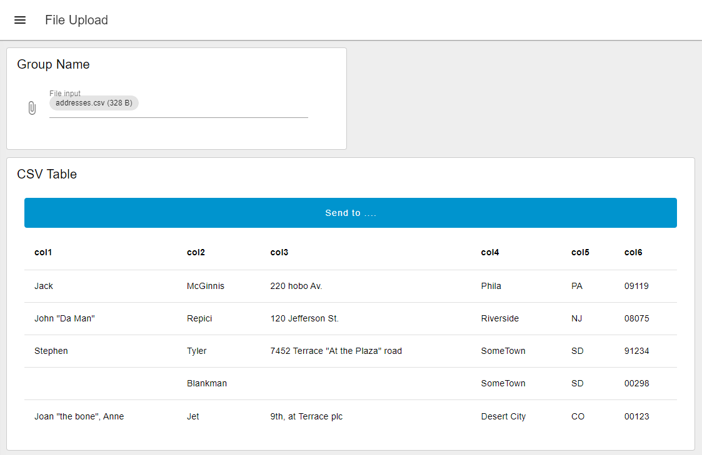

Need to get a file into Node-RED, but don't want to over complicate things.  This article outlines how you can leverage Dashboard 2.0 to import a file directly into Node-RED via a Dashboard.

<!--more-->

## Why would you need to import a file to Node-RED?

Often times it is necessary to update lookup tables in a SQL database, but you don't necessarily want to give access to everyone to edit the database, nor do you want to have to do it all yourself. This can often be seen when new products are introduced into a manufacturing facility. It may not be often, but enough that it warrants its own application. This process will guide you in a way that will enable your teammates to upload the files to the system themselves.

Furthermore, on the management layer of most companies, Excel and Google Sheets are the go-to tools to perform data collection tasks. Getting management involved in processes might require you to build an import feature for them. Asking your manager to "Save as" CSV is much easier than teaching them SQL!

### Node-RED Dashboard (FlowFuse)

This simple flow allows the user to visualize data from a CSV in the Node-RED Dashboard. The button then allows the user to initiate a request to send the data to the next step. This next step could be anything from loading into a SQL database to saving it.

### Instructions ###
1. Install Node-RED Dashboard 2.0. Follow these [instructions](/blog/2024/03/dashboard-getting-started/) to install.  
2. Import Flow - to import the flow into your Node-RED instance follow these [instructions](/blog/2023/03/3-quick-node-red-tips-5/#1.-copy-and-share-your-flows-using-export-and-import). 
3. Access Dashboard - To access the dashboard, navigate to the `https://<flowfuse-instance-name>.flowfuse.cloud/dashboard`.

This dashboard is currently configured to take in CSV files and transform them into a single message that is sent to the table for visualization.  Simultaneously the data from the import is stored locally in the flow context.  From there, the button can be used to trigger the sending of the data from the flow context to the next destination.  In this case, it is a simple debug node.

<iframe width="100%" height="225px" src="https://flows.nodered.org/flow/8c505039ac1b8dbed2bee1e22ee2975a/share?height=100" allow="clipboard-read; clipboard-write" style="border: none;"></iframe>

## Need to Send a File to Node-RED from another application or source?

Check out this [blog](/blog/2024/01/send-a-file) on how to send a file from either a stand alone web application or use the sample python script to imbed it into your current application.