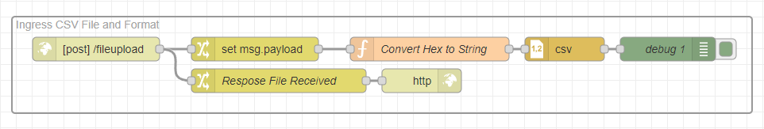

Have you ever needed to send a CSV file to your Node-RED instance? This file can go on to populate a shift schedule, product specifications, or some other configuration file that is used. In this guide, we are leveraging a Python script that runs a Flask application to post the file to a Node-RED instance and organize the data to be sent on or used.
<!--more-->

## Why would you need to send a file to Node-RED?

Often times it is necessary to update lookup tables in a SQL database, but you don't necessarily want to give access to everyone to edit the database, nor do you want to have to do it all yourself. This can often be seen when new products are introduced into a manufacturing facility. It may not be often, but enough that it warrants its own application. This process will guide you in a way that will enable your teammates to upload the files to the system themselves.

## Summary

There are two approaches that were taken when solving this. The first approach is a simple script that will be shared below. It is a simple Python application that allows the user to send a file with a simple command, but this might require a little more technical skills that the end user may not feel comfortable with. Which brought us to pathway number two. A web-based application that allows the user to upload files to a browser with a selectable endpoint. Both have their pros and cons. I will let you decide which is best for your application.

# Simple Script

This Python script requires **requests** and **Python 3.x**.

Install requests:

```bash
pip install requests
```

### Configuration ###

Update the **nodered_url** to the location of the NodeRED instance.  Be sure to adjust the port if the default port of 1880 isn't being used.

Update the **file_path** with the path to where the file to be uploaded will be located.


```python
import requests

def send_file(nodered_url, file_path):
    # Open the file in binary mode
    with open(file_path, 'rb') as file:
        files = {'file': (file.name, file, 'multipart/form-data')}
        response = requests.post(nodered_url, files=files)

    return response

# Update the ip address and port of your Node-RED instance
nodered_url = 'http://localhost:1880/fileupload'

# Update the location of your file
file_path = 'C:/Users/myUser/Downloads/shiftSchedule.csv'

response = send_file(nodered_url, file_path)
print(f"Response Status Code: {response.status_code}")
print(f"Response Body: {response.text}")
```


# Web Application


This application can be run on either Windows or Linux, .bat for windows and .sh for linux.

## Installation

Clone the repository:
```bash
git clone https://github.com/gdziuba/FF_Send-File-to-NR.git
```
Navigate to the directory:
```bash
cd FF_Send-File-to-NR
```

## Configuration

Edit the lines in the body of [index.html](https://github.com/gdziuba/FF_Send-File-to-NR/blob/21214f88c6c4536f49efb88cf5f84bf52071a88b/templates/index.html#L69) to include the endpoints to which you would like to send the files.

```
<option value="http://localhost:1880/fileupload">CSV File Upload</option>
```

## Operating Systems

### Windows 

Run the script:
```bash
.\start_app.bat
```

This will install if necessary, start the Flask Application, and take you to localhost:5000 on the browser.

### Linux

Make the script executable: Run:

```bash
chmod +x setup_and_run.sh
```

To Run:

```bash
./setup_and_run.sh
```

To access the application, open a browser to the ip:5000 of the running application.


# Node-RED Ingress

<!--  -->

<iframe width="100%" height="225px" src="https://flows.nodered.org/flow/effb53752e5d6f767b3c7e5d41a4a6e8/share?height=100" allow="clipboard-read; clipboard-write" style="border: none;"></iframe>

Once we have a file ready to be sent, we now need to configure the receiving side in Node-RED. In this example, we are leveraging a CSV formatted file and then converting it to be used at a later time.

A link to the flow can be found [here](https://flows.nodered.org/flow/effb53752e5d6f767b3c7e5d41a4a6e8).

To import the flow, follows these [instructions](https://flowfuse.com/blog/2023/03/3-quick-node-red-tips-5/#1.-copy-and-share-your-flows-using-export-and-import).

A Simple HTTP In node can be used in the form of a Post, ensuring the configuration allows for a file.