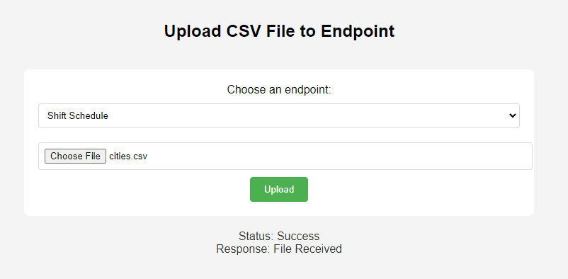

Have you ever needed to send a CSV file to your Node-RED instance? This file can go on to populate a shift schedule, product specifications, or some other configuration file that is used. In this guide, we provide a couple of options to upload the data to your Node-RED for further processing and to organize the data to be sent on or used.

<!--more-->

## Why would you need to send a file to Node-RED?

Often times it is necessary to update lookup tables in a SQL database, but you don't necessarily want to give access to everyone to edit the database, nor do you want to have to do it all yourself. This can often be seen when new products are introduced into a manufacturing facility. It may not be often, but enough that it warrants its own application. This process will guide you in a way that will enable your teammates to upload the files to the system themselves.

Furthermore, on the management layer of most companies, Excel and Google Sheets are the go-to tools to perform data collection tasks. Getting management involved in processes might require you to build an import feature for them. Asking your manager to "Save as" CSV is much easier than teaching them SQL!

## 2 Ways to send a file to Node-RED

There are many approaches that can be taken when solving this. We are going to go over 2 here. 

1. [Simple Python Script](#simple-python-script) - Simple script that will be shared below. It is a simple Python application that allows the user to send a file with a simple command, but this might require a little more technical skills that the end user may not feel comfortable with. 
2. [Stand Alone Web Application](#stand-alone-web-application) - A web-based application that allows the user to upload files to a browser with a selectable endpoint. 

### Simple Python Script

This simple Python script sends a file to a Node-RED flow.  The flow that will work with this script can be seen [here](#node-red-ingress).

The script requires **requests** and **Python 3.x**.

Install requests:

```bash
pip install requests
```

Create a file called run.py and paste the contents into the file.

```python
import requests

def send_file(nodered_url, file_path):
    # Open the file in binary mode
    with open(file_path, 'rb') as file:
        files = {'file': (file.name, file, 'multipart/form-data')}
        response = requests.post(nodered_url, files=files)

    return response

# Update the ip address and port of your Node-RED instance
nodered_url = 'http://localhost:1880/fileupload'

# Update the location of your file
file_path = 'C:/Users/myUser/Downloads/shiftSchedule.csv'

response = send_file(nodered_url, file_path)
print(f"Response Status Code: {response.status_code}")
print(f"Response Body: {response.text}")
```

Update the **nodered_url** to the location of the Node-RED instance.  Be sure to adjust the port if the default port of 1880 isn't being used.

Update the **file_path** with the path to where the file to be uploaded will be located.

**Save**

To run:

```python
python run.py
```

### Stand Alone Web Application



This stand-alone web application can be run on either Windows or Linux, .bat for Windows, and .sh for Linux.

#### Installation

Clone the repository and navigate to the directory:
```bash
git clone https://github.com/gdziuba/FF_Send-File-to-NR.git && cd FF_Send-File-to-NR
```

#### Configuration

Edit the lines in the body of [index.html](https://github.com/gdziuba/FF_Send-File-to-NR/blob/21214f88c6c4536f49efb88cf5f84bf52071a88b/templates/index.html#L69) to include the endpoints to which you would like to send the files.

```
<option value="http://localhost:1880/fileupload">CSV File Upload</option>
```

### Operating Systems

#### Windows

Run the script:
```bash
.\start_app.bat
```

This will install if necessary, start the Flask Application, and take you to localhost:5000 on the browser.

#### Linux

Make the script executable by running running:

```bash
chmod +x setup_and_run.sh
```

Then run the application with:

```bash
./setup_and_run.sh
```

To access the application, open a browser to the **\<node-red-host-ip\>:5000** of the running application.

#### Node-RED Ingress

<iframe width="100%" height="225px" src="https://flows.nodered.org/flow/effb53752e5d6f767b3c7e5d41a4a6e8/share?height=100" allow="clipboard-read; clipboard-write" style="border: none;"></iframe>

Once we have a file ready to be sent, we now need to configure the receiving side in Node-RED. In this example, we are leveraging a CSV formatted file and then converting it to be used at a later time.

A link to the flow can be found [here](https://flows.nodered.org/flow/effb53752e5d6f767b3c7e5d41a4a6e8).

To import the flow, follow these [instructions](/blog/2023/03/3-quick-node-red-tips-5/#1.-copy-and-share-your-flows-using-export-and-import).

A Simple HTTP In node can be used in the form of a Post, ensuring the configuration allows for a file.

## Wanna import it directly into your Node-RED instance via a Dashboard?

Check out this [blog](/blog/2024/01/import-a-file) on how to directly import a file into a Node-RED instance via Dashboard 2.0.