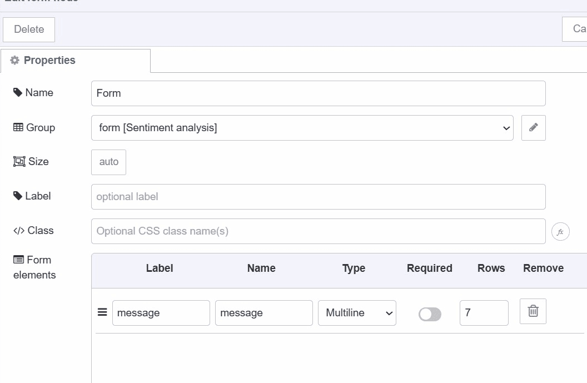
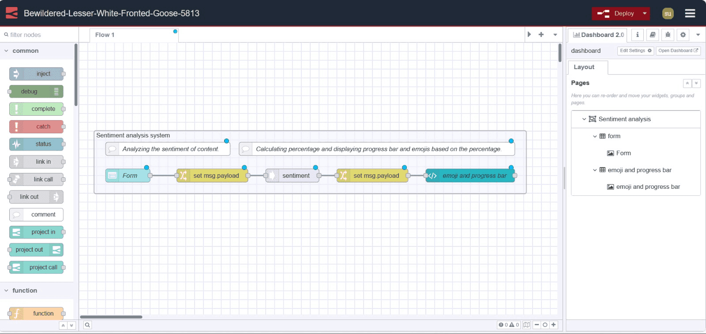

Have you ever built a sentiment analysis system to extract insights from text content? If yes then I don’t think you'll need an explanation of how complex it is to build. In this guide, we will build a sentiment analysis system with Node-RED using Dashboard 2.0 in a few easy steps. 

<!--more-->

## What exactly is sentiment analysis?

Sentiment analysis is a context-mining technique used to understand emotions and opinions expressed in text, often classifying them as positive, neutral, or negative. There are many real-world applications of this technique.

- **Analysing Feedback:** Customers, or other stakeholders like employees, are periodically requested to fill out a feedback form. Analysis of such feedback is the most widespread application of sentiment analysis.
- **Campaign Monitoring:** Another use case of sentiment analysis is a measure of influence which is crucial in any marketing campaign.
- **Brand Monitoring:** Brand monitoring is another great use case for sentiment analysis. Companies can use sentiment analysis to check the social media sentiments around their brand from their audience.

## Building a Form in Dashboard 2.0

In this system, we will analyse the sentiment of text content obtained from the user.  For this we are going to build a user interface using Dashboard 2.0 and Node-RED.

1. Install Node-RED Dashboard 2.0. Follow these [instructions](/blog/2024/03/dashboard-getting-started/) to install.
1. Drag a ui form widget to the canvas and select the created group.
1. Add an element in the form widget and give it a name and label, select the type as multiline, and set the number of rows according to your need.



## Normalizing the data

We need to normalize the payload before sending it to the next node because the form widget always returns an object containing the property of values of form elements.

1. Drag a change node to canvas.
2. Set `msg.payload.$FORM_ELEMENT_NAME` to `msg.payload`, replace the `$FORM_ELEMENT_NAME` with the name of the form element that you have added to the form to obtain user input.
3. Connect the UI form nodes output to the change node’s input.

.png "Normalizing the payload using change node")

## Installing custom node

Now it’s time to install a custom node that can perform sentiment analysis for us. In this guide, we will use the `node-red-node-sentiment` which is a Node-RED node that uses the AFINN-165 wordlists for sentiment analysis of words. It returns a sentiment object containing a score and other properties but we will only use the score property. Score property typically ranges from -5 to 5.

1. Install the `node-red-node-sentiment` package by the Node-RED palette manager.
2. Drag a sentiment node to canvas.
3. Connect the change nodes output to sentiment node input.

## Calculating percentage

Why do we need to calculate the percentage? We will show the final result with the help of a circular progress bar and three different emojis. Ideally we should show the progress bar based on a percentage of score instead of negative values.

1. Drag another change node to canvas.
2. set `msg.payload` to `((msg.sentiment.score - (-5)) / (5 - (-5))) * 100` as a JSONata expression, it will calculate the percentage of the score.

.png "Calculating the percentage based on the score using the change node")

## Displaying result on Dashboard 2.0
Finally, we are going to display the result on Dashboard 2.0 with the help of the Vuetify circular progress bar and emojis. To do that we will build a Vue component by using our ui template widget.

1. Drag a ui template widget to canvas and create another group for it.
2. Paste the below Vue component snippet into the template widget.

We're aware that not everyone coming into Dashboard 2.0 will be familiar with VueJS. We have a more detailed guide [here](https://dashboard.flowfuse.com/nodes/widgets/ui-template.html#building-full-vue-components), but we'll also give a quick overview of the component that we'll use to display the result:

```html
<template>
  <div>
    <v-progress-circular :rotate="360" :size="245" width="20" :width="15" :model-value="msg.payload" color="rgb(0,255,0)">
      
      
      
    </v-progress-circular>
  </div>
</template>
```

- v-progress-circular is a Vuetify component to display a circular progress bar, for a detailed guide refer to our blog on  [Custom Vuetify components for Dashboard 2.0](/blog/2023/10/custom-vuetify-components-dashboard/).
- `rotate` is an attribute that lets you specify the rotation angle of the progress bar.
- `size` and `width` allow you to set the size of the circular progress bar, and another `width` attribute allows you to set the stroke width of the circular progress bar.
-  v-if, v-else-if, and v-else, allow dynamic rendering of elements based on specified conditions, in this component we are rendering emojis based on percentages calculated by score.

Your final flow should look like this:


## Deploying the Flow



Finally, we have successfully built our sentiment analysis system. Now it's time to deploy the flow, to do that click on the red deploy button which you can find in the top right corner. After that go to `https://<your-instance-name>.flowfuse.cloud/dashboard`


## Conclusion

In this post, a sentiment analysis system is built with Node-RED in which the user has a form field to paste text content. After submitting the form, it calculates the percentage based on the output score, which ranges from -5 to 5. The output will be displayed on dashboard 2.0 by a circular progress bar and three different emojis based on percentage.
