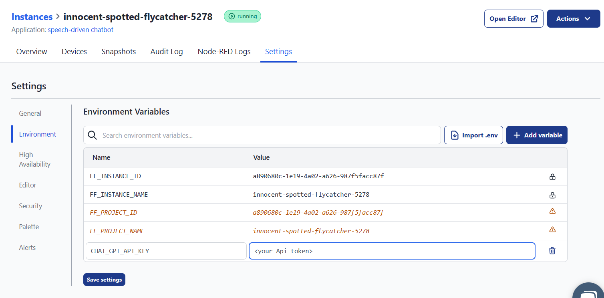
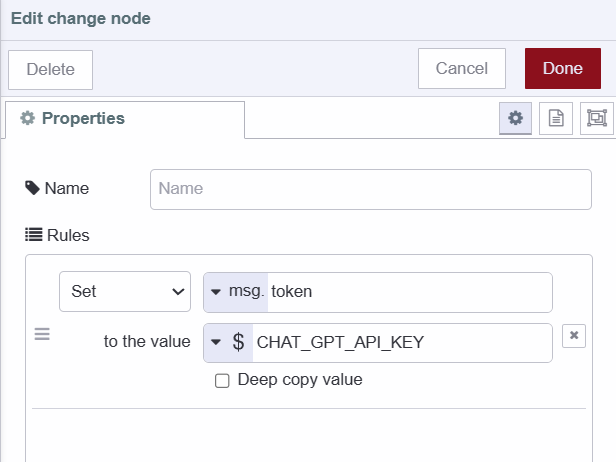
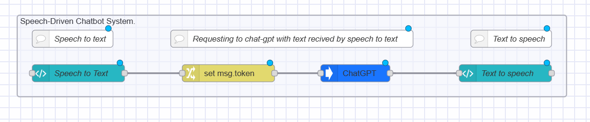
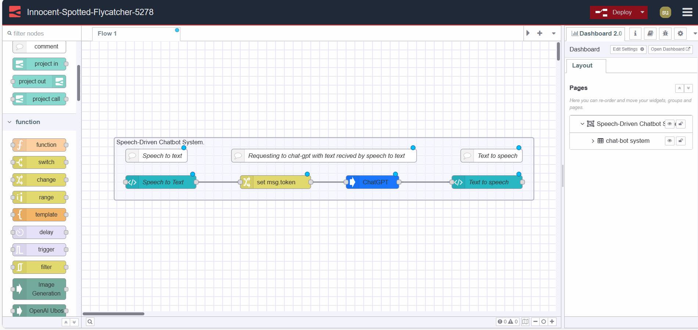
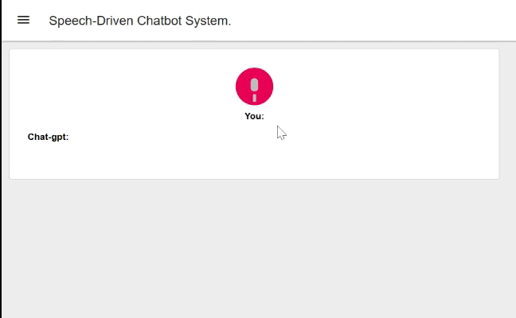

Have you ever wanted to integrate speech recognition and synthesis into your Node-RED project and thought it was too complex? Often it has required external services or APIs. However, in this guide, we show you how you can use speech recognition and synthesis in your Node-RED projects without needing an external service or API.  

In addition, we make things more interesting by building a system that can listen to us and respond like humans using the Chat-GPT API.
Let's get started!

<!--more-->

## What exactly is speech recognition and synthesis?

Speech recognition is a technology where a device captures spoken words through a microphone, checks against grammar rules and vocabulary, and returns recognized words as text. On the other hand, speech synthesis converts app text into speech and plays it through a device's speaker or audio output. There are many benefits and real-world applications of this technology.

- **Hands-Free Operation:** Using speech recognition technology is often used today to perform tasks such as making calls, sending messages, or controlling smart home devices without the need for physical interaction.
- **Accessibility:** It allows individuals with visual impairments to access digital content through spoken words and as discussed above, to control devices without physical interaction.
- **Efficient Content Consumption:** It allows us to listen to information instead of reading. For example, in the audiobook industry by using speech synthesis technology they create audio versions of books which helps users to be more productive.

## Installing Dashboard 2.0 

Install Dashboard 2.0. Follow these [instructions](/blog/2024/03/dashboard-getting-started/) to get up and running.

## Building Speech-to-Text Vue component 
In this section, we will build a Vue component that will perform a speech-to-text conversion operation using Web speech API, and display results on the dashboard.  While we did say previously that we won't need any external API for speech recognition, this [Web Speech API](https://developer.mozilla.org/en-US/docs/Web/API/Web_Speech_API) is not an external API. 
This will process your speech locally as it is a JavaScript API that allows us to use speech-related functionalities, such as speech recognition and synthesis, in a web browser directly. It is widely present in modern browsers (except Firefox) which eliminates the need for external APIs to implement these features. Let's now start to build that component.

1. Drag a ui template widget to canvas and select the created group.
2. Paste the below Vue snippets into the template widget step by step.

If you are unfamiliar with Vue, we have added comments that will help you to understand the code better.

We are going to start by pasting a user interface’s snippet which will allow us to interact with our system. This snippet adds a button that triggers our system to listen, an Icon, and a paragraph to display speech recognition results on the dashboard.


```html
<template>
  <div style="display: flex; flex-direction: column; justify-content: center; align-items: center;">
    <!-- Button triggers recording when clicked -->
    <button @click="startRecording">
      <!-- Microphone icon inside the button -->
      
    </button>
    <!-- Displaying speech recognition results -->
    <p> <strong>You:</strong> {{ results }}</p>
  </div>
</template>
```


Now paste the below script right after the HTML in the template widget, This script adds functionality of speech recognition in our system.

 ```html
<script>
export default {
  data() {
    return {
      // Initial data properties
      buttonText: 'Speak',
      microphoneIcon: 'http://icons.iconarchive.com/icons/blackvariant/button-ui-requests-15/512/Microphone-icon.png',
      recognition: null,
      results: '',
    };
  },
  methods: {
    // Method to start recording
    startRecording() {
      this.buttonText = 'Recording';
      this.recognition.stop();
      this.recognition.start();
    },
    // Method to process the speech recognition results
    processSpeech(event) {
      let results = Array.from(event.results).map(result =>   result[0].transcript).join('');
      this.results = results;
      this.$emit('speak', results);
      //Sending result to next node as payload
      this.send(results);
    },
    // Method to handle the start of recognition
    handleRecognitionStart() {
      this.microphoneIcon = 'https://upload.wikimedia.org/wikipedia/commons/0/06/Mic-Animation.gif';
    },
    // Method to handle recognition errors
    handleRecognitionError(event) {
      this.microphoneIcon = event.error === 'no-speech' || event.error === 'audio-capture'
        ? 'https://i.ytimg.com/vi/9YQU797Oy0Y/hqdefault.jpg'
        : this.microphoneIcon;
    },
    // Method to handle the end of recognition
    handleRecognitionEnd() {
      this.microphoneIcon = 'http://icons.iconarchive.com/icons/blackvariant/button-ui-requests-15/512/Microphone-icon.png';
    },
    // Method to set up the SpeechRecognition object
    setupRecognition() {
      this.recognition = new webkitSpeechRecognition();
      this.recognition.continuous = false;
      this.recognition.interimResults = false;
      this.recognition.onresult = this.processSpeech;
      this.recognition.onstart = this.handleRecognitionStart;
      this.recognition.onerror = this.handleRecognitionError;
      this.recognition.onend = this.handleRecognitionEnd;
    },
  },
  mounted() {
    // Initialize SpeechRecognition when the component is mounted
    this.setupRecognition();
  },
};
</script>
```

## Adding an Environment variable

Why do we need to add an environment variable? In this guide, we will build a speech-driven chatbot that involves integrating the Chat-GPT AI model. For this we need openAi’s API key. An API key is a form of private data that needs to be protected from being exposed. That is why we need the environment variables. It provides a secure way to store and access the API key without revealing it directly in the flow.  For more details see [Using Environment Variables in Node-RED](/blog/2023/01/environment-variables-in-node-red/)


1. Navigate to the instance's setting and then go to the environment section.
2. Click on the `add variable` button and add a variable for Chat-gpt API.



## Setting msg property

Now let’s set that added environment variables as msg's property.

1. Add a change node to canvas.
2. Set environment variable to ms.token property.
3. Connect the change node’s input to the template widget’s output.



## Installing and configuring custom node
In this section, we will install a custom node that will allow us to interact with the Chat-gpt AI model.

1. Install `@sumit_shinde_84/node-red-contrib-node-gpt` by pallet manager, you can use other nodes according to your preference.
2. Drag a ChatGPT node to canvas.
3. Connect the ChatGPT node’s input to the change node’s output.

## Building Text-to-Speech Vue component
We will build a Vue component that converts text received from ChatGPT into speech.

1. Drag another template widget to canvas and select the added group, alternatively, you can create a separate group for this component according to your preference.
2. Paste the below Vue snippets into the template widget.
3. Connect the template widget’s input to the ChatGPT node’s output.

Paste the below snippet in the template widget which displays chat-gpt response on the dashboard


```html
<template>
  <div>
    <strong> Chat-gpt: </strong> {{textToSpeech}}
  </div>
</template>
```


Paste the below snippet right after the HTML, This snippet adds the functionality of text-to-speech into our system, which triggers when msg received by the previous node.

```html
<script>
  export default {
  data() {
    return {
      // Data property to store the text to be spoken
      textToSpeech: '',
    };
  },
  methods: {
    // Method to trigger text-to-speech
    speakText() {
      // Check if there is non-empty text to speech
      if (this.textToSpeech.trim() !== '') {
        // Create a SpeechSynthesisUtterance with the text to be spoken
        const utterance = new  SpeechSynthesisUtterance(this.textToSpeech);
        // Use the SpeechSynthesis API to speak the provided text
        window.speechSynthesis.speak(utterance);
      }
    },
  },
  mounted() {
    // Event listener for receiving messages    
  
     this.$socket.on('msg-input:' + this.id, (msg) => {

      // Update the textToSpeech property with the received message payload
      this.textToSpeech = msg.payload;
     
      // Trigger text-to-speech with the received message
      this.speakText();
    });
  },
};
</script>

<style scoped>
  textarea {
    width: 100%;
    height: 100px;
    margin-bottom: 10px;
  }
</style>
```

Your final flow should look like this: 



## Deploying the Flow



We have successfully built our Speech-Driven Chatbot System. Now it's time to deploy the flow, to do that click on the red deploy button which you can find in the top right corner. After that go to `https://<your-instance-name>.flowfuse.cloud/dashboard`



## Conclusion

In this guide, we have built a Speech-Driven Chatbot System which allows us to understand how we can add speech recognition and synthesis features into our project without any external API or custom node. It also provides a brief overview of how we can integrate chat-gpt into our system.
