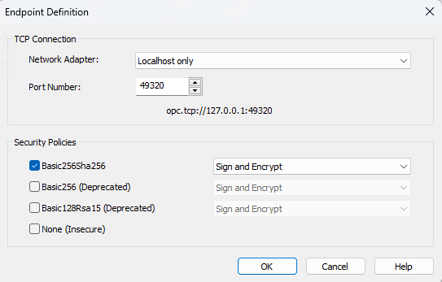
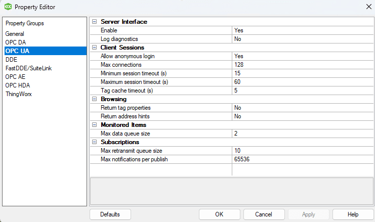
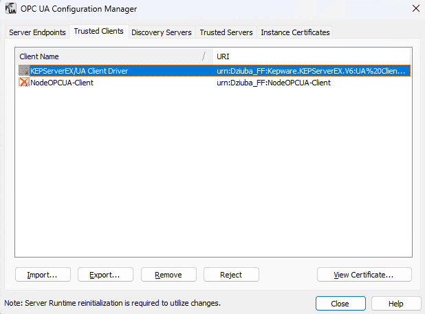
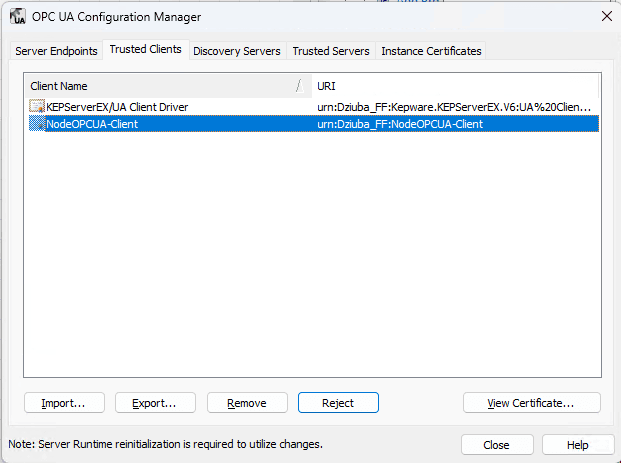
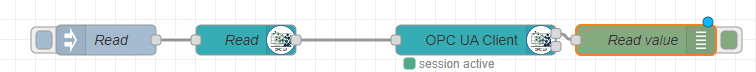
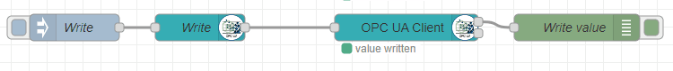

KepserverEX, often referred to as Kepware, is an OPC server that has been the important tool many manufacturing companies have used on their digital transformation journey.  It plays an important role for many to extract data from PLCs, Programmable Logic Controllers, without having to directly interact with them.

<!--more-->

# PTC's KepserverEX

PTC's [KEPServerEX](https://www.ptc.com/en/products/kepware/kepserverex-ppc) is a versatile connectivity platform designed to securely manage, monitor, and control diverse automation devices and software applications. Central to its functionality is the OPC standard, which enables universal communication across industrial hardware and software, facilitating data exchange. This makes KEPServerEX particularly valuable in a variety of use cases, such as real-time data monitoring, machine-to-machine (M2M) communication, and industrial Internet of Things (IIoT) applications. It serves as a critical bridge in the automation and controls engineering space, offering a robust solution for integrating disparate systems, thereby enhancing operational efficiency and enabling data-driven decision-making. Integrating KEPServerEX with Node-RED extends this functionality, by allowing bidirectional communication for sending, storing, and or manipulating data.  

## Scope

The goal of this blog is for a quick start guide on the configuration for collecting data from a KepserverEX OPC server.  We are going to be leveraging the [node-red-contrib-opcua](https://flows.nodered.org/node/node-red-contrib-opcua) node.  We will assume that you already have [KepserverEX](https://www.ptc.com/en/products/kepware/kepserverex-ppc) install and ready for the integration. We will be using Basic256Sha256 security in this guide with anonymous authentication.  Assumptions of the installation include allowing Default configuration of the installation of KepserverEX 6.15 and allowing dynamic tag addressing.

## Configure Connection from Node-RED to Kepserver

### Step 1: KepserverEX

The first thing we need to do is check our **OPC UA Configuration Manager** for the security requirements for our environment.  In the tray at the bottom, click on the KepserverEX symbol and select **OPC UA Configuration**


If your Node-RED instance lives on the same server that your KepserverEX is on, pick accordingly or click add if you need to define by ip address. This is for setting different credential requirements for localhost vs remote host access.  Also note, that if you have multiple network adapters, make sure to select the adapter that is in use. 




We are testing locally on the server, so we will use the one selected for loopback addressing.  We will be leaving the OPC server port as default and select **Basic256Sha256** with **Sign and Encrypt**.

Click **OK**.

### Step 2:  Node-RED

Next, navigate to your Node-RED instance and install the [node-red-contrib-opcua](https://flows.nodered.org/node/node-red-contrib-opcua) node if you haven't already done so.  

Import the flow below into your Node-RED environment. 

<iframe width="100%" height="225px" src="https://flows.nodered.org/flow/04a84fe5b0db7cda9e74ba811e7b0ca5/share?height=250" allow="clipboard-read; clipboard-write" style="border: none;"></iframe>


Next, let's configure the **OPC UA Client**.  Click the **pencil** to add a new OPCUA-Endpoint.


For the endpoint, **copy** the endpoint definition from the KepserverEX OPC UA Configuration Manager.  In our example, it is ```opc.tcp://127.0.0.1:49320```, and paste it into the Endpoint.  For SecurityPolicy select **Basic256Sha256**. For SecurityMode, select **Sign&Encrypt**.  Lastly, we will be selecting **Anonymous**.  Click **Update**, then **Deploy**.  


Trigger the flow by **clicking** on the inject node.  The server may not connect at this time, and it is expected.


### Step 3: KepserverEX

Moving back over to KepserverEX,  Click on the tray again in the bottom of the screen and select **Configuration**, then select **Edit** from the file menu, then **Properties**.  Next, Select **OPC UA** and ensure that **Allow Anonymous login** is set to **Yes**.  Click **OK**.  




Select the tray at the bottom of the screen again, and select **OPC UA Configuration**. Select the **Trusted Clients** tab.




Now select the **NodeOPCUA-Client** and then **click** Trust.  ***If you don't have the client option, trigger the inject node again from the Node-RED flow and check the logs***



### Step 4: Node-RED

Lastly,  Navigate back to Node-RED and **trigger** the inject node.  This node will now browse the project from the KepserverEX and display all of the existing tags.


## Read Tags 

We will be leveraging the default Simulated Examples for reading tags from KepserverEX.  Let's move on to the next set of flows.




Edit the OPCUa-Item node and note the item.

```
ns=2;s=Simulation Examples.Functions.Ramp1
```

Let's break down the syntax,  ns stands for namespace that will coincide with the project.  In this case, it is namespace 2.  Once the namespace has been selected, we are use **Dynamic Addressing** to select the tag through the variable **s**, which stands for string type of NodeId. **Click** Done.  Now let's **trigger** the Read inject node and view the debug output.

The debug node is set to show a complete msg object.  Note the payload as the value of the variable.


## Write Tag

Writing a tag is a similar process.  The only difference is that a variable is set in the **OPCUa-Item** node and the **OPCUa-Client** action is set to Write.

In this example, we created a new variable in KepserverEX under **Simulation Examples > Functions** called myInt of Date Type Long.



View the OPCUa-Item node and note the item.

```
ns=2;s=Simulation Examples.Functions.myInt
```

**Click** Done and **Deploy**

Open up the **Quick Client** within KepserverEX and navigate to the address of **Simulation Examples.Functions** and look for myInt.  It should by default, be 0.  **Trigger** the inject node within Node-RED to see the Value change within the Quick Client.


## Conclusion

This guide was designed to help you easily connect your Node-RED instance to KepserverEX with security.  For more examples of how to do more advanced configuration, please watch the past [webinar](https://flowfuse.com/webinars/2023/getting-started-opcua-node-red/) going over these [examples](https://github.com/mikakaraila/node-red-contrib-opcua/tree/master/examples) in detail.  
