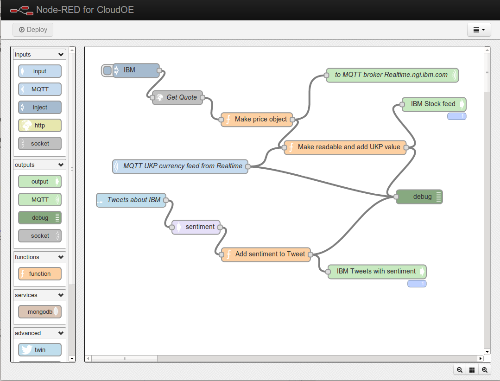
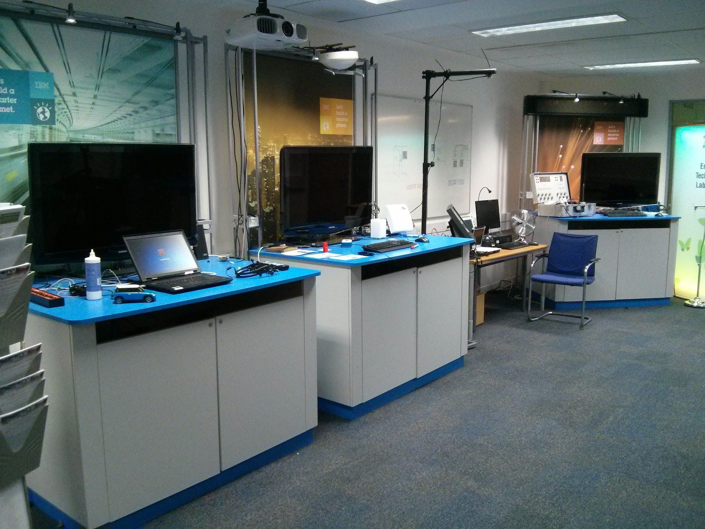
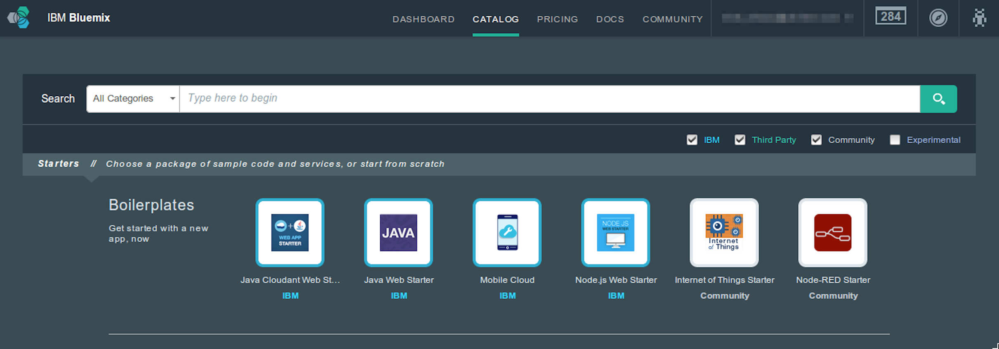

In January 2013, I could have never foreseen that my fun little proof-of-concept project would become Node-RED, an open source low-code environment with millions of deployments in IoT and automation.

<!--more-->

Long before IoT became the ubiquitous term it is today, I was working in IBM’s Emerging Technology Group playing around with capturing data from devices and doing interesting things with it. The team focused on very fast-paced, short, proof-of-concept projects and was afforded time to learn new skills, innovate and work on side projects.

My background working with the MQTT protocol space before it was known outside of IBM led me to a side project: I wanted some way to visualize mapping messages on an MQTT infrastructure to see how they come in on one topic and get sent out on another.

Using it as an excuse to also start playing the relatively new Node.js runtime, I spent a day or two putting together a little demo of an application that would connect to an MQTT broker and visualize the topic mappings in a web browser.

Showing it to my colleague, Dave Conway-Jones, I mentioned it wouldn't take much to make it more interactive; to let you draw the mappings and apply them. He sent me on my way to do just that and, 24 hours later, I had a simple browser-based application that could define and apply mappings between MQTT topics.

It very quickly became useful. 

An early screenshot of Node-RED

The projects Dave and I were working on became rich sources of requirements; each project needing to access data from some other source such as a device plugged into a serial port, or being able to modify the data with a bit of JavaScript code.

I spent a few days redesigning the code to make it easier to write in new nodes, unlocking the ability to quickly add in the function node, change node, and switch node, which became the basic building blocks of the tool.

The utility of the application was clear, and more colleagues started making use of it - all grounded in real client projects. But it was still a tool largely known only to our team.

### Going Open Source

As we considered how best to move the project forward, we essentially had two choices; keep it to ourselves and see if we could get an IBM product group to back turning it into a fully-fledged product, or to go the open source route. In my mind, the OSS route was the natural fit and that is what we ultimately chose to do, getting it published in late 2013.

I demoed Node-RED in late 2013 at a London IoT meetup and word spread among my peers in that community. A week later, I was at an open source hardware conference and attended a workshop on home automation. I was surprised to see Node-RED on everyone’s screens! The facilitator had seen Node-RED and reworked his workshop so that people didn’t have to worry about writing lines of code and were able to do useful things much more quickly.

The IBM Emerging Technology Demo Lab - many of the demos were built on Node-RED

### Building an audience

A key step forward was when IBM was preparing to launch its new IBM Cloud service. In the months before the launch, they were looking for innovative ideas that could help expand the offering. We put forward a proposal to use this tool we'd created as a way to visualise the mapping of web services within the cloud.

This generated some great interest from a wider audience within the company, and whilst that concept didn't ultimately come to anything, we had gotten our project noticed.

Over time, we started seeing Node-RED being picked up by more than just the OSS community. Companies started using it with their own hardware devices and online services.

By this time, IBM Cloud had launched, and from our previous conversations with them, we got Node-RED included as one of the 'starter applications' in the catalogue that gave users a one-click option for getting Node-RED running in the cloud.

Node-RED in the original IBM Cloud catalog

### Moving to a Foundation

As we saw the project grow, discussions were had around the longer-term future of the project. Some companies voiced a concern about it being a single-vendor open source project. This also came at a time when IBM was actively working with the Node.js project to help relaunch the Node Foundation (which has since become the OpenJS Foundation). This culminated in Node-RED joining the foundation as one of its founding projects, alongside other well-established projects such as Node.js itself, jQuery and many others.

Having an independent governance structure around the project gave companies more confidence to get involved, knowing they had an equal voice in its development. Hitachi became big supporters of the project and had a team dedicated to working on it.

For software developers, time spent writing boilerplate code is not time adding value to the application they’re building. With low-code, Node-RED abstracts all that boilerplate so they can focus on the business problem. 

Device manufacturers paid attention when Node-RED was installed on the Raspberry Pi image, with its low-code accessibility attracting a broad range of people from systems engineers building automations to IoT hobbyists.

Now with millions of deployments, Node-RED continues to collect, transform, and integrate data through visualized dashboards. And, as this open source community grows it remains rooted in the two pillars of its low-code user experience, and its extensibility.

