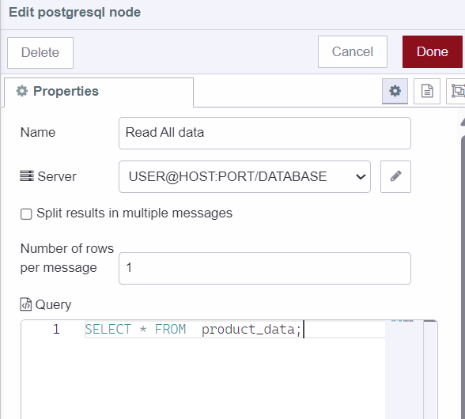
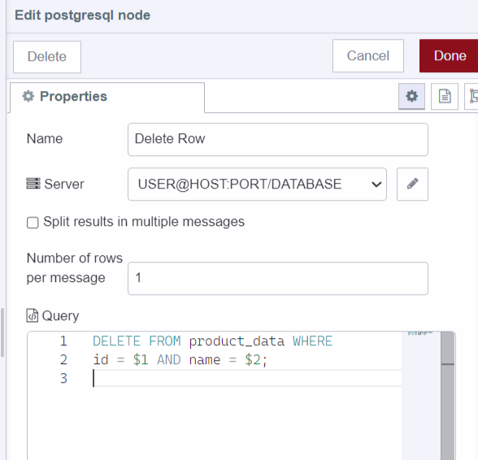
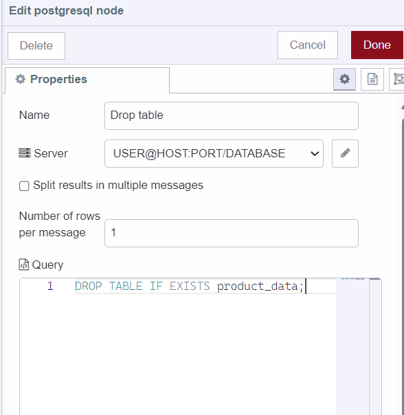
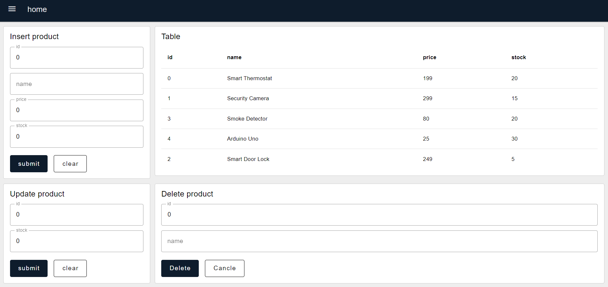

A few months back, we shared a blog on [integrating InfluxDB with Node-RED](https://flowfuse.com/blog/2023/07/connect-node-red-to-influxdb/) to handle time-series data effectively. However, applications typically involve more than just time-series data, they often include various data types that can be efficiently managed with SQL-based databases. In this guide, we will walk you through building a simple inventory management system with Node-RED and PostgreSQL to demonstrate how to integrate PostgreSQL with
Node-RED. 

<!--more-->

# What exactly is Postgresql?

PostgreSQL is an open-source database with a strong reputation for its reliability, flexibility, and support of open technical standards. Unlike other Relational Database Management Systems PostgreSQL supports both non-relational and relational data types. This makes it one of the most compliant, stable, and mature relational databases available today.

## Using PostgreSQL with Node-RED

The first thing we need to do to get things started is to install the Postgresql custom node and gain an understanding of Postgresql configuration details.

1. Install `node-red-contrib-postgresql` by the pallet manager. You can choose other nodes too, but we chose this node because it is part of the [certified node catalogue by FlowFuse](https://flowfuse.com/certified-nodes/) which assures me that the node is robust, secure, and developed with high-quality.
2. Before connecting to your PostgreSQL database, ensure you have the following information ready. Later We will add environment variables to configure the PostgreSQL node to connect with the database:

- Host: IP address or hostname of your PostgreSQL server.
- Port: By default, PostgreSQL uses port 5432. Ensure this matches your PostgreSQL server configuration.
- Database: The name of the PostgreSQL database you want to connect to.
- User: username with the necessary privileges to access the specified database.
- Password: corresponding password for the username.

# Adding environment variables

We have discussed many times in previous blogs that using environment variables is a best practice that prevents revealing confidential configuration details such as API keys, passwords, secret keys, etc directly in the flow. Therefore, In this section, we will add environment variables for Postgresql configuration details, for more details see  [Using Environment Variables in Node-RED](https://flowfuse.com/blog/2023/02/environment-variables-in-node-red/).

1. Navigate to the instance's setting and then go to the environment section.
2. Click on the `add variable` button and add variables for each of the configuration data that we discussed in the above section.
3. Click on the save button and restart the instance by clicking on the top right `Action` button and selecting the restart option.


# Creating Table

In this section, we will create a table in our database to store product data. Additionally, it's important to note that throughout this guide we will send an object containing the properties of configuration details with each request to the database. This approach allows us to use environment variables to secure our sensitive configuration details while connecting to the database.


1. Drag an Inject node onto canvas, and keep it unchanged.
2. Drag the change node onto canvas, and set `msg.pgConfig` properties using the added environment variable as shown in the above image.
3. Drag a Postgresql node onto Canvas, click on that node, and paste the following SQL command into the query input field (I have added comments for your understanding of sql commands)

```sql
-- This is an SQL INSERT statement used to add data into the product_data table.
INSERT INTO product_data (id, name, price, stock)
-- This line specifies the columns into which data will be inserted. The columns are id, name, price, and stock.
-- It's important to match the columns in the same order as the values in the next line.
VALUES ($1, $2, $3, $4);
```

4. Connect the change node’s input to the inject node’s output and the Postgresql node’s input to the change node’s output.


# Installing Dashboard 2.0 

1. Install Dashboard 2.0. Follow these [instructions](https://dashboard.flowfuse.com/getting-started.html) to install.
2. Create your first group, page, theme, and base.

# Inserting Product Data into the Database
In this section, we will add a Form interface that will enable us to obtain product data that we need to insert into the database. Moreover, we will use the Postgresql node to interact with the database.


1. Drag a Ui-Form widget onto the canvas and select the created group.
2. Add an element for all required input data in the form widget and give it a name, label, and select type, I have selected 'number' as a type for 'product id', 'price', and 'stock', and 'text' for 'name', but feel free to adjust according to your preference and data requirements.
3. Drag a change node onto canvas and follow the same steps to set `pgConfig` object properties or you can simply copy and paste that node onto canvas.
4. Drag the function node onto Canvas and paste the following script.

```javascript
// Destructure the properties from msg.payload (obtained data by using form)
const { id, name, price, stock } = msg.payload;
// Create an array containing id, name, price, and stock
// The order of the array items in msg.params will correspond to the placeholders in the SQL query
// For example, $1 will be replaced by the value of id, $2 will be replaced by the value of name, and so on
msg.params = [id, name, price, stock];
return msg;
```

5. Drag a Postgresql node onto the Canvas and click on that node and paste the following SQL command into the query input field

```sql
-- This is an SQL INSERT statement used to add data into the product_data table.
INSERT INTO product_data (id, name, price, stock)
-- This line specifies the columns into which data will be inserted. The columns are id, name, price, and stock.
-- It's important to match the columns in the same order as the values in the next line.
VALUES ($1, $2, $3, $4);
```
6. Connect ui-form’s output to change node’s input, change node’s output to function node’s input, and function node's output to the PostgreSQL node’s input.


# Displaying product data on Dashboard 2.0
In this section, we will retrieve all data from our database table and display it on Dashboard 2.0 using the Ui-table widget.

1. Drag an Inject node onto canvas.
2. Drag and change node to canvas and follow the same steps to set configuration object's property which we have discussed in the above sections.
3. Drag a Postgresql node onto canvas and paste the below SQL command into the query input field. 
4. Drag a Ui-table widget onto canvas and create a new Ui group for it.
5. Connect ui-form’s output to change node’s input, change node’s output to function node’s input, and function node's output to the PostgreSQL node’s input.
```sql
-- Retrieve all data from the product_data table
SELECT * FROM product_data;
```


# Updating product data to the Database


In this section, we will add a form interface to collect the product ID and the new stock value for the update process. Feel free to select other data fields that you need to update. To achieve this, we will add a form interface using Dashboard 2.0. Additionally, we will interact with the database using the same PostgreSQL node that we have used so far in this guide.

1. Drag a Ui-Form widget onto the canvas and create a new UI group for it.
2. Add elements for product id and stock in the form widget and give it a name, label, and select type.
3. Drag the change node onto canvas and set `msg.pgConfig` properties using the added environment variable as we discussed in the above section.
4. Drag a function node onto Canvas and paste the following script.

```javascript 
// Destructure the properties from msg.payload
const { id, stock } = msg.payload;
// Create an array containing id and stock
// The order of the array items in msg.params will correspond to the placeholders in the SQL query
// For example, $1 will be replaced by the value of id, $2 will be replaced by the value of stock
msg.params = [id, stock];
return msg;
```
5. Drag a Postgresql node on canvas click on that node and paste the following SQL command into the query input field.

```sql 
-- UPDATE statement to modify data in the product_data table

UPDATE product_data 
-- Specifies the table to be updated (product_data)

SET 
    stock =  $2
-- Sets the value of the "stock" column to the value represented by the parameter $2.
-- The value to be set is typically provided externally, In our context we getting this parameter by "msg.params"

WHERE id = $1;
-- Specifies the condition that must be met for the update to occur.
-- In this case, it updates rows where the "id" column matches the value represented by the parameter $1.
```

6. Connect ui-form’s output to change node’s input, change node’s output to function node’s input, and function node's output to the PostgreSQL node’s input.


# Deleting product data from the database


In this section, we'll cover how to delete product data from the database. To facilitate this process, we will use Dashboard 2.0's form interface, which collects essential information like the product id and name. While the product id alone is sufficient to delete a product from the database, we include the product name as an additional precaution to prevent accidental deletion of product data.

1. Drag a Ui-Form widget onto the canvas and create a new UI group for it.
2. Add elements for product id and name in the form widget and give it a name, label, and select type.
3. Drag the change node onto canvas and follow the same steps to set `msg.pgConfig` properties using the added environment variable as discuessed in above sections.
4. Drag a function node onto Canvas and paste the following script.

```javascript 
// Destructure the properties from msg.payload
const { id, name } = msg.payload;
// Create an array containing id and name
// The order of the array items in msg.params will correspond to the placeholders in the SQL query
// For example, $1 will be replaced by the value of id, $2 will be replaced by the value of name
msg.params = [id, name ];
return msg;
```
5. Drag a Postgresql node on canvas click on that node and paste the following SQL command into the query input field.

```sql 
-- Deletes rows from the "product_data" table where both "id" and "name" match the given parameters
DELETE FROM product_data 
-- Specifies the conditions for deletion
WHERE id = $1 AND name = $2;
```

6. Connect ui-form’s output to change node’s input, change node’s output to function node’s input, and function node's output to PostgreSQL node’s input.



# Dropping Table
In this final section, we will understand how to drop ( delete ) tables from the database.

1. Drag an Inject node onto the canvas.
2. Drag a change node onto canvas and set `msg.pgConfig` object’s property as we discussed above.
3. Drag a Postgresql node onto canvas and paste the following SQL command into the query input field.

```sql 
-- SQL command to drop the product_data table
DROP TABLE product_data;
```



# Deploying Flow


Our Inventory Management System is now complete and ready for deployment. To initiate the deployment process, locate the red deploy button positioned in the top right corner. Begin by creating a table using the insert node button. For product data insertion, updates, and deletions, navigate to https://<your-instance-name>.flowfuse.cloud/dashboard.



# Conclusion 
This guide has demonstrated the integration of PostgreSQL with Node-RED. Throughout this article we've built an inventory management system with data stored in a database. You've learned to create and drop tables, and performing operations like inserting, updating, and deleting data. Also, we have highlighted best practices such as utilizing environment variables and selecting certified nodes to ensure security.
