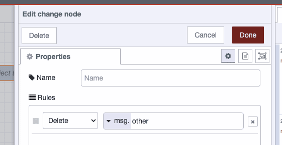

It's quite straightforward to pass plenty of useful data with each message (msg) in your flows. Not only can you store information in msg.payload, but you can also place information in any other named object, for instance, msg.store.

<!--more-->

In this article, we will explore some of the better solutions for storing and retrieving transactional information in your flows.

#### Storing data outside of msg.payload

In this example, we have data in msg.payload as well as in msg.later.

If you want your debug to display the full content of the message, change the output to 'complete message object' as shown above.

You can import the flow using this code.


[{"id":"aaa1e17e5f158004","type":"inject","z":"67746003c844dbc4","name":"Inject the message","props":[{"p":"payload"},{"p":"later","v":"A string I want to be able to use later in my flow","vt":"str"}],"repeat":"","crontab":"","once":false,"onceDelay":0.1,"topic":"","payload":"Hello World","payloadType":"str","x":690,"y":140,"wires":[["bce1bf09736125b7"]]},{"id":"bce1bf09736125b7","type":"debug","z":"67746003c844dbc4","name":"debug 1","active":true,"tosidebar":true,"console":false,"tostatus":false,"complete":"true","targetType":"full","statusVal":"","statusType":"auto","x":880,"y":140,"wires":[]}]


Storing data outside of msg.payload can be very useful when you need access to that data later in your flow. You may notice that many nodes overwrite the content of msg.payload, so putting your data elsewhere is essential otherwise, it will be overwritten and lost.

#### Tidying your messages

You may also want to remove data you don't need from your messages to optimize the speed of your flows.

It's easy enough to remove data you don't need, wherever it sits within your messages using the Change Node. In this example, we are going to delete the content of msg.other while leaving the rest of the message to be passed to the next Node.

The Change Node is configured as follows.

You can import the flow using this code.


[{"id":"1ac51e71153f7c1f","type":"inject","z":"67746003c844dbc4","name":"Inject the message","props":[{"p":"payload"},{"p":"other","v":"We don't need this string anymore","vt":"str"}],"repeat":"","crontab":"","once":false,"onceDelay":0.1,"topic":"","payload":"Hello World","payloadType":"str","x":530,"y":100,"wires":[["5d3a978ad9eab443","cd7609101328caa2"]]},{"id":"5d3a978ad9eab443","type":"debug","z":"67746003c844dbc4","name":"debug 2","active":true,"tosidebar":true,"console":false,"tostatus":false,"complete":"true","targetType":"full","statusVal":"","statusType":"auto","x":700,"y":60,"wires":[]},{"id":"cd7609101328caa2","type":"change","z":"67746003c844dbc4","name":"","rules":[{"t":"delete","p":"other","pt":"msg"}],"action":"","property":"","from":"","to":"","reg":false,"x":730,"y":100,"wires":[["be2f7f68dee570be"]]},{"id":"be2f7f68dee570be","type":"debug","z":"67746003c844dbc4","name":"debug 3","active":true,"tosidebar":true,"console":false,"tostatus":false,"complete":"true","targetType":"full","statusVal":"","statusType":"auto","x":900,"y":100,"wires":[]}]


#### Storing data outside of msg.payload so you can access it later in your flows

Storing data outside of msg.payload allows you to access it later in your flows. In this example, we inject geographical coordinates and use an API to get the sunset time for each location. We can then output the result as a sentence.

As the HTTP Node, which we are using to interact with the weather API, overwrites msg.payload with the response, we will store the submitted city name and coordinates in msg.store for later use.

You can see the flow working below.

You can import the flow using this code.


[{"id":"809cc8f4678767b7","type":"inject","z":"67746003c844dbc4","name":"London","props":[{"p":"payload.city","v":"London","vt":"str"},{"p":"payload.lat","v":"51.5072","vt":"str"},{"p":"payload.lng","v":"0.1276","vt":"str"}],"repeat":"","crontab":"","once":false,"onceDelay":0.1,"topic":"","x":170,"y":80,"wires":[["6b5a6a2ef7a64f1a"]]},{"id":"b86d2d558eebbd7e","type":"inject","z":"67746003c844dbc4","name":"Washington DC","props":[{"p":"payload.city","v":"Washington DC","vt":"str"},{"p":"payload.lat","v":"38.9072","vt":"str"},{"p":"payload.lng","v":"77.0369","vt":"str"}],"repeat":"","crontab":"","once":false,"onceDelay":0.1,"topic":"","x":140,"y":160,"wires":[["6b5a6a2ef7a64f1a"]]},{"id":"aaecc81a2de233d6","type":"debug","z":"67746003c844dbc4","name":"debug 4","active":true,"tosidebar":true,"console":false,"tostatus":false,"complete":"false","statusVal":"","statusType":"auto","x":820,"y":160,"wires":[]},{"id":"6b5a6a2ef7a64f1a","type":"change","z":"67746003c844dbc4","name":"","rules":[{"t":"set","p":"store","pt":"msg","to":"payload","tot":"msg"}],"action":"","property":"","from":"","to":"","reg":false,"x":320,"y":120,"wires":[["273ee743f8d1a5f1","af43cea5866e11f5"]]},{"id":"273ee743f8d1a5f1","type":"template","z":"67746003c844dbc4","name":"create the URL","field":"url","fieldType":"msg","format":"handlebars","syntax":"mustache","template":"https://api.sunrisesunset.io/json?lat={{store.lat}}&lng={{store.lng}}","output":"str","x":500,"y":120,"wires":[["52e8913233f379eb","1d94053c790791ee"]]},{"id":"af43cea5866e11f5","type":"debug","z":"67746003c844dbc4","name":"debug 5","active":true,"tosidebar":true,"console":false,"tostatus":false,"complete":"true","targetType":"full","statusVal":"","statusType":"auto","x":480,"y":160,"wires":[]},{"id":"52e8913233f379eb","type":"http request","z":"67746003c844dbc4","name":"","method":"GET","ret":"obj","paytoqs":"ignore","url":"","tls":"","persist":false,"proxy":"","insecureHTTPParser":false,"authType":"","senderr":false,"headers":[],"x":670,"y":120,"wires":[["aaecc81a2de233d6","a245b322ade3a7e9"]]},{"id":"1d94053c790791ee","type":"debug","z":"67746003c844dbc4","name":"debug 6","active":true,"tosidebar":true,"console":false,"tostatus":false,"complete":"true","targetType":"full","statusVal":"","statusType":"auto","x":660,"y":80,"wires":[]},{"id":"a245b322ade3a7e9","type":"template","z":"67746003c844dbc4","name":"Create the sentence","field":"payload","fieldType":"msg","format":"handlebars","syntax":"mustache","template":"The sun will set at {{payload.results.sunset}} in {{store.city}}.","output":"str","x":860,"y":120,"wires":[["3e4b2d3644845f91"]]},{"id":"3e4b2d3644845f91","type":"debug","z":"67746003c844dbc4","name":"debug 7","active":true,"tosidebar":true,"console":false,"tostatus":false,"complete":"false","statusVal":"","statusType":"auto","x":1040,"y":120,"wires":[]}]


Using this technique, we can build the content of message.store (or any other name you'd like to use) and then output the content at the end of a flow, even if you use msg.payload to interact with APIs and other custom nodes.

#### Why not store the values in context?

Where possible, it's more robust to store all the information related to a particular message within the message rather than saving it to context and retrieving it later. Using context risks a [race condition](https://en.wikipedia.org/wiki/Race_condition#:~:text=A%20race%20condition%20or%20race,to%20unexpected%20or%20inconsistent%20results) within your flow that could result in data corruption.

In this example, we simulate how a race condition can make context a bad choice for transactional data storage. The flow passes in the name and age of two people then moves the age to context. The flow then adds a random delay for each message so that, in some cases, the messages do not reach the debug in the order they were created. After the delay, the age is pulled back from context and added to each msg.payload.

If there is a race condition in play, we should intermittently see Rob and John's stored ages being assigned to the wrong person. We can see in the image above that Rob is showing the incorrect age.

You can import the flow using this code.


[{"id":"7ac4e7165d99f041","type":"inject","z":"67746003c844dbc4","name":"Rob","props":[{"p":"payload.name","v":"Rob","vt":"str"},{"p":"payload.age","v":"46","vt":"str"}],"repeat":"2","crontab":"","once":false,"onceDelay":0.1,"topic":"","x":570,"y":840,"wires":[["1e0575bd662f9277"]]},{"id":"e9c0baba4f50b0b2","type":"inject","z":"67746003c844dbc4","name":"John","props":[{"p":"payload.name","v":"John","vt":"str"},{"p":"payload.age","v":"29","vt":"str"}],"repeat":"2","crontab":"","once":false,"onceDelay":0.1,"topic":"","x":570,"y":880,"wires":[["1e0575bd662f9277"]]},{"id":"d5f688682206d316","type":"change","z":"67746003c844dbc4","name":"","rules":[{"t":"set","p":"age","pt":"flow","to":"payload.age","tot":"msg"}],"action":"","property":"","from":"","to":"","reg":false,"x":850,"y":860,"wires":[["d56225e59bde93cf"]]},{"id":"d56225e59bde93cf","type":"change","z":"67746003c844dbc4","name":"","rules":[{"t":"delete","p":"payload.age","pt":"msg"}],"action":"","property":"","from":"","to":"","reg":false,"x":1050,"y":860,"wires":[["d5a119b311bf8377"]]},{"id":"e3ec11b4e038e564","type":"debug","z":"67746003c844dbc4","name":"debug 8","active":true,"tosidebar":true,"console":false,"tostatus":false,"complete":"false","statusVal":"","statusType":"auto","x":1080,"y":940,"wires":[]},{"id":"d5a119b311bf8377","type":"delay","z":"67746003c844dbc4","name":"","pauseType":"random","timeout":"5","timeoutUnits":"seconds","rate":"1","nbRateUnits":"1","rateUnits":"second","randomFirst":"0","randomLast":"5","randomUnits":"seconds","drop":false,"allowrate":false,"outputs":1,"x":720,"y":940,"wires":[["b329d7f2685d0ed6"]]},{"id":"b329d7f2685d0ed6","type":"change","z":"67746003c844dbc4","name":"","rules":[{"t":"set","p":"payload.age","pt":"msg","to":"age","tot":"flow"}],"action":"","property":"","from":"","to":"","reg":false,"x":900,"y":940,"wires":[["e3ec11b4e038e564"]]},{"id":"1e0575bd662f9277","type":"delay","z":"67746003c844dbc4","name":"","pauseType":"random","timeout":"5","timeoutUnits":"seconds","rate":"1","nbRateUnits":"1","rateUnits":"second","randomFirst":"0","randomLast":"1","randomUnits":"seconds","drop":false,"allowrate":false,"outputs":1,"x":700,"y":860,"wires":[["d5f688682206d316"]]}]


#### Conclusion

Storing transactional data in msg rather than context in Node-RED offers advantages in modularity, scalability, simplicity, and also helps prevent race conditions. By using msg, data transfer between nodes becomes more seamless, allowing for independent node reuse across flows without additional configuration. This approach ensures scalability by avoiding the imposition of large datasets on the global context. Moreover, storing data outside of msg.payload within the msg object enhances flexibility. It separates metadata and other relevant information from the main payload, promoting a cleaner and more organized structure. This practice not only aligns with Node-RED's visual programming paradigm but also improves code readability. Steering clear of context for transactional data, while also organizing it within the msg object, provides a comprehensive and reliable solution within the Node-RED framework.

Thanks to [SunriseSunset](https://sunrisesunset.io/) for creating the useful API we've used in this article.
