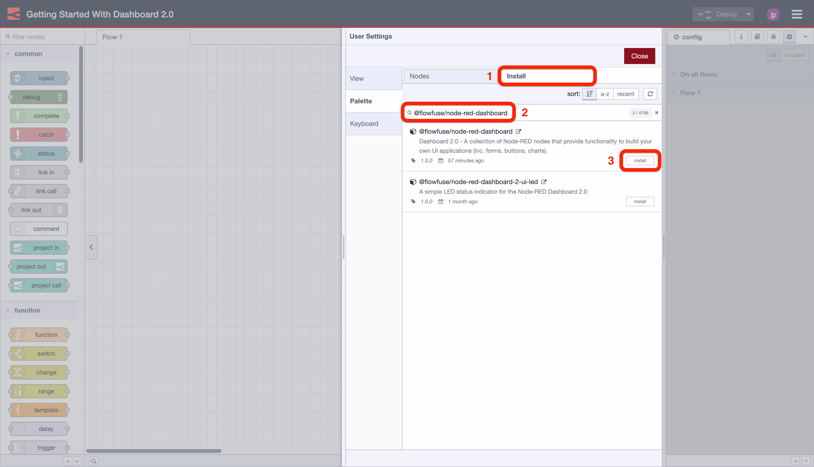
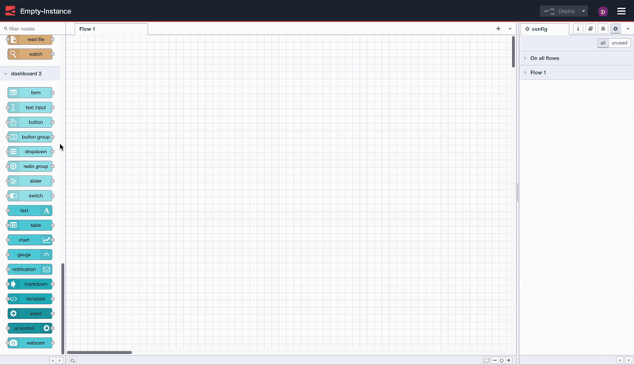
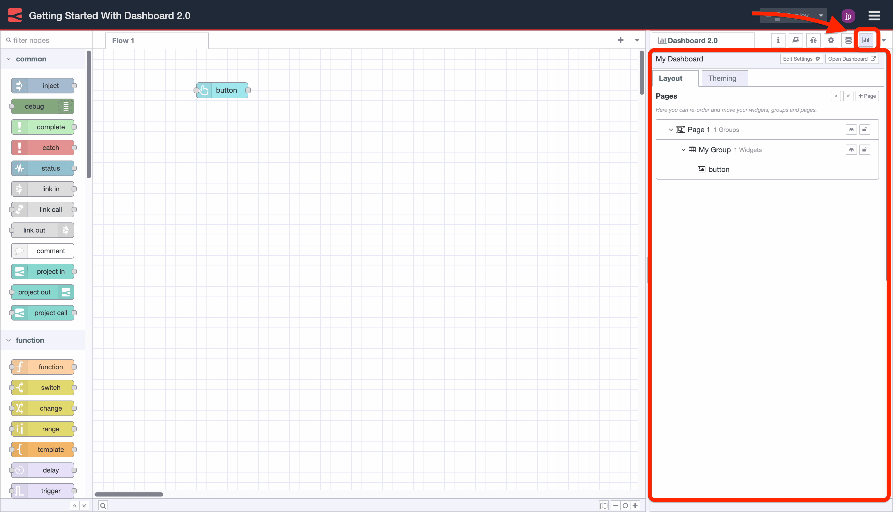
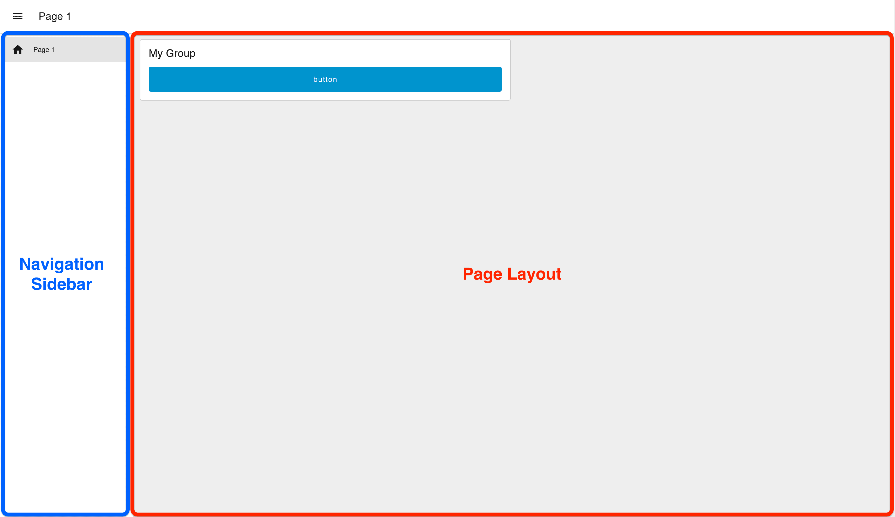
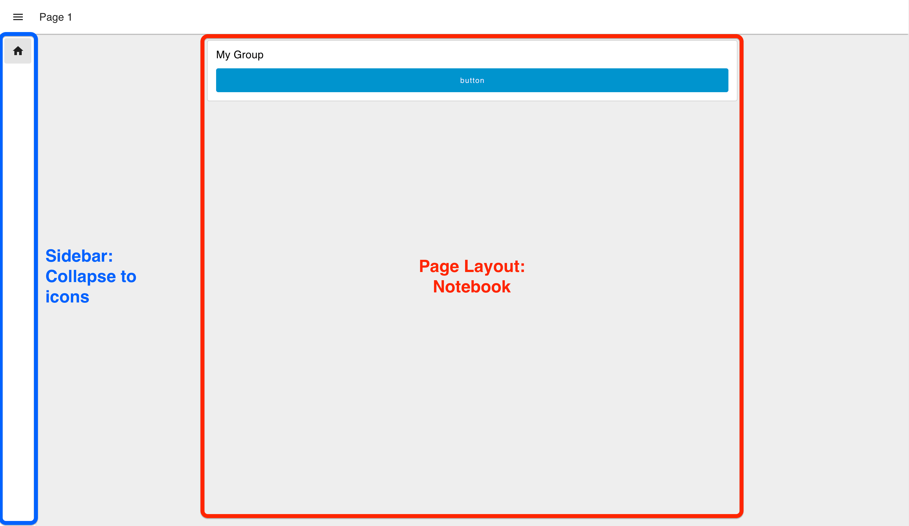
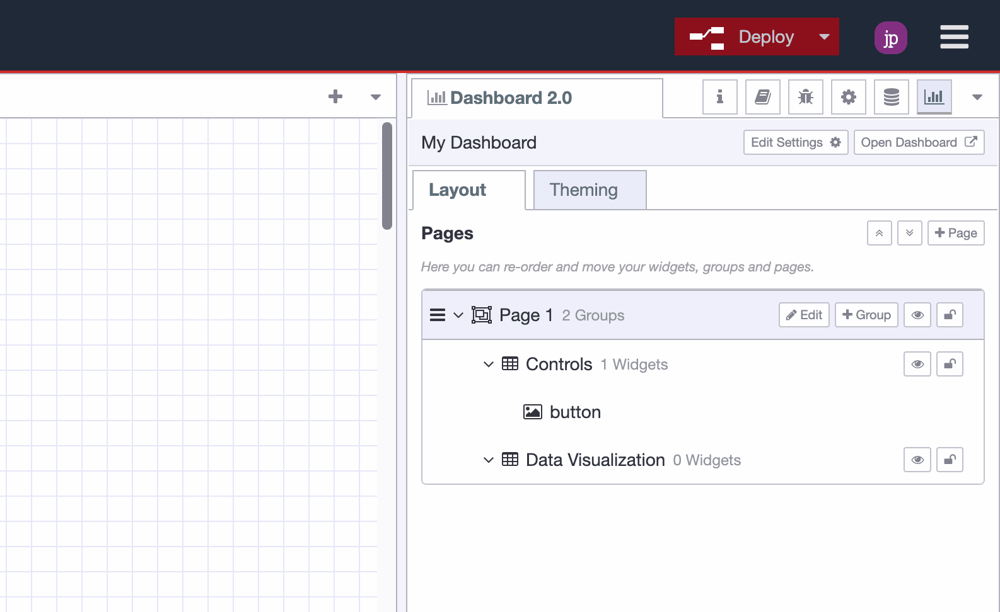
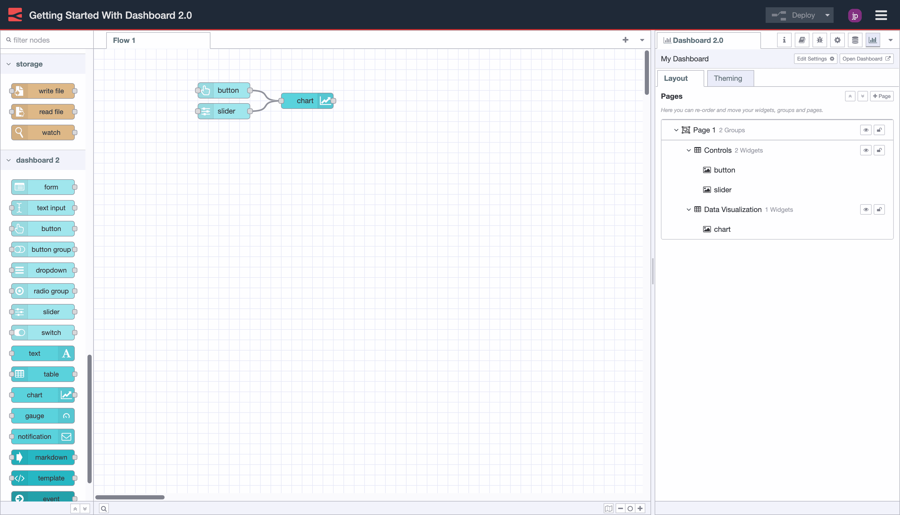
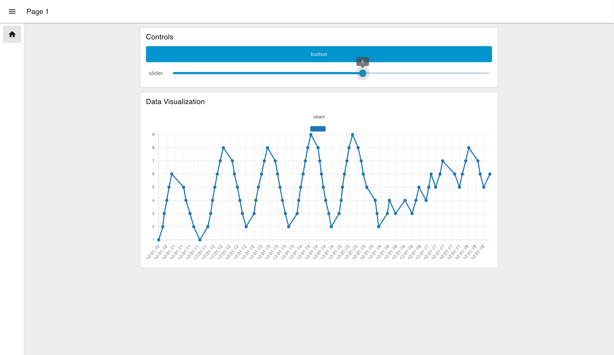

With our latest release of Node-RED Dashboard 2.0, we've made some big improvements to the onboarding experience.

We're seeing over 2,000 people download Dashboard 2.0 per week, and are seeing a great buzz in the community of brand new Node-RED users, experienced Node-RED users that haven't explored a UI solution previously and existing users migrating from Dashboard 1.0.

So, with that in mind, we wanted to offer a new "Getting Started" guide that will help you get up and running with building custom user interfaces and data visualizations in Node-RED.

<!--more-->

## How to Install Node-RED Dashboard 2.0

### Step 1: "Manage Palette"

{data-zoomable}
<figcaption>Screenshot to show where to find the "Manage Palette" option in Node-RED</figcaption>

1. Click the Node-RED Settings (top-right)
2. Click "Manage Palette"

### Step 2: Search & "Install"

{data-zoomable}
<figcaption>Screenshot to show where to find the "Install" tab, and how to find @flowfuse/node-red-dashboard</figcaption>

1. Switch to the "Install" tab
2. Search for _"@flowfuse/node-red-dashboard"_
3. Click "Install"

## Adding your first widgets

With the nodes installed, getting started is as easy as choosing a node from the Palette (the left-hand side list of nodes) in Node-RED, and dropping it onto your canvas.

{data-zoomable}
<figcaption>Screen recording to show how easy it is to deploy your first Dashboard 2.0 application.</figcaption>

In this case, we drop in a `ui-button`, click "Deploy" and then can see the button running live in our user interface.

Notice too that Dashboard will automatically setup some underlying configurations for you (visible in the right-side menu):

- `ui-base`: Each instance of Node-RED that uses Dashboard 2.0 must have a single `ui-base` element (we're hoping to add support for multiple in the future). This element contains all of the global settings for your Dashboard instance.
- `ui-page`: A single Dashboard (`ui-base`) can consist of multiple pages, and can be navigated to using the left-side sidebar. Each page is then responsible for displaying a collection of `ui-group` elements.
- `ui-group`: Each group contains a collection of widgets, and can be used to organize your Dashboard into logical sections.
- `ui-theme`: Each `ui-page` can be assigned a given theme. Your "Themes" provide control over the aesthetic of your Dashboard like color, padding and margins.

## Configuring your layout

Dashboard 2.0 adds a dedicated sidebar to Node-RED to provide a centralized view of your pages, groups and widgets. From here you can add new pages and groups, modify existing settings, and re-order content to your liking.

{data-zoomable}
<figcaption>Screenshot showing the Dashboard 2.0 sidebar in the Node-RED Editor.</figcaption>

When defining your layout options, we break the choice into two sections:

- **Page Layout:** Controls how the `ui-groups`'s are presented on a given page in your application.
- **Navigation Sidebar:** Defines the left-side navigation style, defined at the `ui-base` level.

{data-zoomable}
<figcaption>Example of the "Grid" page layout, with "Collapsing" sidebar navigation.</figcaption>

### Page Layout

Currently, we have three different options for page layout:

- **Grid:** ([docs](https://dashboard.flowfuse.com/layouts/types/grid.html)) This is the default layout for a page, and uses a 12-column grid system to layout your `ui-groups`. Widths of groups and widgets define the number of columns they will render in. So, a "width" of 6" would render to 50% of the screen. Grid layouts are entirely responsive, and will adjust to the size of the screen.
- **Fixed:** ([docs](https://dashboard.flowfuse.com/layouts/types/fixed.html)) Each component will render at a _fixed_ width, no matter what the screen size is. The "width" property is converted a fixed pixel value (multiples of 48px by default).
- **Notebook:** ([docs](https://dashboard.flowfuse.com/layouts/types/notebook.html)) This layout will stretch to 100% width, up to a maximum width of 1024px, and will centrally align. It's particularly useful for storytelling (e.g. articles/blogs) or analysis type user interfaces (e.g. Jupyter Notebooks), where you want the user to digest content in a particular order through scrolling.

### Navigation Sidebar

Dashboard 2.0 offers various options on the appearance of the navigation sidebar:

- **Collapsing:** When the sidebar is opened the page content will adjust with the width of the sidebar.
- **Fixed:** The full sidebar will always be visible, and the page content will adjust to the width of the sidebar.
- **Collapse to Icons:** When minimized, users can still navigate between pages by clicking on the icons representing each page in the sidebar.
- **Appear over Content:** When the sidebar is opened, the page is given an overlay, and the sidebar sits on top.
- **Always Hide:** The sidebar will never show, and navigation between pages can instead be driven by [`ui-control`](https://dashboard.flowfuse.com/nodes/widgets/ui-control.html).

### Define Your Layout

In our example, we're going to switch to a "Notebook" layout, with a "Collapse to Icons" sidebar:

{data-zoomable}
<figcaption>Example of the "Notebook" layout, with "Collapse to Icons" sidebar navigation.</figcaption>

## Adding More Widgets

Now, we're going to build a quick example to demonstrate how we can wire nodes together, and visualize the output from a `ui-slider` onto a `ui-chart`.

### Adding a Group

In the Node-RED Editor's Dashboard 2.0 sidebar, we're going to then do the following things:

1. Edit "My Group" and rename it to "Controls"
2. Create a new "Group" in your existing page called "Data Visualization"

You'll now see the two groups listed under "Page 1". "Controls" with a single `ui-button` and "Data Visualization" with no widgets.

{data-zoomable}
<figcaption>Screenshot of the modified and newly added groups</figcaption>

### Connecting New Nodes

Then, we're going to add two new widgets:

 - UI Chart
 - UI Slider

Which we can do by dropping them from the left-side Palette and onto our canvas.

We'll need to double-click each new node and confirm which "Group" we want to add this node to. In this case, we'll add the `ui-slider` to the "Controls" group, and the `ui-chart` to the "Data Visualization" group.

We're also going to connect the output from both the `ui-slider` and `ui-button` to the input of the `ui-chart`:

{data-zoomable}
<figcaption>Screenshot of the Node-RED Editor, showing the ui-slider and ui-button connected to our ui-chart</figcaption>

Now, when we view our Dashboard, we can see the `ui-slider` output is def straight into our `ui-chart`:

{data-zoomable}
<figcaption>Screenshot of the Dashboard with all three widgets rendered</figcaption>

The final step we're going to make is to modify our `ui-button`. We're going to rename it to "Clear", and configure it's "Payload" option to send a JSON payload of `[]`, which, when sent to the `ui-chart` will clear the chart of all data.

{data-zoomable}
<figcaption>The ui-button configuration after setting it's payload and label</figcaption>

With all of this together, we have the following functional Dashboard:

{data-zoomable}
<figcaption>Short animation showing the final functional dashboard.</figcaption>

## Next Steps

Whilst this is just a simple introduction of Node-RED Dashboard 2.0, we do have many other articles and documentation that can help you get started with more advanced features. 

- [FlowFuse Dashboard Articles](/blog/dashboard/) - Collection of examples and guides written by FlowFuse.
- [Node-RED Dashboard 2.0 Documentation](https://dashboard.flowfuse.com) - Detailed information for each of the nodes available in Dashboard 2.0, as well as useful guides on building custom nodes and widgets of your own.
- [Node-RED Forums - Dashboard 2.0](https://discourse.nodered.org/tag/dashboard-2) -  The Node-RED forums is a great place to ask questions, share your projects and get help from the community.
- [Beginner Guide to a Professional Node-RED](/ebooks/beginner-guide-to-a-professional-nodered/) - A free guide to an enterprise-ready Node-RED. Learn all about Node-RED history, securing your flows and dashboard data visualization.
- [FlowFuse - Book a Demo](/contact-us) - FlowFuse provides a complete platform to scale your production Node-RED applications, increase developer velocity, and enhance security in order to accelerate innovation.

## Follow our Progress

New features and improvements are coming to Node-RED Dashboard 2.0 every week, if you're interested in what we have lined up, or want to contribute yourself, then you can track the work we have lined up on our GitHub Projects:

- [Dashboard 2.0 Activity Tracker](https://github.com/orgs/FlowFuse/projects/15/views/1)
- [Dashboard 2.0 Planning Board](https://github.com/orgs/FlowFuse/projects/15/views/4)
- [Dashboard 1.0 Feature Parity Tracker](https://github.com/orgs/FlowFuse/projects/15/views/5)

 If you have any feature requests, bugs/complaints or general feedback, please do reach out, and raise issues on our relevant [GitHub repository](https://github.com/FlowFuse/node-red-dashboard).