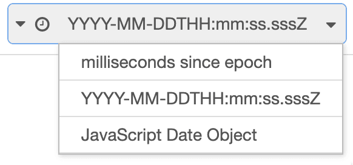

With Node-RED 4.0 coming soon, I wanted to take a look at what users can expect to see with the new release,
as well as some of the new features we're working on.

<!--more-->

The Node-RED project [schedules its releases](https://nodered.org/about/releases/) around a yearly major release that coincides with when a Node.js version
reaches its end-of-support. This lets us drop support for that node.js version and update the default version of node used
in the docker containers we publish. We treat this as a major change because  it might require actions on the end-users part to update any additional modules they have installed.

With Node-RED 4.0, we will be dropping support for anything earlier than Node 18 - with Node 20 the currently recommended version to use. That will give users almost 2 full years before needing to consider another Node.js upgrade.

Now, talking about Node.js versions is not that exciting. What is more exciting is to look at what new features are coming to Node-RED.

There are a few things already merged and ready to be released in the first beta release, and more landing each week.

### More auto-complete

Node-RED already has simple auto-complete on `msg` fields in the editor. We've now extended that to also work with `flow`/`global` context inputs as well as the `env` type for accessing environment variables.

This makes is so much easier to work with these types of properties - being sure you're using something that exists rather than having to switch between different views in the editor to get the names right.

In the case of env vars, it also shows you where the value was set - useful when you have nested groups and subflows which might be overriding a particular value.

The `msg` auto-complete is still based on a built-in list of common message properties used by the core nodes. There is interest in enabling this to pull completions from 'live' messages seen by the node in question - but that's not currently in the plan for 4.0.

### Timestamp formatting

The Inject node has provided the ability to inject a timestamp since the very early days of Node-RED. The value it actually sets is the number of milliseconds since epoch (aka January 1st, 1970). If you're used to working with JavaScript, then this is a perfectly normal way to pass times around. However it isn't always what is needed and flows end up using a Function node to reformat it in some way.

With 4.0 we've added options to pick what format the timestamp is generated in at the start. Now, formatting times and dates can be a big can of worms of options. So for this initial release, we've kept it simple by offering three options:

 - *milliseconds since ecoch* - the existing option, just more explicitly labelled for what it is
 - *YYYY-MM-DDTHH:mm:ss.sssZ* - also known as ISO 8601
 - *JavaScript Date Object* - the standard Date object

There is scope to allow custom format strings to be set in the node - but we'll see what the feedback is on these new options first.

### A better CSV node

The CSV node has had a big overhaul to make it more standards compliant. It turns out CSV has a whole bunch of tricky edge cases that most users don't hit - but if you did hit them you would be stuck.

The new node follows the [RFC4180](https://www.ietf.org/rfc/rfc4180.txt) standard and is also faster - wins all around.

For those flows that rely on some of the non-standard edge case behaviour of the existing node, we've kept a legacy mode in place to keep those flows working.

### Customising config nodes in Subflows

This one needs a bit of explaining. Subflows are a way Node-RED lets you create a flow and add multiple resuable instances of it within your flows. For example, a subflow may connect to an MQTT broker and do some standard processing on the messages it received before sending them on. The Subflow can then expose a set of properties that can be customised for each instance. In our example, that could be the topic the MQTT node subscribes to.

However, in that example, the MQTT node's broker configuration would be locked to the same broker config node in every instance - and that's something we're solving in Node-RED 4.0.

We're making it possible to expose the choice of a configuration node in the Subflow properties - so each instance can be customised even further.

Another common use for this will be with Node-RED Dashboard - which uses config nodes to set the location of a widget. With Node-RED today, you cannot really use dashboard nodes inside subflows as you end up with multiple copies of the widgets all packed into the same group. With this update, you'll be able to configure the subflow instance with exactly what dashboard group to place its contents into.

### Updated JSONata

The JSONata library is used to provide the `expression` types in Node-RED - a really powerful way of working with JSON objects. With this release we've updated to the new major release of JSONata that comes with a bunch of performance improvements.

### And many more minor changes

I'll hold off listing them all out here, but there are plenty of other smaller changes scattered through the editor and the core nodes. Be sure to check the beta release notes when it arrives to see what else has been done.

## Looking further ahead

Whilst all of these are great incremental improvements to Node-RED, there are some bigger items we're looking at that will really improve the overall Node-RED experience.

I wrote recently about improving how users can [test their flows](/blog/2024/02/software-development-in-node-red/#testing). This remains something I think we really help make Node-RED stand apart from other low-code solutions. It's won't be in the imminent 4.0 release, but it is definitely still on the roadmap for a future release.

Another area we want to improve is the collaboration experience within Node-RED. Working on flows as a team is a key feature of FlowFuse, and we want to make it even easier to do.

One of the common complaints is how Node-RED currently handles multiple users editing flows at the same time. Whilst its better than it used to be, it still makes for a very jarring experience when you have to keep merging other users' changes into your own.

Our goal is to make collaboration is simple and natural as possible.

There are a wide range of approaches we could take here. For example, a small improvement would be to merge other users' changes in the background without interrupting what you're doing. But I think we do better than that.

What if the editing experience was more like Google Docs - knowing that other users have the editor open, and being able to see their changes in real time. This would make for a truely collaborative editing experience.

There are some difficult problems to solve before we can get there, but I think this will be one of the more transformational changes to Node-RED we've had for some time.

## Beta releases

The [release plan](https://nodered.org/about/releases/) has Node-RED 4.0 coming around the end of April. As mentioned, we'll be doing a series of beta releases between now and then to start getting early feedback from the community.

Keep an eye on the [community forum](https://discourse.nodered.org/c/news/9) for release announcements as they come.

