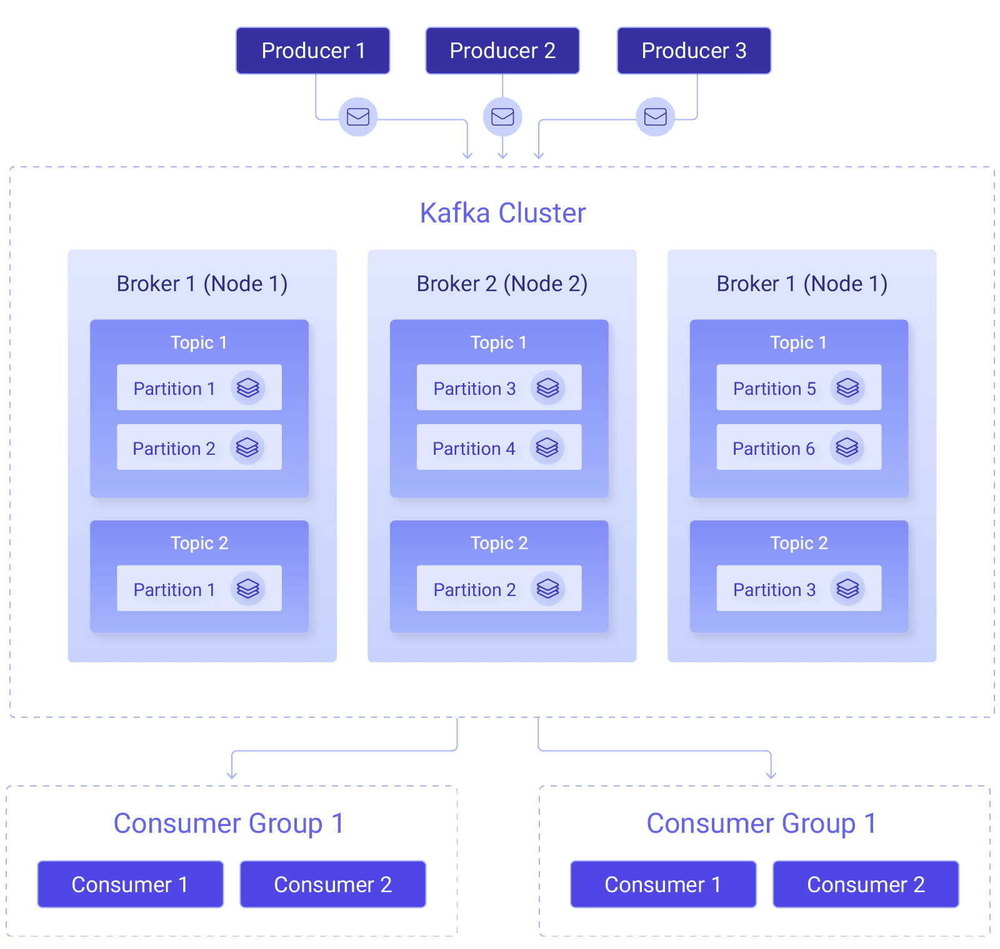

Have you ever wondered how manufacturing and automotive industries can effectively manage the vast amount of real-time data generated by sensors and systems throughout the production process? A few years back, these industries faced major obstacles in handling the large volume of real-time data produced by sensors placed across the production line. Even today many industries continue to grapple with similar challenges. Traditional data management systems struggle to process and analyze this data in real-time, leading to inefficiencies in operational activities and decision-making. To address these challenges, various manufacturing and automobile plants have embraced technologies like Apache Kafka.

<!--more-->

Kafka provides a distributed streaming platform that enables the efficient handling of real-time data streams. By leveraging Kafka, we can aggregate, process, and analyze data in real-time seamlessly. This guide provides a high-level overview of Kafka, covering its definition, components, functionality, applications, and limitations.

## What is Kafka?

Apache Kafka is a platform for distributed data streaming that allows for the publishing, subscribing, storing, and processing of streams of records in real-time. It is intended to handle data streams from multiple sources and to deliver them to multiple consumers. In essence, it can move large quantities of data in real-time from any source to any destination, simultaneously.

Kafka is also a very good [broker for UNS architecture](https://flowfuse.com/blog/2024/01/unified-namespace-what-broker/).

## Understanding Kafka's Architecture

Kafka architecture is designed to provide a scalable and fault-tolerant platform for handling real-time data streams. The architecture consists of several key components, each component serves a specific purpose in the data processing pipeline. In this section, we will take an overview of Kafka's architecture and its key components.

{data-zoomable}

**1. Topics and Partitions**
- Topics: Imagine topics as folders for organizing data – they act as distinct categories. Kafka arranges information into these topics for systematic storage.
- Partitions: Think of partitions as subdivisions within topics. They enable parallel processing across multiple servers, enhancing fault tolerance and throughput.

**2. Producers:**
- Producers: Producers are like architects of data flow. They decide where to send records within a topic. This decision can be balanced using a round-robin or directed by a record key for specific purposes, such as maintaining order.

**3. Brokers:**
- Definition: Brokers are the backbone servers in a Kafka cluster.
- Tasks: Brokers store data, handle requests from both producers and consumers, and maintain the integrity and persistence of data. They also manage the critical task of tracking offsets, which determine the position of consumers within partitions.

**4. Consumers and Consumer Groups:**
- Consumers: These entities read data from brokers. They subscribe to one or more topics and pull data from the specific partitions they are interested in.
- Consumer Groups: Consumers collaborate in groups to scale data processing. Kafka dynamically assigns each consumer in a group a set of partitions from the subscribed topics, ensuring that each partition is processed by only one consumer within the group.

**5. Offsets**
- Definition: Offsets act as unique identifiers for records within a partition. They denote the position of a consumer in the partition.
- Function: As consumers read records, they increment their offset. This allows them to resume processing from where they left off, which is crucial for handling failures or restarts. Kafka stores offset information in a specialized topic for easy recovery.

**6. Replication**
- Mechanism: Kafka ensures data durability by replicating partitions across multiple brokers.
- Replication Factor: This configurable setting determines the number of copies of a partition in the cluster. If one broker fails, another can seamlessly take over, guaranteeing high availability.

## Features of Kafka

Now that we've gained a foundational understanding of Kafka, let's explore the key features that make it a preferred choice for many organizations. These features highlight why Kafka transcends being just another data processing tool and why it merits consideration for various use cases.

- **High Throughput and Scalability:** Kafka can handle thousands of messages per second and can scale horizontally and vertically to meet growing data demands without compromising performance.
- **Fault Tolerance and Reliability:** Built to ensure reliability, Kafka guarantees fault tolerance through replication, safeguarding data against loss in the event of a broker failure. Data redundancy ensures data safety even during hardware failures.
- **Real-Time Processing and Low Latency:** Kafka's real-time processing ensures low latency for instant data analysis, which is critical for real-time decision-making.

## Applications of Kafka

As we explore the capabilities of Kafka, we realize that it goes beyond being just a regular data processing tool. Kafka is a strategic powerhouse that influences decision-making, operational efficiency, and overall effectiveness in various industries. In this section, we will discuss specific, practical applications of Kafka in different industries, demonstrating how its adaptability can solve unique challenges.

**1. Manufacturing Operations Optimization:**
- Real-time Production Monitoring: Kafka is used in manufacturing for continuous monitoring of production lines, equipment status, and inventory levels. This real-time visibility aids in optimizing production efficiency, reducing downtime, and enhancing overall supply chain management.
- Quality Assurance and Yield Management: Companies utilize Kafka to monitor quality control metrics in real-time, enabling proactive measures to maintain product quality standards, minimize defects, and optimize production yield.

**2. Predictive Maintenance:** Organizations use Kafka to collect and analyze sensor data from machinery and equipment to predict potential failures. This helps them optimize scheduled maintenance tasks to prevent costly downtime and disruptions

**3. Supply Chain Management:** Kafka provides real-time visibility into supply chain operations. This enables companies to track shipments, monitor inventory levels, and coordinate with suppliers and distributors for efficient supply chain management.

**4. Logistics and Transportation:** Companies use Kafka to track vehicle and shipment locations in real-time, optimizing routes through the processing of streams of GPS data.

**5. Telecommunications:** Telecom operators utilize Kafka to monitor network performance metrics in real-time. This allows swift responses to outages or service degradations, ensuring a seamless communication network.

**6. Financial Services:** Banks leverage Kafka to process transactions in real-time, enabling immediate fraud detection by analyzing patterns in transaction data as they occur. This enhances overall security and compliance in financial operations.

## Challenges and Considerations

As beneficial as Kafka is in various industries, it also presents certain limitations and challenges that must be considered before deciding to use Kafka for your applications.

1. Performance: Kafka both receives and transmits data. When the flow of data is compressed or decompressed, the performance is affected. For example, if the data is decompressed it will eventually drain the node memory. As a result, it affects both throughput and performance.

2. Complexity: As we all know Kafka is an excellent platform for streamlining messages. However, in the case of migration projects that transform data, Apache Kafka gets more complex. Hence, to interact with both data producers and consumers you need to create data pipelines.

3. Tool Support: There is always a concern for startup companies to use Kafka over other options.  Especially, if it remains in the long run. This is because a full set of management and monitoring tools are absent in Kafka. 

4. Message Tweaking: Kafka uses system calls before delivering a message. Therefore, the messages are sensitive to modifications. Tweaking messages reduces the performance of Kafka to a greater extent. The performance is not impacted only under the condition of not changing the message. 

5. Data Storage: Apache Kafka is not a recommended option for storing large sets of data. If the data is stored for a long period, the redundant copies of it are also stored. When this happens, the app must be ready to compromise its performance. For this reason, only use Kafka if there is a need to store data for a short period. 

## Conclusion 

This guide provides a high-level overview of Apache Kafka, including its definition, architecture, features, and applications in various industries and the challenges or limitations of using Kafka. Kafka's versatility in real-time data processing, decision-making, and operational efficiency is highlighted, with applications ranging from manufacturing to finance. The overview aims to provide a clear understanding of Kafka's role in handling data challenges and fostering innovation across sectors.

