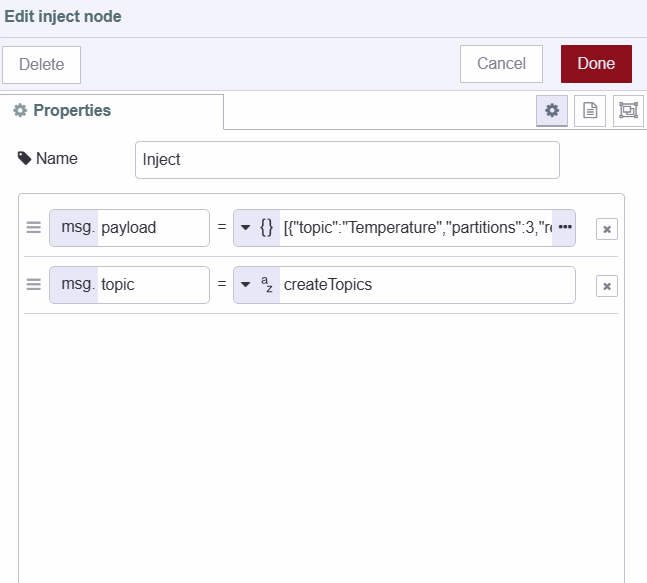

Have you ever wondered how manufacturing and automotive industries can effectively manage the vast amount of real-time data generated by sensors and systems throughout the production process? A few years back, these industries faced major obstacles in handling the large volume of real-time data produced by sensors placed across the production line. Even nowadays many industries continue to grapple with similar challenges. Traditional data management systems struggle to process and analyze this data in real-time, leading to inefficiencies in operational activities and decision-making. To address these challenges, various manufacturing and automobile plants have embraced technologies like Apache Kafka.

<!--more-->

Kafka provides a distributed streaming platform that enables the efficient handling of real-time data streams. By leveraging Kafka, we can aggregate, process, and analyze data in real-time seamlessly. However, despite its extensive benefits, Kafka also has some limitations. But there's no need to worry. Throughout this comprehensive guide, we will delve into everything about Kafka, including its pros and cons, its applications in the real world, and how to use it efficiently with Node-RED applications.

## What exactly is Kafka?

Apache Kafka is a platform for distributed data streaming that allows for the publishing, subscribing, storing, and processing of streams of records in real-time. It is intended to handle data streams from multiple sources and to deliver them to multiple consumers. In essence, it can move large quantities of data in real-time from any source to any destination, simultaneously.

Kafka is also a very good [broker for a UNS architecture](https://flowfuse.com/blog/2024/01/unified-namespace-what-broker/).

## Understanding Kafka's Core Components and its working
To ensure that we make the most of Kafka, it's best to start by understanding its core components and how it works before moving to practice. By doing so, we can use it more efficiently and without any confusion.

{data-zoomable}

**1. Topics and Partitions**
- Topics: Imagine topics as folders for organizing data – they act as distinct categories. Kafka arranges information into these topics for systematic storage.
- Partitions: Think of partitions as subdivisions within topics. They enable parallel processing across multiple servers, enhancing fault tolerance and throughput.

**2. Producers:**
- Producers: Producers are like architects of data flow. They decide where to send records within a topic. This decision can be balanced using a round-robin or directed by a record key for specific purposes, such as maintaining order.

**3. Brokers:**
- Definition: Brokers are the backbone servers in a Kafka cluster.
- Tasks: Brokers store data, handle requests from both producers and consumers and maintain the integrity and persistence of data. They also manage the critical task of tracking offsets, which determine the position of consumers within partitions.

**4. Consumers and Consumer Groups:**
- Consumers: These entities read data from brokers. They subscribe to one or more topics and pull data from the specific partitions they are interested in.
- Consumer Groups: Consumers collaborate in groups to scale data processing. Kafka dynamically assigns each consumer in a group a set of partitions from the subscribed topics, ensuring that each partition is processed by only one consumer within the group.

**5. Offsets**
- Definition: Offsets act as unique identifiers for records within a partition. They denote the position of a consumer in the partition.
- Function: As consumers read records, they increment their offset. This allows them to resume processing from where they left off, crucial for handling failures or restarts. Kafka stores offset information in a specialized topic for easy recovery.

**6. Replication**
- Mechanism: Kafka ensures data durability by replicating partitions across multiple brokers.
Replication Factor: This configurable setting determines the number of copies of a partition in the cluster. If one broker fails, another can seamlessly take over, guaranteeing high availability.

## Features of Kafka
Now we have a basic understanding of Kafka. In this section, we will discuss Kafka features which make Kafka stand out as a popular choice for many organizations. Understanding these features will illuminate why Kafka is more than just another data processing tool and why it's worth considering for various use cases.

- **High Throughput and Scalability:** Kafka can handle thousands of messages per second and can scale horizontally and vertically to meet growing data demands without compromising performance.
- **Fault Tolerance and Reliability:** Built to ensure reliability, Kafka guarantees fault tolerance through replication, safeguarding data against loss in the event of a broker failure. Data redundancy ensures data safety even during hardware failures.
- **Real-Time Processing and Low Latency:** Kafka's real-time processing ensures low latency for instant data analysis, critical for real-time decision-making.

## Applications of Kafka
Now that we have covered the basics and features of Kafka, let's take a closer look at its specific applications across various industries. Kafka is not just limited to data processing but also influences critical aspects of operations, decision-making, and efficiency. In this section, we will discuss how Kafka is being used in different sectors to tackle unique challenges.

**1. Manufacturing Operations Optimization:**
- Real-time Production Monitoring: Kafka is used in manufacturing for continuous monitoring of production lines, equipment status, and inventory levels. This real-time visibility aids in optimizing production efficiency, reducing downtime, and enhancing overall supply chain management.
- Quality Assurance and Yield Management: Companies utilize Kafka to monitor quality control metrics in real-time, enabling proactive measures to maintain product quality standards, minimize defects, and optimize production yield.

**2. Predictive Maintenance:** Organizations use Kafka to collect and analyze sensor data from machinery and equipment to predict potential failures. This helps them optimize scheduled maintenance tasks to prevent costly downtime and disruptions

**3. Supply Chain Management:** Kafka provides real-time visibility into supply chain operations. This enables companies to track shipments, monitor inventory levels, and coordinate with suppliers and distributors for efficient supply chain management.

**4. Logistics and Transportation:** Companies use Kafka to track vehicle and shipment locations in real-time, optimizing routes through the processing of streams of GPS data.

**5. Telecommunications:** Telecom operators utilize Kafka to monitor network performance metrics in real-time. This allows swift responses to outages or service degradations, ensuring a seamless communication network.

**6. Financial Services:** Banks leverage Kafka to process transactions in real-time, enabling immediate fraud detection by analyzing patterns in transaction data as they occur. This enhances overall security and compliance in financial operations.

## Building a real-time temperature monitoring system with Kafka and Node-RED
In the rest of this guide, we will build a simple real-time temperature monitoring system using Kafka and Node-RED. This will help you to understand how to use Kafka in your Node-RED applications. We will cover everything from creating topics to sending and receiving data in Kafka. before we start building, let's explore the scenario, understand how data will flow, and delve into how different components will work.

Imagine a temperature sensor in a city. It sends temperature data to Kafka's "Temperature" topic, split into partitions for downtown, suburban, and industrial areas. Producers decide where data goes based on zones. Brokers store and manage data, handling requests and maintaining order through offsets. Replication ensures data safety another server takes over if needed. Consumers, representing city departments, subscribe to "Temperature." They work in groups, each managing a zone for parallel processing. As the sensor keeps sending data, offsets track positions, letting consumers resume from the last reading. Replication guarantees data availability for real-time analysis. 

In our context, we will generate simulated data and create both producers and consumers within the same system or device. However, in practical scenarios, producers and consumers are often deployed across different devices or systems, facilitating data exchange between them.

## Installing and running Kafka locally 
In this section, we will install Kafka locally with the help of Docker to make our installation easier, so before you start make sure you have Docker installed.

1. Pull the zookeeper image if it is not already, and run the zookeeper container.
```
docker run -p 2181:2181 zookeeper
```

2. Pull the Kafka image if it is not already, and run Kafka Container, expose PORT 9092.
```
docker run -p 9092:9092 `
-e KAFKA_ZOOKEEPER_CONNECT=<Your_Private_Ip>.1:2181 `
-e KAFKA_ADVERTISED_LISTENERS=PLAINTEXT://<Your_Private_Ip>:9092 `
-e KAFKA_OFFSETS_TOPIC_REPLICATION_FACTOR=1 `
confluentinc/cp-kafka
```

## Running Kafka on the cloud

To run Kafka on the cloud, you can consider utilizing it cloud platform according to your preferences. For a guide on running Kafka on a cloud platform, the procedures may differ. You can refer to the documentation provided by your preferred cloud service for detailed instructions.

During the writing of this guide, I utilized [Aiven’s cloud data platform](https://aiven.io/kafka-connect) which offers the option to use Kafka in the free trial. However, you are free to choose any cloud service that suits your requirements and preferences.

## Installing Dashboard 2.0
In this section, we will install Dashboard 2.0, we will display the temperature data of different areas on the Dashboard 2.0 chart. 

1. Install Node-RED Dashboard 2.0. Follow these [instructions](https://dashboard.flowfuse.com/getting-started.html) to install.
2. Create your first group, page, theme, and base.

## Installing and configuring Kafka custom node

1. Install `node-red-kafka-manager` by the palette manager.
2. Before connecting to Kafka, ensure you have the following information ready and environment variables set up as discussed below in the Adding environment variable section.

- Host: The IP address or hostname of your Kafka broker server. 
- Port: Kafka typically uses port 9092 by default. Ensure this aligns with your Kafka broker's configuration.
- SSL Configuration (if applicable):
   CA Certificate: The Certificate Authority (CA) certificate for validating the SSL connection.
- SASL (Simple Authentication and Security Layer) Mechanism: Most of the Kafka broker servers use SASL for authentication such as 'PLAIN', 'SCRAM-SHA-256,' or 'SCRAM-SHA-512.'
- Username: SASL Username of Kafka broker server for authentication.
- Password: SASL password of Kafka broker server for authentication.

3. Drag the Kafka Producer node onto the Canvas, click on that node and click on the edit icon next to the broker input field to configure it.


4. Enable the TLS option if your Kafka broker server is using it for secure communication.
5. After enabling the TLS option click on the edit icon next to `add new tls-config` and upload the CA Certificate in PEM format.


## Adding Environment variables
In this section, we will set up environment variables for Kafka configuration. If you read our previous blog posts, you may already know why we highly suggest using environment variables for every configuration. If not, please refer to our blog post on [Using Environment Variables in Node-RED](https://flowfuse.com/blog/2023/01/environment-variables-in-node-red/) for more information.


1. Navigate to the instance's setting and then go to the environment section.
2. Click on the `add variable` button and add variables ( host, port, username and password) for the configuration data that we discussed in the above section. To leverage the ease of configuration provided by the Kafka custom node that we are utilizing, ensure to set only one variable for both host and port in the following format:
```
[format:`[{"host":<enter IP address or hostname of your Kafka broker server >,"port":<enter port on which your kafka broker server is listening>}]
```
3. Click on the save button and restart the instance by clicking on the top right Action button and selecting the restart option.

## Creating a new Kafka topic
In this section, we'll guide you through the process of creating a Kafka topic to handle temperature data from different city areas. To ensure the segregation of data for different zones within the city, we will configure the topic to create three partitions.

1. Drag an inject node onto Canvas.
2. Set `msg.topic` to `createTopics` string.
3. Set `msg.payload` to `[{"topic": "Temperature","partitions": 3,"replicationFactor":1}]`, you can create as many topics as you want at a time.
4. Drag the Kafka admin node onto Canvas.
5. Connect the inject node’s output to the Kafka admin node’s input.
6. Deploy the flow by clicking on the top-right red deploy button.
7. After the Deploy, click on the inject button to create a topic.




## Sending Data to Kafka topic
In this section, we will be creating a producer for sending simulated temperature data of the downtown area of the city. This producer will be responsible for populating one of the three partitions available in the temperature topic. During the creation of the temperature topic, we have already configured it with three partitions. We will be using these partitions to distribute data from each area across the cities (downtown, suburban and industrial). This partitioning process ensures that the data is organized and kept separate, which makes it easier and more efficient to process and analyze.

1. Drag a Kafka producer node onto Canvas.
2. Selected added Kafka configuration.
3. Click on that node and add the topic that we have created, set the key as `downtown, and set the partition number as 0. (The partition index starts from zero)
4. Drag an inject node onto Canvas.
5. Set `msg.payload` to `$floor($random() * 100)` as a JSON expression and set the inject node to send payload automatically after a specific interval of time.


## Receiving data from Kafka topic
In this section, we will be creating a consumer who will subscribe to listen to downtown area temperature data.

1. Drag the Kafka consumer node onto Canvas.
2. Selected added Kafka configuration.
3. Click on that node, add the topic that we have created, and enter partition 0 from which it will read temperature data. (partition index starts from zero)
4. Add the Change node onto the Canvas and set `msg.topic` to `msg._kafak.key` and `msg.payload` to `$number(msg.payload)` because the Kafka custom node that we are using is converting number data into a string. (consumer returns a Kafka object containing information related topic’s partition from data received, a key which we have set in the producer section to recognize data, and other information)
5. Add the ui-chart widget onto Canvas and select the created group in which the chart will render.
6. Connect the Kafka consumer node’s output to the change node’s input and the change node’s output to the ui-chart widget’s input.


Repeat the same steps to create producer and consumer for the rest of the two areas suburban and industrial, ensuring to set partitions 1 and 2, as we have already assigned partition 0 to the first producer that we have created.

## Deploying the flow
Our temperature monitoring system is now complete and ready for deployment. To initiate the deployment process, locate the red 'Deploy' button positioned in the top right corner and navigate to `https://<your-instance-name>.flowfuse.cloud/dashboard`


## Limitation of Kafka
We have covered everything about Kafka, but it's important to also consider its limitations when making decisions about using it.

1. Performance
Kafka both receives and transmits data. When the flow of data is compressed or decompressed, the performance is affected. For example, if the data is decompressed it will eventually drain the node memory. As a result, it affects both throughput and performance.

2. Complexity
As we all know Kafka is an excellent platform for streamlining messages. However, in the case of migration projects that transform data, Apache Kafka gets more complex. Hence, to interact with both data producers and consumers you need to create data pipelines.

3. Tool Support
There is always a concern for startup companies to use Kafka over other options.  Especially, if it remains in the long run. This is because a full set of management and monitoring tools are absent in Kafka. 

4. Message Tweaking
Kafka uses system calls before delivering a message. Therefore, the messages are sensitive to modifications. Tweaking messages reduces the performance of Kafka to a greater extent. The performance is not impacted only under the condition of not changing the message. 

5. Data Storage
Apache Kafka is not a recommended option for storing large sets of data. If the data is stored for a long period, the redundant copies of it are also stored. When this happens the app must be ready to compromise its performance. For this reason, only use Kafka if there is a need to store data for a short period. 
   
## Conclusion 
This guide has covered everything you need to get started with Kafka with Node-RED. Throughout this article, we've built a real-time temperature monitoring system using Kafka and Node-RED to explain how you can use Kafka in your Node-RED applications, Additionally, we have covered the installation of Kafka, its applications, limitations etc.

