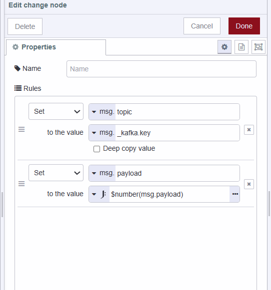

In today's fast-paced manufacturing landscape, innovation is essential, alongside streamlined data integration and analysis. Manufacturing firms must navigate a constant influx of real-time data streams efficiently. Leveraging Kafka offers a robust solution to this challenge. If you're interested in learning more about how businesses in the manufacturing industry use Kafka, we recommend checking out our blog post on [using kakfa in manufacturing](https://flowfuse.com/blog/2024/03/using_kafka_in_manufacturing/).

<!--more-->

In this step-by-step guide, we’ll walk you through everything you need to know about using Node-RED with Kafka, from how to install and connect Kafka to how to send and receive data. We’ll guide you through every step of the process, making sure you have everything you need to get the most out of Kafka.

## Discussing problem and potential solution
Let's start by dissussing a problem: imagine a temperature sensor network across a city. We need to centralize and analyze this data in real time for effective monitoring and visualization.

Temperature sensors will feed data into Kafka through Kafka producer. To retrieve real-time data for visualization and monitoring, we’ll be using Kafka consumer. We will organize the data by region. The temperature data for each region will be managed in a specific Kafka topic partition.

While in this guide, we will generate simulated data using random number expression and run both producers and consumers on the same system, practical scenarios often involve distributed setups across different devices or systems.

## Installing and running Kafka locally 
In this part, we’ll be installing Kafka locally using Docker to simplify the installation process, so make sure you’ve got Docker installed before you dive in.

1. Pull the zookeeper image if it is not already, and run the zookeeper container.
```
docker run -p 2181:2181 zookeeper

```

2. Pull the Kafka image if it is not already, and run Kafka Container, expose PORT 9092.
```
docker run -p 9092:9092 `
-e KAFKA_ZOOKEEPER_CONNECT=<Your_Private_Ip>.1:2181 `
-e KAFKA_ADVERTISED_LISTENERS=PLAINTEXT://<Your_Private_Ip>:9092 `
-e KAFKA_OFFSETS_TOPIC_REPLICATION_FACTOR=1 `
confluentinc/cp-kafka
```

## Running Kafka on the cloud
To run Kafka on the cloud, you can consider utilizing any cloud service according to your preferences. For a guide on running Kafka on a cloud platform, the procedures may differ. You can refer to the documentation provided by your preferred cloud service for detailed instructions.

During the writing of this tutorial, I utilized [Aiven’s cloud data platform](https://aiven.io/kafka-connect) which offers the option to use Kafka in the free trial. However, you are free to choose any cloud service that suits your requirements and preferences.

## Installing Dashboard 2.0
In this section, we will install Dashboard 2.0, we will display the temperature data of different region on the Dashboard 2.0 chart at real-time. 

1. Install Node-RED Dashboard 2.0. Follow these [instructions](https://dashboard.flowfuse.com/getting-started.html) to install.
2. Create your first group, page, theme, and base.

## Installing and configuring Kafka custom node

1. Install `node-red-kafka-manager` by the palette manager.
2. Before connecting to Kafka, ensure you have the following information ready and environment variables set up as discussed below in the Adding environment variable section.

- Host: The IP address or hostname of your Kafka broker server. 
- Port: Kafka typically uses port 9092 by default. Ensure this aligns with your Kafka broker's configuration.
- SSL Configuration (if applicable):
  CA Certificate: The Certificate Authority (CA) certificate for validating the SSL connection.
- SASL (Simple Authentication and Security Layer) Mechanism: Most of the Kafka broker servers use SASL for authentication such as 'PLAIN', 'SCRAM-SHA-256,' or 'SCRAM-SHA-512.'
- Username: SASL username of Kafka broker server for authentication.
- Password: SASL password of Kafka broker server for authentication.

3. Drag the Kafka Producer node onto the Canvas, click on that node, and click on the edit icon next to the broker input field to configure it.


4. Enable the TLS option if your Kafka broker server is using it for secure communication. 
5. After enabling the TLS option click on the edit icon next to `add new tls-config` and upload the CA Certificate in PEM format.


## Adding Environment variables
In this section, we will be setting up environment variables for Kafka configuration. If you have read our previous blog post, you may already know why we highly suggest using environment variables for every configuration. If not, please refer to our blog post on [Using Environment Variables in Node-RED](https://flowfuse.com/blog/2023/01/environment-variables-in-node-red/) for more information.


1. Navigate to the instance's setting and then go to the environment section.
2. Click on the `add variable` button and add variables ( host, port, username, and password) for the configuration data that we discussed in the above section. To leverage the ease of configuration provided by the Kafka custom node that we are utilizing, ensure to set only one variable for both host and port in the following format:
```
[{"host":<enter IP address or hostname of your Kafka broker server >,"port":<enter port on which your kafka broker server is listening>}]
```
3. Click on the save button and restart the instance by clicking on the top right Action button and selecting the restart option.

## Creating a new Kafka topic
In this section, we'll guide you through the process of creating a Kafka topic to handle temperature data from different city region. To ensure the segregation of data for different zones within the city, we will configure the topic to create three partitions.

1. Drag an inject node onto Canvas.
2. Set `msg.topic` to `createTopics` string.
3. Set `msg.payload` to `[{"topic": "Temperature","partitions": 3,"replicationFactor":1}]`, you can create as many topics as you want at a time.
4. Drag the Kafka admin node onto Canvas.
5. Connect the inject node’s output to the Kafka admin node’s input.
6. Deploy the flow by clicking on the top-right red deploy button.
7. After the Deploy, click on the inject button to create a topic.


## Sending Data to Kafka topic
In this part, we’ll be setting up a producer to send simulated city region temperature data to kafka. The producer will populate one of the available partitions in our temperature topic. 

We’ve already set up the temperature topic with 3 partitions. We’ll use these partitions to send data from each city region across the city (downtown region, suburban region, and industrial region). The partitioning process keeps the data separated, making it easier and faster to work with and analyze.

1. Drag a Kafka producer node onto Canvas.
2. Selected added Kafka configuration.
3. Click on that node and add the topic that we have created, set the key as `downtown`, and set the partition number as 0. (The partition index starts from zero)
4. Drag an inject node onto Canvas.
5. Set `msg.payload` to `$floor($random() * 100)` as a JSON expression and set the inject node to send the payload automatically after a specific interval of time.


## Receiving data from Kafka topic
In this section, we will be creating consumers who will subscribe to listen to downtown region temperature data.

1. Drag the Kafka consumer node onto Canvas.
2. Selected added Kafka configuration.
3. Click on that node, add the topic that we have created, and enter partition `0` from which it will read temperature data.
4. Add the Change node onto the Canvas and set `msg.topic` to `msg._kafka.key` and `msg.payload` to `$number(msg.payload)` because the Kafka custom node we are using is converting number data into a string. (consumer returns a Kafka object containing information related topic’s partition from data received, a key which we have set in the producer section to recognize data, and other information)
5. Add ui-chart node on to Canvas and select the created group in which the chart will render.
6. Connect the Kafka consumer node’s output to change the node’s input and change the node’s output to the chart node’s input.




Repeat the same steps to create producer and consumer for the rest of the two regions suburban and industrial, ensuring to set partitions 1 and 2 for, as we have already assigned partition 0 to the first producer created.

## Deploying the flow
Our temperature monitoring system is now complete and ready for deployment. To initiate the deployment process, locate the red 'Deploy' button positioned in the top right corner and navigate to `https://<your-instance-name>.flowfuse.cloud/dashboard`


## Conclusion 
In this guide, we’ve gone over everything you need to know about how to get started with kafka and node-red. additionally, in this article, we’re going to focus on solving a problem where the sensors data across the city need to be centrally stored for efficient monitoring and visualization. By solving this problem step-by-step, you’ll understand how to integrate Kafka into your node-red applications.

