Node-RED is super easy and doesn't require much coding knowledge, which is why many people love it! Even though Node-RED is straightforward, some terms, like "global," "flow," and "environment" variables, might seem puzzling at first. However, many people have realized these concepts are quite easy to grasp after reading about them on a few resources or simply participating in Node-RED forums. To save you time and help you understand the different concepts quicker, this guide will cover Node-RED variables in depth, aiming to deepen your proficiency while minimizing the effort required to gather information.

<!--more-->

## Understanding Node-RED Variables

Variables are a crucial component in Node-RED. They come in two types: context variables and environment variables. Context variables are used to keep track of the application's state, which includes node, flow, and global variables. On the other hand, environment variables store confidential configuration information such as secret and API keys, preventing this data from being accidentally exposed in the flow.

### Exploring Node variables

Node variables are specific to each node and are only visible within that node. This means we cannot read or write into that variable from outside of the node where it is initialized. This is ideal for cases where you want to store data specific to a single node, to ensure data isolation and prevent interference with other nodes

For example, You have a form on a Node-RED Dashboard 2.0, and you want to insert the submitted data into a database along with a unique ID for each submission. You can use a node variable to store and track a counter variable in the function node.

#### Initiating/setting Node variable

To initiate and set a node variable in the function node, you will have to use the context’s `set` method:

```javascript
context.set('variableName', value);
```

This action sets the value for the context variable with the specified name.

#### Retrieving Node variable

To retrieve a node variable within a function node, use the context's `get` method:

```javascript
context.get('variableName');
```

#### Deleting Node variables

We cannot delete node variables using a Node-RED node; you'll need to use the Node-RED "Context Data" tab's delete option available for each variable, as explained in the "Exploring Context Data" tab section at the end of the guide.

### Exploring Flow variables

Flow variables are accessible to function, change, inject, and switch nodes and some third-party nodes within the same tab or flow where they have been set. It is useful for sharing data within a specific flow or tab, allowing for seamless data transfer between nodes within the same flow.

For example, in a temperature monitoring system, you have multiple sensors sending data to different nodes within the same flow. You can use flow variables to pass the current temperature reading between nodes for processing and analysis within that specific flow.

#### Initiating/setting Flow variable

We can set flow variables using function and change node. To initiate a Flow variable in the function node, you will have to use the flow's `set` method like below in the function node:

```javascript
flow.set('variableName', value);
```

In the change node, you can set it as shown in the below image

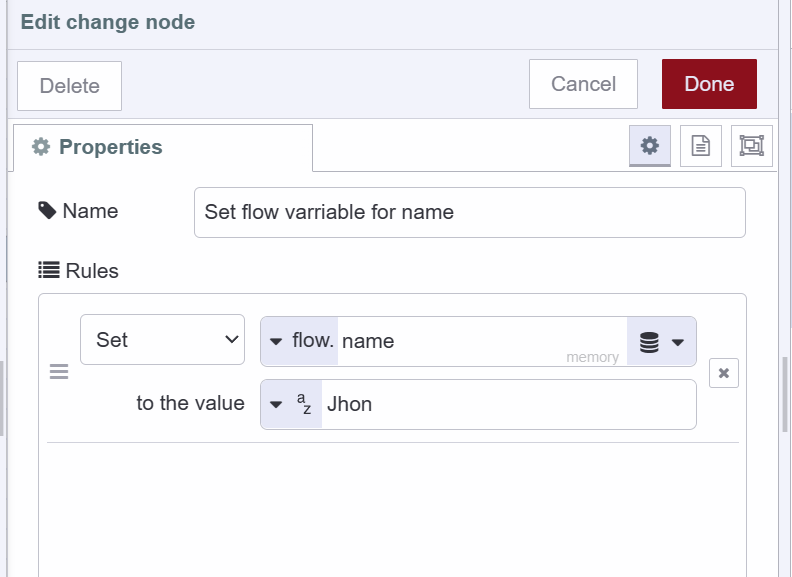{data-zoomable}

#### Retrieving Flow variable

You can retrieve flow variables using the function, change, inject, and switch. To retrieve a flow variable, use the flow's `get` method like the below in the function node:

```javascript
flow.get('variableName');
```

Retrieving flow variables in change, inject, and switch nodes is quite similar. You simply need to select the "flow" option and enter the variable name in the input field. Below is an image showing how you can retrieve flow variables using the change node.

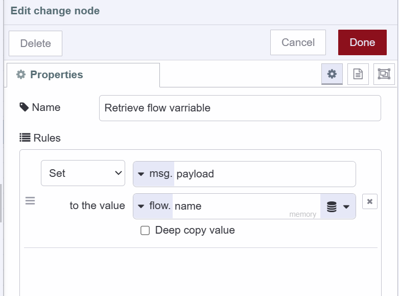{data-zoomable}

#### Deleting Flow variables

To delete flow variables you can use both the "context data" tab and the change node. I have shown in the below image how you can delete flow variables using the change node:

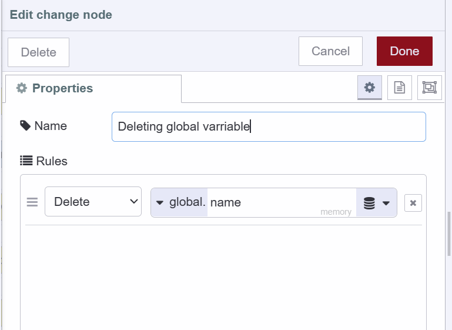{data-zoomable}

### Exploring Global variables

Global variables in Node-RED are accessible to function, change, inject, switch, and certain third-party nodes within a given Node-RED instance. They serve as a centralized storage point for data that needs to be accessed across different parts of an application. This is especially useful when you want to share data across multiple flows or tabs within the same Node-RED instance.

For example, in a home automation system with flows for lighting, security, and climate control, global variables can store user preferences or system settings that all flows can access and update. This allows for consistent behaviour across the entire system.

#### Initiating/setting Flow variable

We can set Global variables using the function and change node. To initiate a Flow variable in the function node, you will have to use the global`s set method like the below in the function node:

```javascript
global.set('variableName', value);
```

In the change node, you can set it as shown in the below image

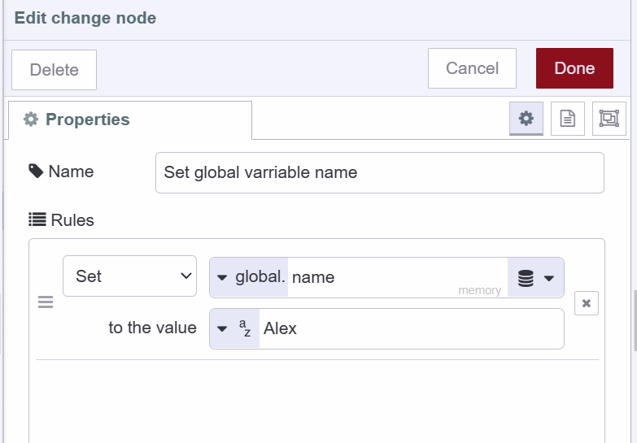{data-zoomable}

#### Retrieving Global variable

To retrieve a global variable, use the global's `get` method like the below in the function node:

```javascript
global.get('variableName');
```
Retrieving global variables in change, inject, and switch nodes is quite similar. You simply need to select the "global" option and enter the variable name in the input field. Below is an image showing how you can retrieve global variables using the change node:

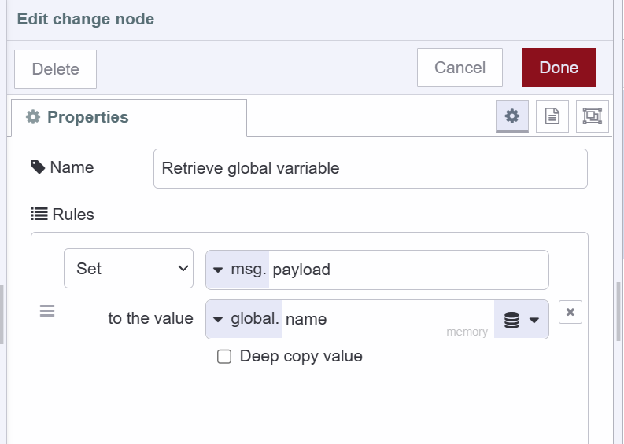{data-zoomable}

#### Deleting Global variables

To delete the global variables again you can use both the "context data" tab and the change node. I have shown in the below image how you can delete global variables using the change node:

{data-zoomable}

### Exploring Environmental variables

Environment variables are specifically used for storing sensitive configuration data, such as API keys or database credentials, ensuring this information isn't directly exposed within your flows. In Node-RED you can set environment variables at flow and global level.

- Flow-level environment: Used to store sensitive configuration data accessible only within a specific flow. This ensures secure and isolated storage of sensitive information. For example, when building a multi-flow Node-RED application, each flow may need different configuration details, like API keys or unique identifiers. Using flow-level environment variables allows each flow to securely store its specific sensitive data without exposing it to other flows.

- Global-level environment: Variables are used to store sensitive data accessible across all flows in a Node-RED instance. They are helpful when you need to share the same sensitive data across different flows. For example, If multiple flows need to use the same API key, setting a global-level environment variable allows them to access this data securely, avoiding repeated configurations and ensuring consistency.

#### Setting Environment Variables

To set flow-level environment variables you'll have to use the edit dialog of the flow.

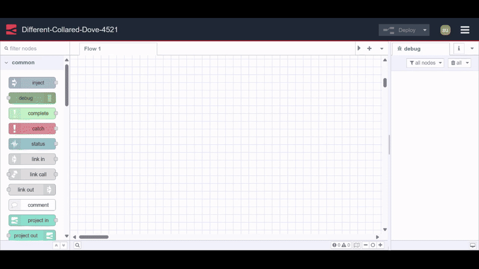{data-zoomable}

For information on setting and managing global-level environment variables, refer to [Using Environment varriables in Node-RED](/blog/2023/01/environment-variables-in-node-red/).

#### Accessing Environment variables 

To access both flow-level and global-level environment variables in a function node, use:

```javascript
env.get('variableName');
```
Environment variables in the change, inject, and switch nodes can be accessed by selecting the "$ env variable" option and entering the variable name in the input field. Here's an example of accessing an environment variable using the change node:

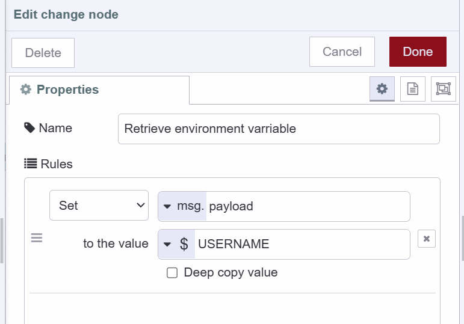{data-zoomable}

In the template node, you can access it like below:

```javascript
This is my username : {{env.USERNAME}}.

```

*Note: When you have variables with the same name, accessing them will prioritize the flow-level variable over the global-level one. To access a global-level environment variable in this scenario, you need to add a prefix to the variable name with '$parent'*

#### Deleting Environment variables 

To delete added environment variables, you can use the same interface where added them. In the right corner of your added environment variable, you'll see a delete or cross icon. Simply click on it to delete the variable.

### Exploring Context Data tab

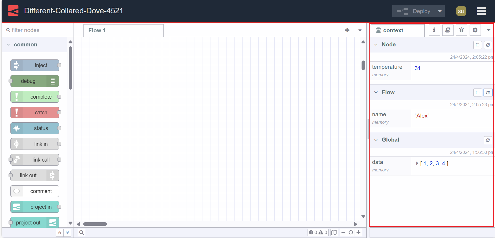{data-zoomable}

Node-RED provides a dedicated interface for viewing and managing all Node-RED variables. Navigate to the sidebar's "Context Data" tab, where you'll find sections for Node, Flow, and Global variables. Each section has a refresh icon at the top right corner; click on it to see the latest or newly added variables.

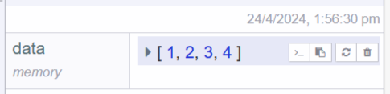{data-zoomable}

In this tab, you'll also find information about when each variable was set or updated, along with additional options on the right side of each variable. The first option allows you to copy the variable's name, the second option lets you copy the variable's value, the third option refreshes the variable to show the most recent value, and the fourth option allows you to delete the variable.

### FlowFuse persistent storage

So far, we have seen three types of context variables and all are stored in memory. This means that when we stop the Node-RED instance, the variables will get wiped out.

FlowFuse provides a way to persist these variable values between restarts and FlowFuse stack updates. For more details, refer to [FlowFuse Persistent Context](https://flowfuse.com/docs/user/persistent-context/).

#### Setting Persistent Variables in Function Node

To set variables as persistent in a function node, you just need to pass one more argument "persistent" in the set method.

```javascript
context.set('varriableName',value,'persistent'); 
```

```javascript
flow.set('varriableName',value,'persistent');
```

```javascript
global.set('varriableName',value,'persistent');
```

To set them using change node steps are the same as storing them in memory you just need to change the store option to persistent from memory in the change node like below:

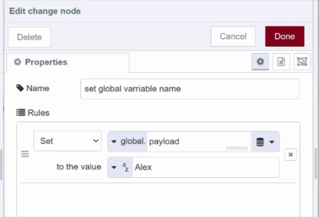{data-zoomable}

#### Retrieving Persistent Variables in Function Node

To retrieve a variable stored in the persistent store you'll need to pass "persistent" in the get method.

```javascript
context.get('varriableName','persistent'); 
```

```javascript
flow.get('varriableName','persistent');
```

```javascript
global.get('varriableName','persistent');
```

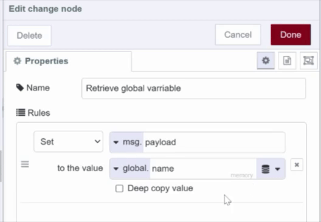{data-zoomable}

## Conclusion

In this comprehensive guide, we've explored the fundamental concepts of Node-RED variables, including node, flow, global, and environment variables. We've learned how to initiate, retrieve, and manage these variables effectively, utilizing both function nodes and change nodes. Additionally, we have learned about memory storage and persistent storage.
