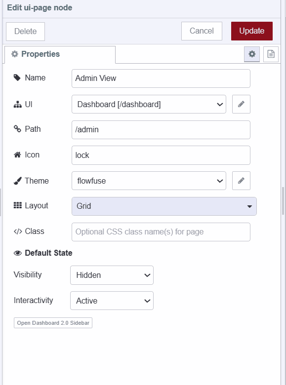

Managing and analyzing increasing amounts of data becomes crucial for organizations. Dashboard 2.0 and Node-RED help organizations access the data, normalize it, and visualize it. But what about controlling who can access what data? That's where an admin-only page comes in. Now With Node-RED Dashboard 2.0, we can also create robust and secure admin-only pages easily. In this guide, we'll provide you with step-by-step instructions to Build an Admin-only page with Node-RED Dashboard 2.0.

<!--more-->

If you're new to Dashboard 2.0, refer to our blog post [Getting Started with Dashboard 2.0](/blog/2024/03/dashboard-getting-started/) to install and get things started.

## Enabling FlowFuse User Authentication

Before proceeding further, let’s enable FlowFuse user authentication. This step adds an extra layer of protection to our dashboard by adding a login page that restricts access exclusively to registered FlowFuse users. Additionally, it further simplifies the process for the FlowFuse Multiuser addon to track and access logged-in user's data on the dashboard.

For more information, refer to the [documentation](/docs/user/instance-settings/#flowfuse-user-authentication) and ensure that it is enabled.

{data-zoomable}

## Exploring FlowFuse Multiuser Addon 

The FlowFuse Multiuser Addon is a plugin developed for Dashboard 2.0 to access logged-in user data on the dashboard. To install and understand how the FlowFuse Multiuser Addon works, refer to [Exploring the FlowFuse User Addon ](/blog/2024/04/displaying-logged-in-users-on-dashboard/#enabling-flowfuse-user-authentication)

## Storing a list of Admin users

Before we start building the admin-only page We need to store a list of admin users somewhere so that we can later display the admin-only page to those users only, For this guide we will store the admin list in the global context.

1. Drag an inject node onto the canvas.
2. Drag the 'change' node onto the canvas and set `global.admins` to a JSON array containing the usernames of admin users. This will store the created admin list in our Node-RED global context.

{data-zoomable}

3. Connect the inject node’s output to the change node’s input.
4. To store the list in a global context, click the inject node’s button once you've deployed the flow.

## Building an Admin-only page

Now, let's proceed with the practical steps to implement the admin-only page:

1. Create a new page in Dashboard 2.0, where we will display sensitive data that we want to hide from regular users, this page will be our admin page.
2. Drag an event node on the canvas, then click on it, and select the UI base that contains your all pages including the admin page 
3. Drag a switch node on the canvas, and add two conditions, one to check whether the user’s username is contained in the admin list or a second for otherwise, see the below image.

{data-zoomable}

4. Drag two change nodes onto the canvas, Configure the first change node to show the admin page by setting `msg.payload` as `{"pages":{"show":["Admin View"]}}`, and the second change node to hide the admin page by setting the payload as: `{"pages":{"hide":["Admin View"]}}`.

{data-zoomable}

{data-zoomable}

5. Connect the first change node's input to the switch node's first output and the second change node's input to the switch node's second output.
6. Drag a ui-control widget onto the canvas, then click on it and select ui-base which includes all your pages including the admin page. 
7. Finally, connect both change node’s outputs to the ui-control’s input.

## Hidding Admin only page by default 

To hide an admin-only page by default to ensure regular users don't accidentally land on the admin-only page the following steps are needed.

1. Go to the Dashboard 2.0 sidebar, and select the layout tab.
2. Locate the admin-only page and click on the edit icon next to it.
3. Set visibility as "hidden".

{data-zoomable}

## Deploying the flow

{data-zoomable}

1. With your flow updated to include the above, click the "Deploy" button in the top-right of the Node-RED Editor.
2. Navigate to `https://<your-instance-name>.flowfuse.cloud/dashboard`.
3. When you visit the page for the first time, you'll need to log in with your FlowFuse username and password or through Single-Sign on.

Now, if your username is added to the list of admin usernames stored in the global context, you will be able to see the admin-only page.

{data-zoomable}

{data-zoomable}

## Next step

If you want to learn more about FlowFuse multiuser addon and personalize the multiuser dashboard. we do have many other resources, please refer to them to learn more.

- [Webinar](/webinars/2024/node-red-dashboard-multi-user/) - This webinar provides an in-depth discussion of the Personalised Multi-User Dashboards feature and offers guidance on how to get started with it.
- [Personalised Multi-user Dashboards with Node-RED Dashboard 2.0](/blog/2024/01/dashboard-2-multi-user/) - This article explores the process of building multi-user Dashboards secured with FlowFuse Cloud.
- [Displaying logged-in users on Dashboard 2.0](/blog/2024/04/displaying-logged-in-users-on-dashboard/) - This detailed guide demonstrates how to display logged-in users on Dashboard 2.0 which using the FlowFuse Multiuser addon and FlowFuse.
- [Multi-User Dashboard for Ticket/Task Management](/blueprints/flowfuse-dashboard/multi-user-dashboard/) blueprint, which allows you to utilize templates to develop Personalize multi-user dashboard quickly.

{% include "cta.njk", cta_query: "utm_campaign=60718323-BCTA&utm_source=blog&utm_medium=cta&utm_term=high_intent&utm_content=How%20to%20Build%20an%20Admin%20Dashboard%20with%20Node-RED%20Dashboard%202.0", cta_type: "signup", cta_text: "Looking to build a multi-user dashboard, deploy it in seconds, scale and manage Node-RED efficiently, and enable seamless remote access for your entire team?" %}