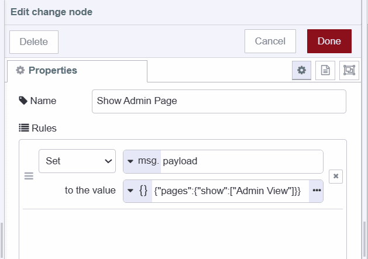

As businesses grow, data doubles, and managing and analyzing such increasing amounts of data becomes crucial. businesses are using Node-RED and its Dashboard 2.0 to handle this effectively. But what about controlling who can access what data? That's where an admin-only page comes in.

<!--more-->

Now With Node-RED Dashboard 2.0, we can also create robust and secure admin-only pages easily. In this guide, we'll show you a step-by-step guide to Build an Admin-only page with Node-RED Dashboard 2.0.

If you're new to Dashboard 2.0, refer to our blog post [Getting Started with Dashboard 2.0](https://flowfuse.com/blog/2024/03/dashboard-getting-started/), and Dashboard 2.0 to get things started.

## Enabling FlowFuse User Authentication

Before proceeding further, let’s enable FlowFuse user authentication. This step adds an extra layer of protection to our dashboard by adding a login page that restricts access exclusively to registered FlowFuse users. Additionally, it further simplifies the process for the FlowFuse Multiuser addon to track logged-in users on the dashboard.

1. Navigate to the instance setting.
2. Select the “Security” tab.
3. Enable “FlowFuse User Authentication”

{data-zoomable}

## Installing FlowFuse Multiuser Addon 

The FlowFuse Multiuser Addon is a plugin developed for Dashboard 2.0 to access logged-in user data on the dashboard. For more information on FlowFuse Multiuser Addon refer to [Exploring the FlowFuse User Addon ](https://flowfuse.com/blog/2024/04/displaying-logged-in-users-on-dashboard/#Enabling-FlowFuse-User-Authentication)

1. Click the Node-RED Settings (top-right)
2. Click "Manage Palette"
3. Switch to the "Install" tab
4. Search for `@flowfuse/node-red-dashboard-2-user-addon`

##  Building Admin-only page

### Outlining approach 

Before we start building the Admin-only page, let's outline our approach :

- Once the FlowFuse Multiuser addon is configured, each Dashboard 2.0 node emits a `msg` which will have user information attached as `msg._client.user`.
- We'll store the list of admin user’s usernames in the Node-RED global context.
- Using an event node, we'll track visitors to the admin-only page.
- If the visitor's username is contained in the list of admin usernames, they'll see the page; otherwise, the page will be hidden.

### Practical implementation

Now, let's proceed with the practical steps to implement the admin-only page:

- Create an admin page in Dashboard 2.0 to hide sensitive data from regular users.
- Drag an event node on the canvas, then click on it, and choose the UI base of which your admin page and other pages are part.
- Drag a switch node on the canvas, and add two one to check whether the user’s username is contained in the admin list or a second for otherwise, see the below image.

{data-zoomable}

- Drag two change nodes onto the canvas. Configure the first one to show the admin page using the payload: `{"pages":{"show":["Admin View"]}}`, and the second one to hide it using the payload: `{"pages":{"hide":["Admin View"]}}`.

{data-zoomable}

{data-zoomable}

- Connect the first change node to the switch node's first output, and the second change node to the second output.
- Drag a UI control node onto the canvas, then click on it to select the same UI base that you selected for the event node. 
- Finally, connect both change node’s output to the ui control’s input.

## Storing a list of Admin users

Now we will have to store a list of admin users somewhere, For this guide we will store that admin list in the Node-RED global context.

- Drag an inject node onto the canvas.
- Drag the 'change' node onto the canvas and set msg.payload to a JSON array containing the usernames of admin users. This will store the created admin list in our Node-RED global context. Click the inject node’s button once you've deployed the flow.

{data-zoomable}

- Connect the inject node’s output to the change node’s input.

## Deploying the flow

{data-zoomable}

1. With your flow updated to include the above, click the "Deploy" button in the top-right of the Node-RED Editor.
2. Navigate to `https://<your-instance-name>.FlowFuse.cloud/dashboard`.

Now you'll need to log into the dashboard with your FlowFuse account username and password. Afterward, you’ll see the admin page if your username is added to the admin list.

{data-zoomable}

{data-zoomable}

## Next step

If you want to learn more about FlowFuse multiuser addon and personalize multiuser dashboard. we do have many other resources, please refer to them to learn more.

- [Webinar](https://flowfuse.com/webinars/2024/node-red-dashboard-multi-user/) - This webinar provides an in-depth discussion of the Personalised Multi-User Dashboards feature and offers guidance on how to get started with it.
- [Personalised Multi-user Dashboards with Node-RED Dashboard 2.0](https://flowfuse.com/blog/2024/01/dashboard-2-multi-user/) - This article explores the process of building multi-user Dashboards secured with FlowFuse Cloud.
- [Displaying logged-in users on Dashboard 2.0](https://flowfuse.com/blog/2024/04/displaying-logged-in-users-on-dashboard/) - This detailed guide demonstrates how to display logged-in users on Dashboard 2.0 which using the FlowFuse Multiuser addon and FlowFuse.

- [Multi-User Dashboard for Ticket/Task Management](https://flowfuse.com/blueprints/flowfuse-dashboard/multi-user-dashboard/#multi-user-dashboard-for-ticket%2Ftask-management) blueprint, which allows you to quickly utilize templates to develope Personalize multi-user dashboard.

## Conclusion
In conclusion, by following the steps in this guide, you can easily make an Admin-only page in Node-RED Dashboard 2.0. Using the FlowFuse Multiuser addon and FlowFuse's features, you'll make sure only allowed users can see important information. This way, you increase security and control over your dashboard, giving you better management over who can see what data.

