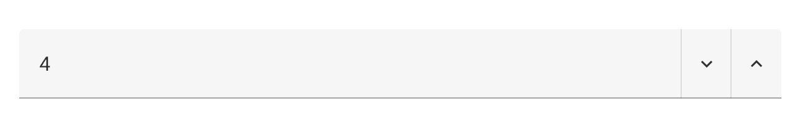
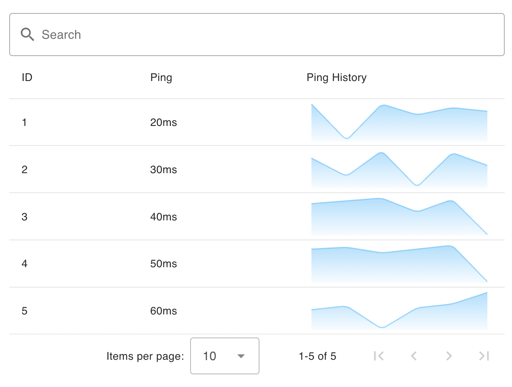

With a new release of Node-RED Dashboard 2.0 we have plenty of new fixes and improvements being added to the project. In this post, we'll deep dive into community contributions, PWA support, new Vuetify components, and the rest of the great work published in this latest release.

<!--more-->

## Community Contributions

I firstly wanted to take this opportunity to point out a big milestone that I'm very proud to see in Node-RED Dashboard 2.0.

This release marks the first time we've had more contributions in a single release from the community, than from FlowFuse employees. I think this is a testament to the community, and a big milestone in validating the success, and popularity, of Dashboard 2.0 in the wider Node-RED community.

So thank you very much [@BartButenaers](https://github.com/bartbutenaers), [@Ek1nox](https://github.com/Ek1nox), [@fullmetal-fred](https://github.com/fullmetal-fred) and [@cgjgh](https://github.com/cgjgh) for for great efforts and initiative in improving Node-RED Dashboard 2.0.

For anyone else that's interested in contributing to the project, please do reach out, and we'll be happy to help you get started. We also have a [Contributing Guide](https://dashboard.flowfuse.com/contributing/) if you want to dive straight in.

## Progressive Web App (PWA) Support

The biggest community contribution we saw in this release was the addition of Progressive Web App (PWA) support. This feature was added by [@cgjgh](https://github.com/cgjgh), and allows you to install your Node-RED Dashboard 2.0 applications directly onto your platform, including Windows, iOS and Android.

This work will give your Dashboard's a much more native/natural feel when running on your own machines, and mean you no longer need to go via your browser to access your applications.

## New Vuetify (Preview) Components Available

Vuetify is the component library on which most of our Dashboard 2.0 components are built. Our core widgets implement the more fundamental UI elements, but that doesn't stop you from building out fully customized interfaces yourself using our [ui-template node](https://dashboard.flowfuse.com/nodes/widgets/ui-template.html) with the vast collection of Vuetify components.

Within the `ui-template` node, we natively support any of the [core Vuetify components](https://vuetifyjs.com/en/components/all/#containment), but Vuetify itself is always evolving and often they release components into their [Vuetify Labs](https://vuetifyjs.com/en/labs/introduction/#what-is-labs).

In their latest releases, a few of the new components have caught our eye as we've seen them regularly requested in Dashboard 2.0. As such, we've now made available the following Vuetify components inside a `ui-template` node:


#### Number Input ([docs](https://vuetifyjs.com/en/components/number-inputs/#installation))


_An example v-number-input from Vuetify's component library_

We do have [plans](https://github.com/FlowFuse/node-red-dashboard/issues/41) for this to become a core widget, and will likely introduce this sooner, rather than later, however, in the mean time, you can now use the `v-number-input` component in a `ui-template` node to create your own number inputs instead.

```html
<template>
    <v-number-input v-model="value"></v-number-input>
</template>

<script>
  export default {
    data() {
      return {
        value: 0
      }
    },
    watch: {
      value: function () {
        this.send({payload: this.value})
      }
    }
  }
</script>

<style>
    .v-number-input__control .v-btn {
        color: var(--v-theme-on-surface);
    }
</style>
```

#### Sparkline ([docs](https://vuetifyjs.com/en/components/sparklines/#installation))


_An example v-sparkline rendering the output from a ui-slider_

Sparklines are a great way to visualize data trends in a small space, and we've seen them requested a few times in the past. Now you can use the `v-sparkline` component in a `ui-template` node to create your own sparklines.

This will also likely become a standalone node at some point too, possibly as a third-party widget, but for now implementing into a `ui-template` is very straight forward.

In the following example `ui-template`, we append any incoming `msg.payload` to a `value` array and render the sparkline accordingly.

```html
<template>
  <v-sparkline class="nrdb-ui-sparkline" :auto-line-width="false" :fill="false" :gradient="gradient"
    :gradient-direction="'top'" :line-width="2" :model-value="value" :padding="8"
    :smooth="10" :stroke-linecap="'round'" :type="'trend'" auto-draw></v-sparkline>
</template>

<script>
  export default {
    data: function () {
      return {
        gradient: ['#f72047', '#ffd200', '#1feaea'],
        value: [0, 2, 5, 9, 5, 10, 3, 5, 0, 0, 1, 8, 2, 9, 0]
      }
    },
    watch: {
      msg: function () {
        this.value.push(this.msg.payload)
      }
    }
  }
</script>

<style>
.nrdb-ui-sparkline path {
  stroke-dasharray: 0 !important;
}
</style>
```

There is no limitation on _where_ you can use the sparkline either, we could, for example, add it to a `v-data-table` to show a sparkline of a particular feature for each row in the table:


_An example v-data-table that renders a v-sparkline on each row_

Here we see the corresponding template for the above `v-data-table` example:

```html
<template>
    <!-- Provide an input text box to search the content -->
    <v-text-field v-model="search" label="Search" prepend-inner-icon="mdi-magnify" single-line variant="outlined"
        hide-details></v-text-field>
    <v-data-table v-model:search="search" :items="msg?.payload" :headers="headers">
        <template v-slot:header.pingvalues="{ item }">
            Ping History
        </template>
        <template v-slot:item.ping="{ item }">
            {{ item.ping }}ms
        </template>
        <template v-slot:item.pingvalues="{ item }">
            <v-sparkline v-model="item.pingValues" :gradient="['#42b3f4', '#42b3f400']"
                :line-width="2" gradientDirection="top" :smooth="true" :fill="true">
        </template>

    </v-data-table>
</template>

<script>
export default {
  data () {
    return {
      search: '',
      headers: [
        { key: 'id', title: 'ID' },
        { key: 'ping', title: 'Ping' },
        { key: 'pingvalues', title: 'Ping History' }
      ]
    }
  }
}
</script>
```


#### Treeview ([docs](https://vuetifyjs.com/en/components/treeview/#installation))


_An example v-treeview from Vuetify Lab's component library_

The `v-treeview` component is a great way to visualize hierarchical data in a tree-like structure. We've seen this requested a few times in the past, and now you can use the `v-treeview` component in a `ui-template` node to create your own treeviews.

There is still scope for this to, one day, become a core or third party widget, but in the mean time, it's very easy to get this up and running in a `ui-template` node.

The Treeview example, and other examples above are available in this sample flow:

<iframe width="100%" height="340px" src="https://flows.nodered.org/flow/0ac4d82aaf97409cb0dce9812cfa214c/share?height=300" allow="clipboard-read; clipboard-write" style="border: none;"></iframe>

## Other Highlights

Whilst the above are the main highlights of this release, we've also had a number of other smaller improvements and fixes that have been added to the project. These include:

- UI Radio Group - Dynamic radio options in [#765](https://github.com/FlowFuse/node-red-dashboard/pull/765)
- UI Notification - Notification output & output msg when button clicked in [#766](https://github.com/FlowFuse/node-red-dashboard/pull/766)
- UI Dropdown - Clear dropdown selection in [#775](https://github.com/FlowFuse/node-red-dashboard/pull/775)
- UI Button - Add "Emulate Click" option in [#783](https://github.com/FlowFuse/node-red-dashboard/pull/783)

You can see the full list of changes in the [1.8.0 Release Notes](https://github.com/FlowFuse/node-red-dashboard/releases/tag/v1.8.0).

## Follow our Progress

New features and improvements are coming to Node-RED Dashboard 2.0 every week, if you're interested in what we have lined up, or want to contribute yourself, then you can track the work we have lined up on our GitHub Projects:

- [Dashboard 2.0 Activity Tracker](https://github.com/orgs/FlowFuse/projects/15/views/1)
- [Dashboard 2.0 Planning Board](https://github.com/orgs/FlowFuse/projects/15/views/4)
- [Dashboard 1.0 Feature Parity Tracker](https://github.com/orgs/FlowFuse/projects/15/views/5)

 If you have any feature requests, bugs/complaints or general feedback, please do reach out, and raise issues on our relevant [GitHub repository](https://github.com/FlowFuse/node-red-dashboard).