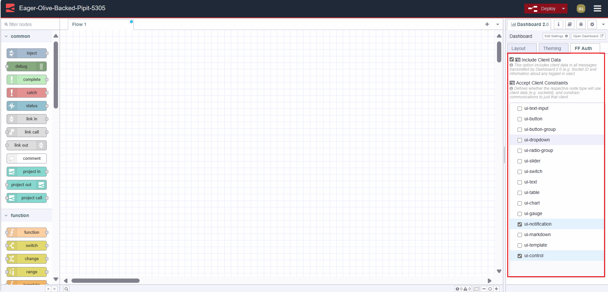
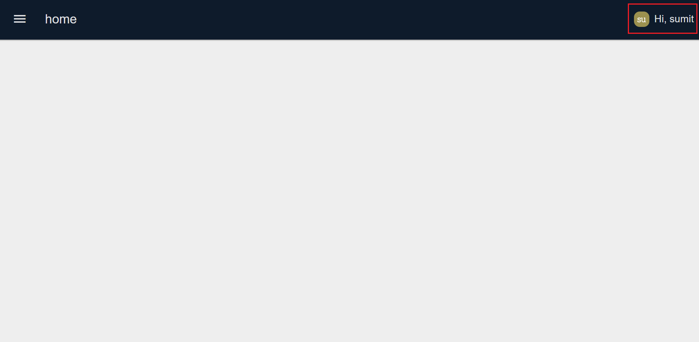

A few months ago when Dashboard 2.0 didn't exist, I was searching for customizable solutions with Dashboard 1.0 to build a more user-friendly, customizable, and powerful dashboard. Now Dashboard 2.0 is released, we've gained a more powerful, customizable, and well-maintained Dashboard compared to Dashboard 1.0. Now In this guide, we will explore one of the most powerful features that Dashboard 2.0 offers us. We will create a Multi-user dashboard that will display logged in user information on the dashboard.

<!--more-->

If you're new to Dashboard 2.0, refer to our blog post [Getting Started with Dashboard 2.0](https://flowfuse.com/blog/2024/03/dashboard-getting-started/)

## Enabling Flowfuse User Authentication 
Before we can show user data on the dashboard we need to figure out how we get the data from users. This may seem like a pain point but don’t worry about it. Flowfuse offers a feature that not only helps us secure the dashboard but also makes it simpler to get the user data at the dashboard at a later stage.

1. Navigate to the instance setting.
2. Select the Security tab.
3. Enable “Flowfuse user authentication”


## Installing Flowfuse user addon

1. Click the Node-RED Settings (top-right)
2. Click "Manage Palette"
3. Switch to the "Install" tab
4. Search for `@flowfuse/node-red-dashboard-2-user-addon`
5. Click "Install"

## Exploring the Flowfuse User Addon
Understanding the Flowfuse User Addon can be a bit complex if you're not familiar with the basics of how it works and the type of object it attaches to the msg emitted by Dashboard 2.0 widgets. Therefore, discussing it in a separate section is important.
The Flowfuse User Addon is a plugin developed for Dashboard 2.0, leveraging the Flowfuse API to retrieve information about logged in user. In this addon, user information is attached to the msg emitted by Dashboard 2.0 nodes. This user information object is attached as msg._client.user, Below is an example of how that object looks:

```
   "userId": "", // unique identifier for the user
   "username": "", // FlowFuse Username
   "email": "", // E-Mail Address connected to their FlowFuse account
   "name": "", // Full Name
   "image": "" // User Avatar from FlowFuse
}
```
Behind the scenes, we're appending our user object to the msg object, via the SocketIO auth option. We make the socketio object available via a computed [setup](https://dashboard.flowfuse.com/contributing/guides/state-management.html#setup-store) object, this means that we can also access user data in any ui-template widget like this:

```
setup.socketio.auth.user
```
When running Node-RED Dashboard 2.0 on FlowFuse, you'll have a new sidebar option in the Node-RED Editor, you just have to navigate to the FF Auth tab and you’ll see two option

**Option 1: Include client Data**

By default, this option is enabled. When this option is enabled, an object with user information will be added to the “msg” emitted by any widget of the Node-red Dashboard 2.0.

**Option 2: Accept client constraints**

A feature that ensures messages are specifically targeted to individual clients, which enhances the precision and security of data transmission within the platform. It determines by enabling the nodes option in the FF Auth tab whether the enabled node type will utilize client data, such as socketid, and restrict communications to only that client.

For example, consider a manufacturing facility where each production line has its own monitoring system. With this feature enabled, data from sensors on Production Line A will only be sent to the monitoring system designated for Production Line A. This ensures that data remains isolated and relevant to each specific area of operation, maintaining organizational efficiency and security.

*Note: Please note that Multi-User Addons can only be used by our Teams and Enterprise Self-Hosted customers. Upon request, we provide all required configurations to get started.*



## Displaying logged in user on Dashboard 2.0
We are all set to display logged in user on Dashboard 2.0. You can confirm this by printing the msg object emitted by the Dashboard 2.0 widget, which should have attached user information. Use the debug node for this.

To display user information on the dashboard we will use Vue’s [Teleport](https://dashboard.flowfuse.com/nodes/widgets/ui-template.html#teleports) feature to render content to a specific location in the DOM, we will display user information at the action bar’s right-hand side.

1. Drag an ui-template widget onto the canvas.
2. Click on that node, and select type as “Widget (Ui-Scoped)”. ( this allows us to render this ui-template at ui scoped which means I will not required to add separate ui-templates for different pages )
3. Copy the below vue snippet and paste that into the ui-template.

```
<template>
    <!-- Teleporting user info to #app-bar-actions, which is id of actions bars right corners area -->
    <Teleport v-if="loaded" to="#app-bar-actions">
        <div class="user-info">
            <!-- Displaying user image -->
            
            <!-- Greeting the user -->
            <span>Hi, {{ setup.socketio.auth.user.name }}</span>
        </div>
    </Teleport>
</template>

<script>
    export default {
        data() {
            return {
                // Flag to indicate if the component is loaded
                loaded: false
            };
        },
        mounted() {
            // Component is mounted, set loaded to true
            this.loaded = true;
        }
    }
</script>

<style>
    /* Styling for user info display */
    .user-info {
        display: flex;
        align-items: center;
        gap: 8px;
    }
    /* Styling for user avatar image*/
    .user-info img {
        width: 24px;
        height: 24px;
  }
</style>
```

## Deploying the flow 

1. To initiate the deployment process, locate and click the red 'Deploy' button positioned in the top right corner. 
2. Navigate to `https://<your-instance-name>.flowfuse.cloud/dashboard`.

Now you'll be able to see the profile icon along with a greeting containing your name.



If you are interested in learning more about Multiuser dashboards, please refer to our [webinar](https://flowfuse.com/webinars/2024/node-red-dashboard-multi-user/) and [blog post](https://flowfuse.com/blog/2024/01/dashboard-2-multi-user/). They provide detailed insights and practical tips on maximizing the potential of Multiuser dashboards with Node-RED Dashboard 2.0, Additionally, we offer a [Multi-User Dashboard for Ticket/Task Management](https://flowfuse.com/blueprints/flowfuse-dashboard/multi-user-dashboard/#multi-user-dashboard-for-ticket%2Ftask-management) blueprint, which allows you to quickly utilize templates to develope Personalize multi-user dashboard.

## Conclusion 
In this guide, we have demonstrated how to secure your dashboard and how to retrieve and display logged in user data on the Dashboard 2.0. Additionally, we have discussed the functionality of the Flowfuse multi-user addon.
