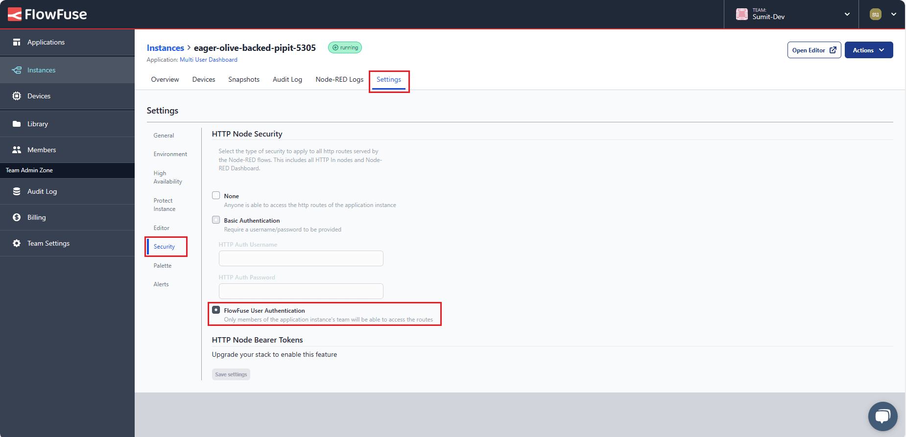

A few months ago when Dashboard 2.0 didn't exist, I was searching for customizable solutions with Dashboard 1.0 to build a more user-friendly, customizable, and powerful dashboard. Now Dashboard 2.0 is released, we've gained a more powerful, customizable, and well-maintained Dashboard compared to Dashboard 1.0. Now In this guide, we will explore one of the most powerful features that Dashboard 2.0 offers us. We will create a Multi-user dashboard that will display logged in user information on the dashboard.

<!--more-->

If you're new to Dashboard 2.0, refer to our blog post [Getting Started with Dashboard 2.0](https://flowfuse.com/blog/2024/03/dashboard-getting-started/)

## Enabling Flowfuse User Authentication

Before we can show user data on the dashboard we need to figure out how we get the data from users. This might seem complicated, but don’t worry about it. FlowFuse offers a feature that not only helps us secure the dashboard but also makes it simpler to get the user data at the dashboard at a later stage.

1. Navigate to the Instance "settings".
2. Select the "Security" tab.
3. Enable “Flowfuse User Authentication”

{data-zoomable}

## Exploring the FlowFuse User Addon

The FlowFuse User Addon is a plugin developed for Dashboard 2.0, leveraging the FlowFuse API to retrieve information about logged in user. 

## Installing Flowfuse user addon

1. Click the Node-RED Settings (top-right)
2. Click "Manage Palette"
3. Switch to the "Install" tab
4. Search for `@flowfuse/node-red-dashboard-2-user-addon`
5. Click "Install"

### How it Works

In this addon, user information is attached to the `msg` emitted by Dashboard 2.0 nodes. This user information object is attached as `msg._client.user`. Below is an example of how that object looks:

```
   "userId": "", // unique identifier for the user
   "username": "", // FlowFuse Username
   "email": "", // E-Mail Address connected to their FlowFuse account
   "name": "", // Full Name
   "image": "" // User Avatar from FlowFuse
}
```

Behind the scenes, the user addon is appending the user object to the `msg`, via the SocketIO auth option. We make the socketio object available via a computed [setup](https://dashboard.flowfuse.com/contributing/guides/state-management.html#setup-store) object, this means that we can also access user data in any ui-template widget with `{{ setup.socketio.auth.user }}`, in the `<template>`, or `this.setup.socketio.auth.user`, in the JS.

When running Node-RED Dashboard 2.0 on FlowFuse, you'll have a new tab available in the "Dashboard 2.0" sidebar in the Node-RED Editor, you just have to navigate to the "FF Auth" tab and you’ll see two options.

**Option 1: Include Client Data**

By default, this option is enabled. When this option is enabled, an object with user information will be added to the “msg” emitted by any widget of the Node-red Dashboard 2.0.

**Option 2: Accept Client Constraints**

A feature that ensures messages are specifically targeted to individual clients, which enhances the precision and security of data transmission within the platform. It determines by enabling the nodes option in the FF Auth tab whether the enabled node type will utilize client data, such as socketid, and restrict communications to only that client.

For example, consider a manufacturing facility where each production line has its own monitoring system. With this feature enabled, data from sensors on Production Line A will only be sent to the monitoring system designated for Production Line A. This ensures that data remains isolated and relevant to each specific area of operation, maintaining organizational efficiency and security.

*Note: Please note that Multi-User Addons can only be used by our Teams and Enterprise Self-Hosted customers. Upon request, we provide all required configurations to get started.*

{data-zoomable}

## Displaying logged in user on Dashboard 2.0

Now you know how the user add on works, you are all set to display logged in user on Dashboard 2.0. To confirm this you can use a `debug` node that receives the `msg` object emitted by the Dashboard 2.0 widgets.

To display user information on the dashboard we will use Vue’s [Teleport](https://dashboard.flowfuse.com/nodes/widgets/ui-template.html#teleports) feature to render content to a specific location in the DOM, we will display user information at the action bar’s right-hand side.

1. Drag a `ui-template` widget onto the canvas.
2. Click on that node, and select type as “Widget (Ui-Scoped)”. ( this allows us to render this ui-template at ui scoped which means I will not required to add separate ui-templates for different pages )
3. Copy the below vue snippet and paste that into the ui-template.

```
<template>
    <!-- Teleporting user info to #app-bar-actions, which is the ID of the action bars' right corners area -->
    <Teleport v-if="loaded" to="#app-bar-actions">
        <div class="user-info">
            <!-- Displaying user image -->
            
            <!-- Greeting the user -->
            <span>Hi, {{ setup.socketio.auth.user.name }}</span>
        </div>
    </Teleport>
</template>

<script>
export default {
    data() {
        return {
            // Flag to indicate if the component is loaded
            loaded: false
        };
    },
    mounted() {
        // This function is called when the component is inserted into the DOM.
        // Setting loaded to true here ensures the component is ready to access #app-bar-actions,
        // as it's now part of the same DOM structure.
        // Accessing it before mounted() would cause an error because the component wouldn't be initialized in the DOM yet.
        this.loaded = true; // Setting loaded to true to indicate that the component has been mounted successfully
    }
}
</script>

<style>
/* Styling for user info display */
.user-info {
    display: flex;
    align-items: center;
    gap: 8px;
}
/* Styling for user avatar image*/
.user-info img {
    width: 24px;
    height: 24px;
}
</style>
```

## Deploying the flow 

1. With your flow updated to include the above, click the "Deploy" button in the top-right of the Node-RED Editor.
2. Navigate to `https://<your-instance-name>.flowfuse.cloud/dashboard`.

Now you'll be able to see the profile icon along with a greeting containing your name.

{data-zoomable}

## Next step

If you want to learn more about flowfuse multiuser addon and personalize multiuser dashboard. we do have many other resources, please refer to them to learn more.

- [Webinar](https://flowfuse.com/webinars/2024/node-red-dashboard-multi-user/) - This webinar provides an in-depth discussion of the Personalised Multi-User Dashboards feature and offers guidance on how to get started with it.
- [Personalised Multi-user Dashboards with Node-RED Dashboard 2.0](https://flowfuse.com/blog/2024/01/dashboard-2-multi-user/) - This article explores the process of building multi-user Dashboards secured with FlowFuse Cloud.


## Conclusion 
In this guide, we have demonstrated how to secure your dashboard and how to retrieve and display logged in user data on the Dashboard 2.0. Additionally, we have discussed the functionality of the Flowfuse multi-user addon.
