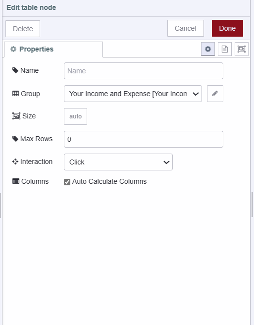

This guide delves into Node-RED Dashboard 2.0 widgets, teaching you how to build applications using them.

<!--more-->

If you're new to Dashboard 2.0, I recommend starting with the [Getting Started with Dashboard 2.0](/blog/2024/03/dashboard-getting-started/) guide and installing it.

## What Are Widgets?

Widgets in Node-RED are like building blocks for creating the user interface. They're made of front-end pieces of code and work on the client's side. In Dashboard 2.0, you get a variety of widgets like forms, templates, buttons, and others to make different parts of your interface.

## Building Applications with Dashboard 2.0 Widgets

{data-zoomable}

In this guide, we'll create a basic app where you can input expenses and income. That will be displayed on the chart and table for analysis. This app will use more than half of the widgets available in Dashboard 2.0, helping you understand and use them confidently.

### Adding Forms

To enable income and expense submission, we'll incorporate a form using the **ui-form** widget.

1. Drag the **ui-form** widget onto the canvas.
2. Double-click it to access various widget properties; refer to the [ui-form properties docs](https://dashboard.flowfuse.com/nodes/widgets/ui-form.html#properties) for details.
3. Select the ui-group where it should render.
4. Add date, description, amount, and note form elements by clicking the **+element** button at the bottom left.

{data-zoomable}

Once you've added the income submission form, repeat the process to add an expense submission form on another **ui-page** and **ui-group**.

{data-zoomable}

### Storing Form Data

The **ui-form** widget emits a payload object with key-value pairs of form elements upon submission. We'll store this data in a global context.

1. Drag a **function** node onto the canvas and use the following code which also contain notification message set to payload:

```javascript
let income = global.get('income') || [];

income.push({
  ...msg.payload,
  type: "income",
});

global.set('income', income);

msg.payload = "Thank you for submitting income!";

return msg;
```

### Displaying Notifications

For displaying notifications on the dashboard, we'll utilize the **ui-notification** widget, which allows showing notifications at different positions on the dashboard. It accepts `msg.payload` to send string messages or raw HTML/JavaScript for custom formatting.

1. Drag the **ui-notification** widget onto the canvas.
2. Set the position property to center. You can also adjust colors or notification timeout by modifying the color and timeout properties. Please take a look at the [ui-notification docs](https://dashboard.flowfuse.com/nodes/widgets/ui-notification.html#properties) for more information on **ui-notification.

{data-zoomable}

### Listening events 

In Dashboard 2.0, the **ui-event** widget allows you to listen for user behavior or events. It does not render any content or components on the dashboard. Currently, this widget only listens for page view and leave events.

With this, we can listen for a page view and page leave event and trigger tasks based on those events. For instance, in our application, we will be displaying a table containing income-expense data and a chart that we will gets update when we visit a new page or leave a page.

1. Drag an **ui-event** widget onto the canvas.
2. Double-click on it and select the correct **ui-base** of your application.

For more information on ui-event refer to [ui-event docs](https://dashboard.flowfuse.com/nodes/widgets/ui-event.html).

### Retrieving Income-Expense Data

In our income-expense application, we will display the income and expenses in a single table.

1. Drag a **change** node onto the canvas.
2. Set `msg.payload` to the JSON expression below, which merges two icome and expense array.
3. Connect the output of the **ui-event** widget to the input of the **change** node.

```javascript
[$globalContext('income'), $globalContext('expense')]
```
{data-zoomable}

### Displaying Data on the Table

To display data on the table, we use the **ui-table** widget in Dashboard 2.0. This widget accepts an array of objects as input. The columns in the table correspond to the properties of the objects within the array, and each row represents a different object with values corresponding to those properties.

1. Drag a **ui-table** widget onto the canvas.
2. Create a new **ui-page** and **ui-group** for it.
3. Connect the output of the **change** node to the input of the **ui-table** widget.

{data-zoomable}

For more information on ui-table refer to [ui-table docs](https://dashboard.flowfuse.com/nodes/widgets/ui-table.html)

### Calculating total category-wise 

In our application, we will display data on the chart with the total income and total expenses for analysis. For that in this section we will calculate the total expense and income using the function node.

1. Drag an **function** node onto canvas.
2. Paste the following code in it, we have added comments in the code for your better understanding.

```javascript
// Get income and expense arrays from a global context, or set them as empty arrays if not found
let income = global.get('income') || [];
let expense = global.get('expense') || [];

// Initialize an empty result array
let result = [];

// Send an empty payload to reset chart
node.send({ payload: [] });

// Calculate total income by summing up amounts in the income array
let totalIncome = income.reduce((sum, item) => sum + parseFloat(item.amount), 0);
result.push({ category: "Income", amount: totalIncome });

// Calculate total expense by summing up amounts in the expense array
let totalExpense = expense.reduce((sum, item) => sum + parseFloat(item.amount), 0);
result.push({ category: "Expense", amount: totalExpense });

// Set the result array as the payload of the message
msg.payload = result;

// Return the message
return msg;
```

### Displaying data on the chart 

To display charts on the dashboard, we have to use the ui-chart widget which allows us to display different types of charts on a dashboard including linear, bar, scatter, etc. This accepts an array and object as input.

1. Drag a **ui-chart** widget onto the canvas.
2. Double-click on the widget and select Type as **bar**.
3. Configure the series to **category** and the y-axis to **amount**. This configuration informs the chart that the **amount** property of the input objects will be plotted on the y-axis of the chart.
4. Connect the output of the ui-event widget's output to the input of the function node and the function node's output to the ui-chart widget's output.

{data-zoomable}

### Adding custom footer with ui-template

With ui-template widget, we can add a custom component to our app using Vue.js. It also allows adding custom CSS for dashboar and more. For more information refer to [ui-template docs](https://dashboard.flowfuse.com/nodes/widgets/ui-template.html).

Using this widget, we will add a footer to our application.

1. Drag an ui-template widget onto the canvas.
2. Set the type widget( ui scoped ) which will render this widget on entire dashboard so that we will not need to add seprate footers for each page of the dashboard.
3. Insert the following vue.js code in the ui-template widget. 

```javascript
// Get income and expense arrays from global context, or set them as empty arrays if not found
let income = global.get('income') || [];
let expense = global.get('expense') || [];

// Initialize an empty result array
let result = [];

// Send an empty payload to reset chart
node.send({ payload: [] });

// Calculate total income by summing up amounts in the income array
let totalIncome = income.reduce((sum, item) => sum + parseFloat(item.amount), 0);
result.push({ category: "Income", amount: totalIncome });

// Calculate total expense by summing up amounts in the expense array
let totalExpense = expense.reduce((sum, item) => sum + parseFloat(item.amount), 0);
result.push({ category: "Expense", amount: totalExpense });

// Set the result array as the payload of the message
msg.payload = result;

// Return the message
return msg;
```

{data-zoomable}

### Deploying your application flow

{data-zoomable}

1. Deploy the flow by clicking the top right **Deploy** button.
2. Locate the ***Open Dashboard** button at the top-right corner of the Dashboard 2.0 sidebar and click on it to navigate to the dashboard.

Now that we've built an income-expense tracker application and gained a basic understanding of Dashboard 2.0 widgets for building dashboards, but you might notice a difference in the application layout or style from the screenshot above. For more detailed understand on Dashboard 2.0 styling, navigation and layout refer to our [Comprehensive guide: Node-RED Dashboard 2.0 layout, sidebar, and styling](https://flowfuse.com/blog/2024/05/node-red-dashboard-2-layout-navigation-styling/)

### Up next

If you want to enhance this simple application by adding more features or want to make the application personalize for users, consider the following resources:

[Webinar](/webinars/2024/node-red-dashboard-multi-user/) - This webinar provides an in-depth discussion of the Personalised Multi-User Dashboards feature and offers guidance on how to get started with it.

[Displaying logged-in users on Dashboard 2.0](/blog/2024/04/displaying-logged-in-users-on-dashboard/) - This detailed guide demonstrates how to display logged-in users on Dashboard 2.0 which using the FlowFuse Multiuser addon and FlowFuse.

[How to Build an Admin Dashboard with Node-RED Dashboard 2.0](/blog/2024/04/building-an-admin-panel-in-node-red-with-dashboard-2/) - This detailed guide demonstrates how to build a secure admin page in Node-RED Dashboard 2.0.

[How to Build An Application With Node-RED Dashboard 2.0](/blog/2024/04/how-to-build-an-application-with-node-red-dashboard-2/) - This guide, covers how you can build personalize multiuser dashboard using flow fuse multi-user addon

[Multi-User Dashboard for Ticket/Task Management blueprint](/blueprints/flowfuse-dashboard/multi-user-dashboard/#multi-user-dashboard-for-ticket%2Ftask-management) -  this blueprint allows you to utilize templates to develop a personalized multi-user dashboard quickly. This Task management blueprint has all features such as adding, updating, and deleting tasks, user profiles, and admin dashboard.


