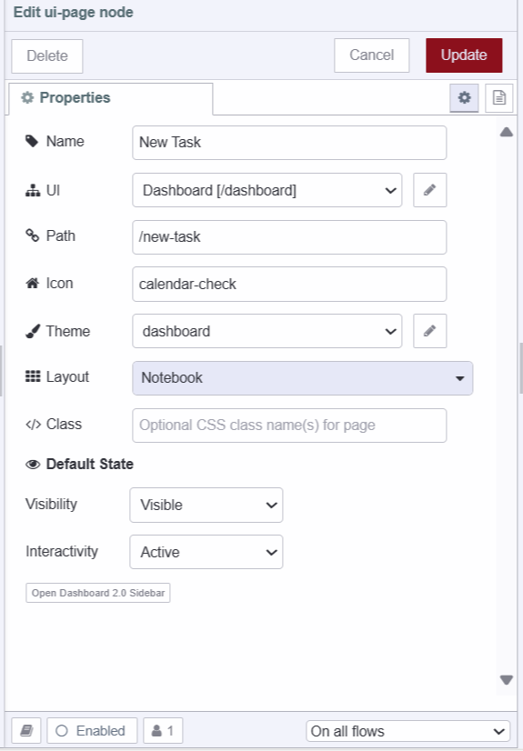
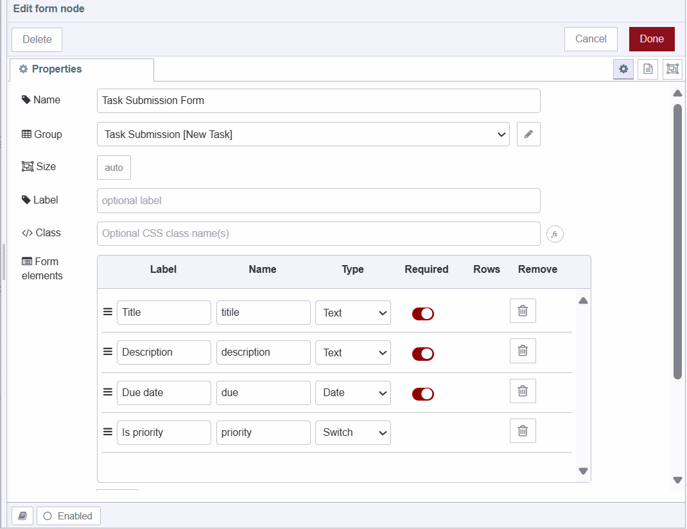
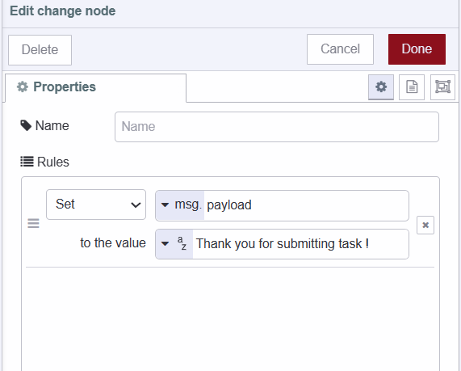
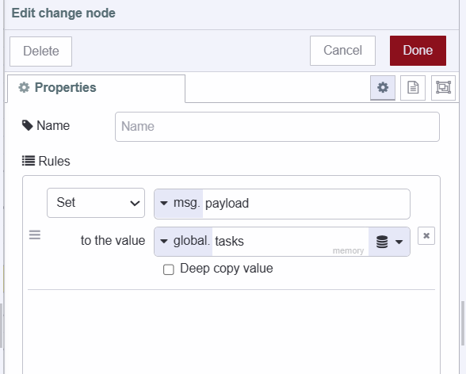
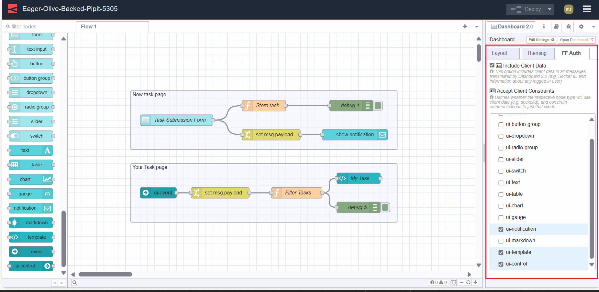
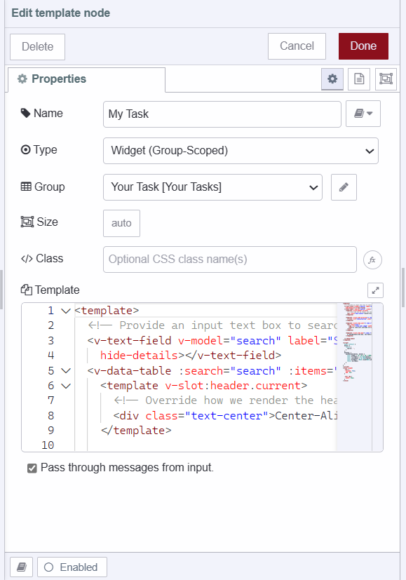
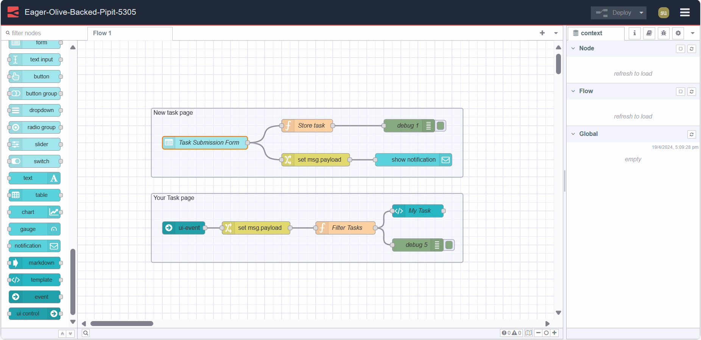

In this guide, we'll build a Todo application to guide you through the features and explain how you can build rich and dynamic applications too. It shows many of the features that make Dashboard 2.0 great, and why you should use it over the deprecated node-red-dashboard.

<!--more-->

If you're new to Dashboard 2.0, refer to our blog post [Getting Started with Dashboard 2.0](/blog/2024/03/dashboard-getting-started/) to install and get things started.

## Installing Flowfuse user addon

The FlowFuse User Addon is a plugin developed for Dashboard 2.0, that levereges the FlowFuse API to access logged in user's information at Dashboard 2.0. For detailed information refer to the [Exploring the FlowFuse User Addon](/blog/2024/04/displaying-logged-in-users-on-dashboard/#exploring-the-flowfuse-user-addon) and make sure to install it.


Before you begin the application development process, please make sure that FlowFuse user authentication is enabled. This feature adds a layer of security to your application with a login page. By combining the FlowFuse user addon with user authentication, we gain access to the logged in user's data within our application. For more information on FlowFuse user authentication, refer to the [documentation](/docs/user/instance-settings/#flowfuse-user-authentication) and make sure that it is enabled.

## Building Task Management application

{data-zoomable}

Throughout this guide, we will be building a simple, secure, and personalized Task management application that will allow users to create and view their tasks.

### Building a Form to Submit Tasks

1. Drag an **ui-form** widget onto the canvas.
2. Click on the edit icon next to Page 1 (The default page added when you install Dashboard 2.0) in the Dashboard 2.0 sidebar. While this step is optional, updating the page configurations as shown in the image below ensures that your application aligns with the layout described in this guide.

{data-zoomable}

3. Click on the **ui-form** widget to add form elements such as title, description, due date, and priority.

{data-zoomable}

### Storing Tasks in the Global Context

For this guide, we are storing our Tasks in Node-RED global context but storing them  in a database will make it easy to manage your task data.

1. Drag a **function** node onto the canvas
2. Paste the below code in the **function** node.

```javascript
// Retrieve the existing tasks from the global context or initialize an empty array if none exists

let tasks = global.get('tasks') || [];

// Push the new task object into the tasks array, including the task details and the user object extracted from the message object, as each payload emitted by the Node-RED Dashboard 2.0 widgets contains user information due to the FlowFuse User Addon.

tasks.push({
  ...msg.payload,
  ...{
    user: msg._client.user // Assign the user object to the task
  }
});

// Update the 'tasks' variable in the global context with the modified tasks array

global.set('tasks', tasks);

return msg;
```

3. Connect the **ui-form** widget’s output to the **function** node’s input.

### Displaying notification on successful task submission

1. Drag a **change** node onto the canvas and set `msg.payload` to the confirmation message you want to display on successful task submission.

{data-zoomable}

2. Drag an **ui-notification** onto the canvas select **ui-base** and set the position to "center".
3. Connect the **ui-form** widget’s output to the **change** node’s input and the **change** node’s output to the **ui-notification** widget's input.

### Retrieving and Filtering Tasks

Now that we can store tasks along with the user details of who submitted them, we need to retrieve and filter them based on users, ensuring that users can only see their tasks only and not others.

1. Drag a **ui-event** widget onto the canvas and select **ui-base** for it. The **ui-event** will enable us to display updated tasks on the table without the need for polling, as it triggers when the page reloads or changes.
2. Drag a **change** node onto the canvas and set `msg.payload` to `global.tasks`.

{data-zoomable}

3. Drag a **function** node onto the canvas and paste the below code into it.

```javascript
// Filter the payload array of tasks to include only those tasks associated with the currently logged in user.

msg.payload = msg.payload.filter((task) => task.user.userId === msg._client.user.userId);

// Return the modified message object containing the filtered tasks.

return msg;
```
4. Connect the **ui-event** widget’s output to the **change** node’s input and the **change** nodes’ output to the **function** node’s input.

### Enabling client constraint for ui-template

Before we begin building our table to display tasks, we need to enable access to client constraints for the **ui-template** widget. Access client constraints ensure that messages or actions are specifically targeted to individual clients. For instance, if 100 people are interacting with the same task management dashboard simultaneously and one person submits a task, the notification will only be visible to that person and not to the remaining 99 individuals.

If you have experience with Node-RED Dashboard 1.0, you may recall that these client constraints were only available for **ui-control** and **ui-notification** widgets but in Dashboard 2.0 you can enable it for any widget.

{data-zoomable}

1. Navigate to the Dashboard 2.0 sidebar and select the top-right "FF Auth" Tab
2. In the "Accept Client Constraints" option, you'll see Dashboard 2.0 widgets where this option is by default enabled for **ui-notification** and **ui-control**, enable it for **ui-template** as well.

### Creating a table and displaying the task

In this section, we will build an interactive table using **ui-template** and [vuetify component](https://vuetifyjs.com/en/components/all/). Vuetify offers a wide range of components, all of which are compatible with our Node-RED Dashboard 2.0's ui-template widget. You can easily use them by just simply copying and pasting them into the **ui-template** widget.

1. Drag an **ui-template** widget onto the canvas
2. Create a new **ui-page** and **ui-group** for it. Below, I have provided a screenshot of the "new task" page configurations. Again You can replicate it if you want to align with the layout described in this guide, otherwise, it is optional.

{data-zoomable}

3. Paste the below code into the widget, If you're new to Vue.js, rest assured I've included helpful comments for clarity.

```html
` <template>
 <!-- Input field for searching tasks -->
 <v-text-field v-model="search" label="Search" prepend-inner-icon="mdi-magnify" single-line variant="outlined"
  hide-details></v-text-field>
 
 <!-- Data table to display tasks -->
 <v-data-table :search="search" :items="msg?.payload">
  <!-- Custom header for the "current" column -->
  <template v-slot:header.current>
   <div class="text-center">Center-Aligned</div>
  </template>

  <!-- Template for the "priority" column -->
  <template v-slot:item.priority="{ item }">
   <!-- Display priority icon if it exists -->
   <v-icon v-if="item.priority" icon="mdi-alert" color="red"></v-icon>
  </template>

  <!-- Template for the "user" column -->
  <template v-slot:item.user="{ item }">
   <!-- Display user avatar and username -->
   <div class="user">
    <!-- User avatar -->
    
    <!-- Username -->
    <span>{{ item.user.username }}</span>
   </div>
  </template>

  <!-- Template for the "due" column -->
  <template v-slot:item.due="{ item }">
   <!-- Calculate and display the number of days between due date and current date -->
   {{ daysBetween(item.due, new Date()) }} Days
  </template>
 </v-data-table>
</template>

<script>
 export default {
  data() {
   return {
    // Search input field model
    search: '',
   }
  },
  methods: {
   // Method to calculate the number of days between two dates
   daysBetween(date1, date2) {
    // Calculate the difference in days
    const oneDay = 24 * 60 * 60 * 1000; // hours*minutes*seconds*milliseconds
    const firstDate = new Date(date1);
    const secondDate = new Date(date2);
    const diffDays = Math.round(Math.abs((firstDate - secondDate) / oneDay));
    return diffDays;
   }
  }
 }
</script>

<style scoped>
 /* Styling for user avatar and username */
 .user {
  display: flex;
  gap: 5px; /* Gap between avatar and username */
 }

 /* Styling for user avatar */
 .user img {
  width: 24px; /* Set width of user avatar */
 }
</style>

```
3. Connect the **ui-template** widget's input to the **function** node's output ( function node which we have added to filter tasks based on user ).

## Deploying the flow 

{data-zoomable}

1. Deploy the flow by clicking the top right Deploy button.
2. Locate the 'Open Dashboard' button at the top-right corner of the Dashboard 2.0 sidebar and click on it to navigate to the dashboard.
3. Login with the registered FlowFuse account username and password.

Now, we're all set to add tasks. Navigate to the "New Task" page to add tasks. To view tasks, navigate to the "your Task" page.

## Next step

If you want to enhance this simple application by adding more features, consider the following resources:

- [Webinar](/webinars/2024/node-red-dashboard-multi-user/) - This webinar provides an in-depth discussion of the Personalised Multi-User Dashboards feature and offers guidance on how to get started with it.

- [Displaying logged-in users on Dashboard 2.0](/blog/2024/04/displaying-logged-in-users-on-dashboard/) - This detailed guide demonstrates how to display logged-in users on Dashboard 2.0 which using the FlowFuse Multiuser addon and FlowFuse.

- [How to Build an Admin Dashboard with Node-RED Dashboard 2.0](/blog/2024/04/building-an-admin-panel-in-node-red-with-dashboard-2/) - This detailed guide demonstrates how to build a secure admin page in Node-RED Dashboard 2.0.

- [Multi-User Dashboard for Ticket/Task Management](/blueprints/flowfuse-dashboard/multi-user-dashboard/) blueprint, which allows you to utilize templates to develop a personalized multi-user dashboard quickly. This Task management blueprint has all features such as adding, updating, and deleting tasks, user profiles, and admin dashboard.

{% include "cta.njk", cta_query: "utm_campaign=60718323-BCTA&utm_source=blog&utm_medium=cta&utm_term=high_intent&utm_content=How%20to%20Build%20An%20Application%20With%20Node-RED%20Dashboard%202.0", cta_type: "signup", cta_text: "Looking to build a multi-user dashboard, deploy it in seconds, scale and manage Node-RED efficiently, and enable seamless remote access for your entire team?" %}
