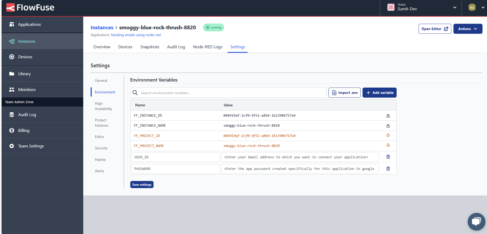
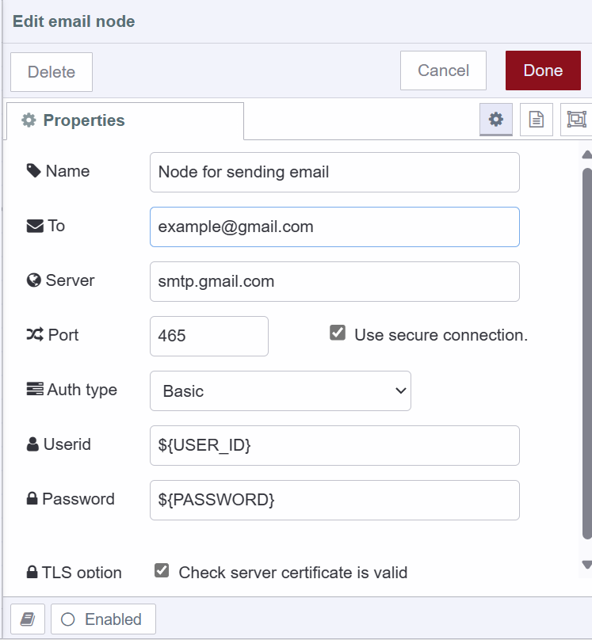
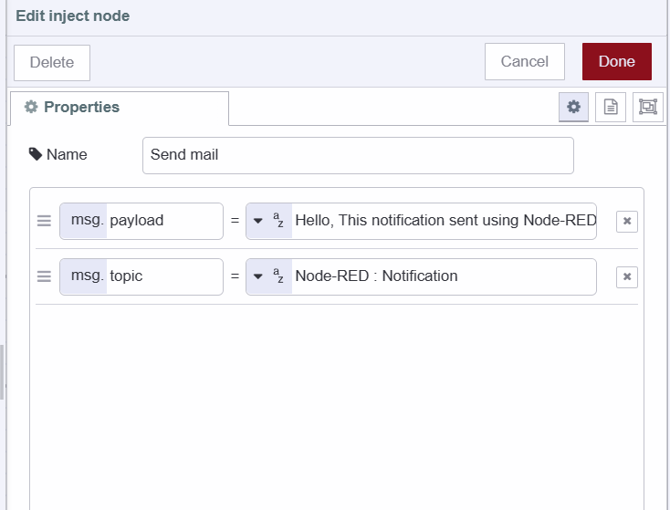
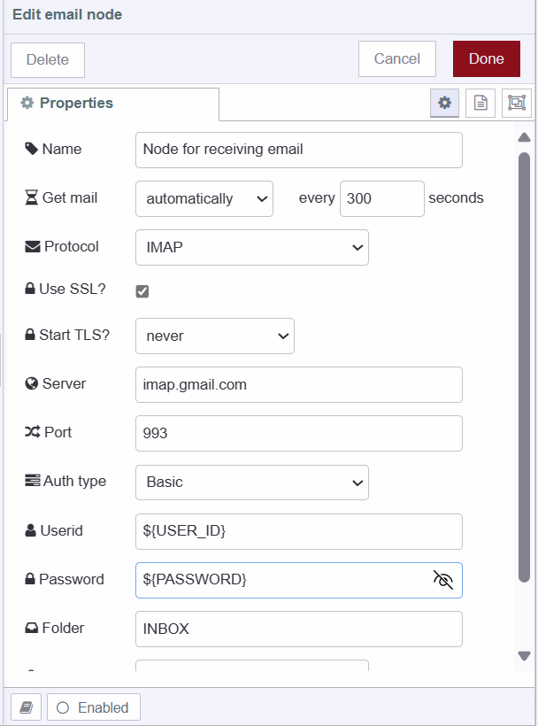
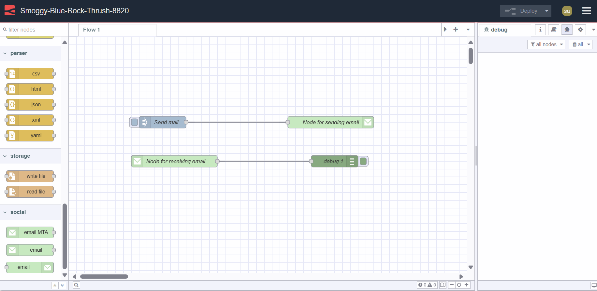
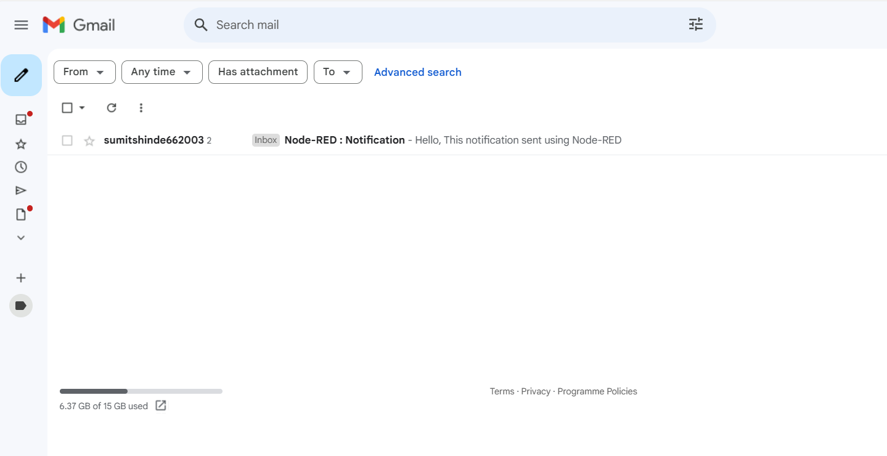

We recently published an article on [Sending Telegram messages using Node-RED](https://flowfuse.com/blog/2024/04/sending-and-receiving-telegram-messages-with-node-red/). However, in IoT, it's not the only option we utilize for sending notifications. We employ numerous other approaches, and email notification is one popular approach among those. In this guide, we will cover how you can send and receive emails using Node-RED. Additionally, we will discuss some of the best practices that should be followed when sending email notifications with your IoT applications.

<!--more-->

## When to Use Email for IoT Notification

With so many communication methods available, each with its advantages, it’s essential to consider the situations where email is best suited for IoT integration.

- For Non-Urgent Notifications: Emails are great for sending updates or notifications that don't require an immediate response. They're perfect for IoT situations where quick reactions aren't necessary.
- For Compliance and Documentation: Emails provide a clear record of communication, which is essential for meeting compliance requirements and audit standards in regulated IoT industries.
- For Sending Detailed Information: Emails support longer messages and file attachments, making them ideal for sharing comprehensive reports, logs, or documents in IoT applications.
- Broad Notification Reach: Emails enable notifications to be delivered to multiple recipients simultaneously, that ensures IoT messages can reach users efficiently across different locations.

## Installing Email Custom Node

1. Click the Node-RED Settings (top-right).
2. Click "Manage Palette."
3. Switch to the "Install" tab.
4. Search for `node-red-node-email`.
5. Click "Install"

## Understanding Custom Email Node Configurations

1. **Server:**
   - This is the mail server address of your email service provider. It typically looks like `smtp.example.com` for outgoing emails and `imap.example.com` or `pop.example.com` for incoming emails.

2. **Port:**
   - The port number to use for connecting to the mail server. Common ports include for outgoing emails:
     - 465: This is the SMTP port for SSL-encrypted connections.
     - 587: This is the SMTP port for TLS encrypted connections (STARTTLS).
     - 25: This is the default SMTP port, but ISPs often block it for security reasons.
   - For incoming emails, the default ports are:
     - 993: IMAP port for SSL-encrypted connections.
     - 143: IMAP port for plain TCP connections.
     - 995: POP3 port for SSL-encrypted connections.
     - 110: POP3 port for plain TCP connections.

3. **Use Secure Connection:**
   - Enabling this option ensures that the connection to the mail server is encrypted using Transport Layer Security (TLS). It's recommended to enable this option whenever possible to secure your email communications.
   - For ports 587 or 25, if the mail server supports the STARTTLS extension (which upgrades a plain text connection to an encrypted one), you should leave this option disabled.

4. **Auth Type:**
   - The authentication method required by your email service provider:
     - **Basic:** This method requires a username and password to authenticate with the mail server.
     - **XOAuth:** This method requires a username and access token, typically used for OAuth authentication.
     - **None:** Use this option if your mail server does not require authentication. However, this is rare and generally not recommended for outgoing mail servers.

5. **TLS Option:**
   - Checking this option ensures that the email node verifies the validity of the server's SSL/TLS certificate. It's recommended to enable this option to ensure secure communication with the mail server.

6. **Format to SASL:**
   - SASL (Simple Authentication and Security Layer) XOAuth2 tokens are used for authentication when using the XOAuth authentication method.
   - If this option is ticked, the email node will automatically format the XOAuth2 token by combining the username and token, encoding it in base64, and passing it to the mail server in the correct format.
   - If this option is unticked, you must manually format the token before passing it to the email node.

7. **Protocols:**
    - SMTP (Simple Mail Transfer Protocol): Responsible for sending outgoing email messages from the sender's email client or application to the recipient's email server.
    - POP3 (Post Office Protocol version 3): Downloads messages to the client, typically deleting from the server.
    - IMAP (Internet Message Access Protocol): Access and manage email directly on the server, syncing across devices.

## Gmail Configuration Details for Node-RED Integration

Throughout this guide, we will demonstrate how to send emails using Node-RED with Gmail as a third-party email service provider. To connect our Gmail account with the Node-RED application, it is essential to understand the following Gmail-specific configuration details.

- **Server:** For outgoing emails `smtp.gmail.com` and for incoming emails `imap.gmail.com`. 
- **Userid:** Your Gmail address, e.g., example@gmail.com.
- **Port:** Either 465 (SSL) or 587 (TLS).
- **Password:** To connect to your Google account with your app or devices, you'll need to enable and generate an app password. For more information, refer to [Sign in with app passwords](https://support.google.com/mail/answer/185833?hl=en). Make sure to generate a separate app password for each of your Node-RED applications.

## Creating Environment Variables for Secure Email Configuration

Configuring your email account within Node-RED involves handling sensitive data such as your login credentials. To ensure the security of your information, it's essential to utilize environment variables. This approach prevents your sensitive data from being directly exposed within your flow. For more information refer to the [Using Environment variable with Node-RED].

{data-zoomable}

1. Navigate to the instance's “setting” and then go to the “environment” tab.
2. Click on the add variable button and add variables for userid and password.
3. Click on the save button and restart the instance by clicking on the top right Action button and selecting the restart option.

## Configuring Email Node for Sending Emails

1. Drag an e-mail node onto the canvas and click on it.
2. Enter the email address of the recipient you want to send the email notification to in the 'to' input field. You can also dynamically set it with msg.to. To include recipients for the 'cc' and 'bcc', use `msg.cc` and `msg.bcc` respectively. For more information, refer to the [Node README](https://flows.nodered.org/node/node-red-node-email).
3. Enter the server address as `smtp.gmail.com` into the server input field.
4. Enter the port as 465 to use SSL-encrypted connections and 587 for TLS-encrypted connections. You can use either of them.
5. Select the auth type as "basic" and enter the environment variables set for the user ID and password in the corresponding input fields as shown below.
6. Enable the "use secure connection" option.

 {data-zoomable}

## Sending emails to Gmail

1. Drag an inject node onto the canvas.
2. Set `msg.payload` as the body content of your email. To set it dynamically, use `msg.plaintext` for the plain text email body and msg.html for the HTML email body. To include attachments, use `msg.attachment`, which should be an array containing one or more attachments in the [Nodemailer](https://nodemailer.com/message/attachments/) format.
3. Set `msg.topic` as the subject of your email.
4. Connect the e-mail node's input to the inject node's output.

 {data-zoomable}

## Receiving Email from Gmail

1. Drag an "e-mail in" node onto the canvas.
2. Select the "Get mail" option according to your preference.
3. Select Protocol as "IMAP," which is recommended when you are connecting your third-party app for receiving emails.
4. Enter the environment variable set for userid and password in the corresponding field as shown below.
5. Drag a debug node onto the canvas and connect the debug node's input to the "e-mail in" node's output.

{data-zoomable}

## Deploying the Flow

{data-zoomable}

{data-zoomable}

- With your flow updated to include the above, click the "Deploy" button in the top-right of the Node-RED Editor.

Now, to send an email, you can either click the inject button or set it to trigger it on critical events.

## Ensuring Email Delivery: Understanding Anti-Spam Measures and Best Practices

Typically, third-party email service providers implement some type of anti-spam measures to reduce spam and protect users from fraudulent emails. However, these measures may occasionally misclassify legitimate emails as spam or originate from trusted sources. To prevent such incidents from occurring with our sent emails or notifications, it is crucial to comprehend these anti-spam measures and adopt best practices to reduce the likelihood of being marked as spam.

### Understanding Anti-Spam Measures

Anti-spam measures are essential components of email servers aimed at filtering out unwanted or malicious emails. These measures encompass various strategies, including:

- Content Filtering: This method involves scanning email content for specific keywords, phrases, or patterns commonly associated with spam messages.
- Sender Authentication:  Verifying the legitimacy of sender email addresses or domains. This often involves using the Sender Policy Framework (SPF) to check if the sender's IP is authorized to send emails on behalf of their domain.
- IP Filtering: IP filtering blocks or filters messages from known spam sources based on their IP addresses.
- Reputation Scoring: Reputation scoring assigns a numerical score to senders based on their email sending history, behavior, and other factors. This score influences the likelihood of emails being marked as spam.

### Best practices to follow 

- Clear and Concise Messaging: Keep notification messages clear, concise, and action-oriented. Communicate the purpose of the notification and any necessary next steps that recipients should take.
- Avoid spam trigger words: Refrain from using words commonly associated with spam in your email content, such as "free," "limited time offer," or "urgent."
- Ensure your email is authenticated: Perform email authentication using protocols like SPF, DKIM, and DMARC to verify the legitimacy of your emails and improve deliverability.
- Manage Email Frequency: Avoid sending too many email notifications within a short period, as this can trigger spam filters. Instead, maintain a consistent sending frequency and provide valuable content to recipients.
- Maintain a Clean Email List: Regularly clean your email list by removing invalid or inactive email addresses. High bounce rates and spam complaints can negatively impact your sender's reputation.
- Monitor Sending Reputation: Monitor your sender reputation using tools like SenderScore or Postmaster Tools. A poor sender reputation can result in email deliverability issues and increased spam filtering.

## Conclusion

This guide covers integrating email into Node-RED for the seamless sending and receiving of email notifications. We provide step-by-step instructions, explore best practices, and address anti-spam measures, ensuring reliable delivery of email notifications.

