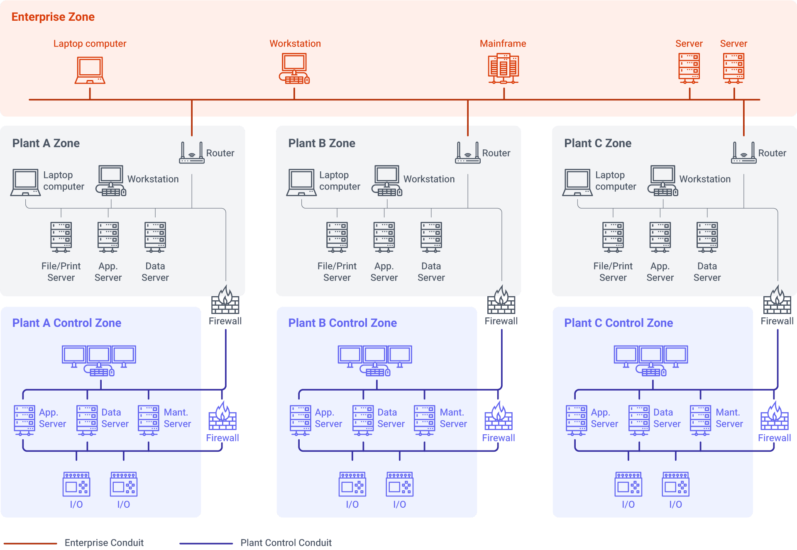
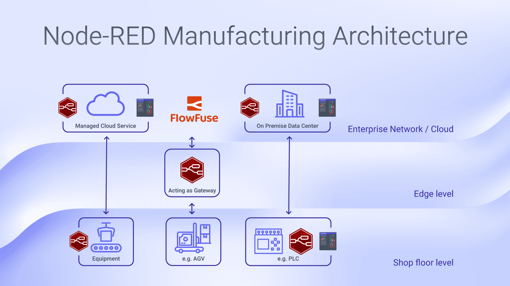

The architecture of a factory's Node-RED infrastructure is a common topic of discussion and inquiry. Fundamentally, my response to such queries unfolds in two parts. Initially, the focus must be on data organization. I champion a structure centered around a [Unified Namespace](/solutions/uns/), a concept I explore in depth in this article ["Node-RED in a Unified Namespace Architecture."](/blog/2024/02/node-red-unified-namespace-architecture/) However, this is only one part of the inquiry. The other part of the question delves into the positioning of FlowFuse and Node-RED within the network infrastructure.

<!--more-->

## Understanding the Multilayered Approach: The Foundation of Factory Architecture

For illustrative purposes, I’ve opted to reference the [Purdue / ISA-99 Model](https://webstore.ansi.org/preview-pages/ISA/preview_S_990001_2007.pdf), despite its fair share of criticism. Many of today's factories and manufacturing spaces adhere to this model, and the aim here is to mirror a realistic network scenario. For the sake of clarity, I've condensed the network into three primary layers.

**ISA-99 Visualization**

{data-zoomable}

At the base is the Shopfloor layer. This is where all the physical factory equipment resides. Often, this layer is segmented further, but for our discussion, it's represented as a single zone.

Next is the Edge layer, which serves as the communicative conduit between the Shopfloor and the Enterprise layers. This layer often contains a Demilitarized Zone (DMZ) where various Gateways are positioned.

At the top, we find the Enterprise Layer. This can signify either cloud services or a company-wide accessible network. Frequently, the Cloud and Enterprise layers are divided, but in our case, it doesn’t matter whether they are separated.

{data-zoomable}

## Applications Across Factory Layers

**Shopfloor:** Node-RED's versatility shines at the shopfloor level, where it’s typically installed on a variety of industrial devices. A prominent application is the development of simple Human-Machine Interfaces (HMIs) using the [Dashboard module](https://dashboard.flowfuse.com/), which enables operators to interact with the machines visually and intuitively. Additionally, Node-RED is instrumental in data acquisition tasks, where it can gather, process, and interpret data from sensors and actuators in real-time. This capability allows for the monitoring of production processes, predictive maintenance, and the triggering of automated workflows in response to specific conditions or anomalies detected on the shop floor.

**Edge:** At the edge level, Node-RED plays a pivotal role in harmonizing the divide between Operational Technology (OT) and Information Technology (IT). Its gateway functionalities are not only integral in facilitating the flow of data between the shopfloor devices and the enterprise-level systems but also it is at this juncture that plant-wide Key Performance Indicators (KPIs) are generated. These KPIs, aggregated from various data points across the production line, are essential for operational oversight and strategic decision-making. Edge-level Node-RED instances can run local analytics and manage alarms.

**Enterprise Network:** Within the higher echelons of the network, FlowFuse establishes its domain, serving as a central hub for managing multiple Node-RED instances. In this space, Node-RED’s agility is leveraged for creating test environments, where simulated data flows can be used to model and understand potential changes before they are deployed on the shopfloor. For enterprise-wide KPI calculations, advanced analytics, and integration with other business systems like ERP or CRM. This layer can use data processed at the edge to inform enterprise-level decisions, drive continuous improvement, and harness machine learning models to glean deeper insights into the production process, quality control, and supply chain logistics.

### The Device Agent: Empowering Remote Node-RED Instances

Every Node-RED instance that isn’t hosted within the Enterprise/Cloud Network’s domain of FlowFuse operates on a Device Agent. This simple tool runs Node-RED and facilitates the connection to FlowFuse. Such remote Node-RED instances are referred to as Devices.

### How to communicate between Node-RED Instance? Project Nodes

Facilitating communication between Node-RED instances is a fundamental requirement for creating a cohesive and responsive Node-RED architecture. FlowFuse elevates this capability by providing an event-driven communication framework (based on MQTT) that binds different Node-RED instances together. This is primarily achieved through the use of Project Links—a feature within FlowFuse that allows for the smooth transfer of data between instances.

These [Project Links](/docs/user/projectnodes/) are more than just communication channels; they represent a method of organizing Node-RED instances into a networked application, where each instance can be considered a node within the project. With Project Links, instances can subscribe to specific events or topics and publish messages that other instances are listening for. This is particularly useful for triggering actions across the network, like updating a dashboard in real time or controlling devices on the shopfloor based on analytics computed at the edge.

## Summary

By employing a unified namespace approach and strategically positioning Node-RED and FlowFuse within the network, we enable a seamless flow of data from the shopfloor to the enterprise level. This multilayered approach not only enhances communication between operational technology and information technology but also empowers real-time monitoring, predictive maintenance, and strategic decision-making. 

{% include "cta.njk", cta_query: "utm_campaign=60718323-BCTA&utm_source=blog&utm_medium=cta&utm_term=high_intent&utm_content=Node-RED%20Manufacturing%20Architecture", cta_type: "signup", cta_text: "" %}