In this comprehensive guide, we will explore different layouts and sidebar styles in Dashboard 2.0. Additionally, we will cover how you can style the dashboard 2.0 element effortlessly.

<!--more-->

If you are new to Dashboard 2.0, refer to [Getting started with Node-RED Dashboard 2.0](/blog/2024/03/dashboard-getting-started/) and make sure you have installed it.

## Understanding Dashboard 2.0 layouts.

A layout in Node-RED Dashboard 2.0 refers to how groups of widgets are organized and arranged on a page. It controls the visual structure and placement of these widget groups to create an organized and easy-to-use interface.

### Exploring Dashboard 2.0 layouts

In Dashboard 2.0, we have three types of layouts: Grid, Notebook, and fixed.

#### Grid layout

Choosing this layout divides your dashboard page into **12 equal-size** columns, and you can specify how many columns your group will occupy using the **size** property. When groups within a row take up all column space of a given screen width, new rows automatically start. Additionally, the height of each row is determined by the tallest widget in that row.

In this layout, each group creates its internal grid layout based on the columns it occupies.

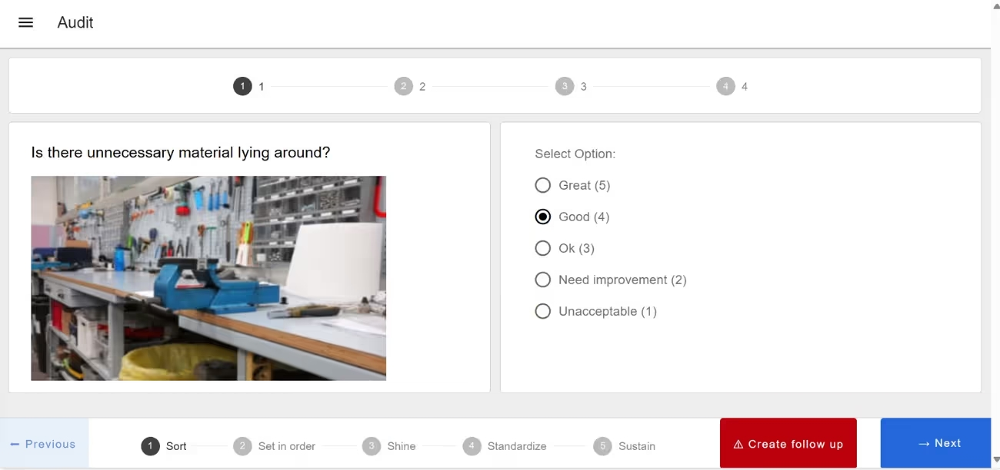{data-zoomable}

In the image above, you can see that the first and last widget groups occupy all columns, while in the middle, two groups each take up 6 columns. Notice how the first group creates its internal grid layout.

#### Notebook layout

Choosing the Notebook layout for your page in Dashboard 2.0 makes it work like a Jupyter Notebook, fixed at a width of **1024px** and **centered**. Changing the width doesn't affect the group's width but changes the internal column counts. It's great for dynamic Markdown, data tables, and visuals. Groups of pages are stacked vertically, and groups by default represent **6 column** counts each.

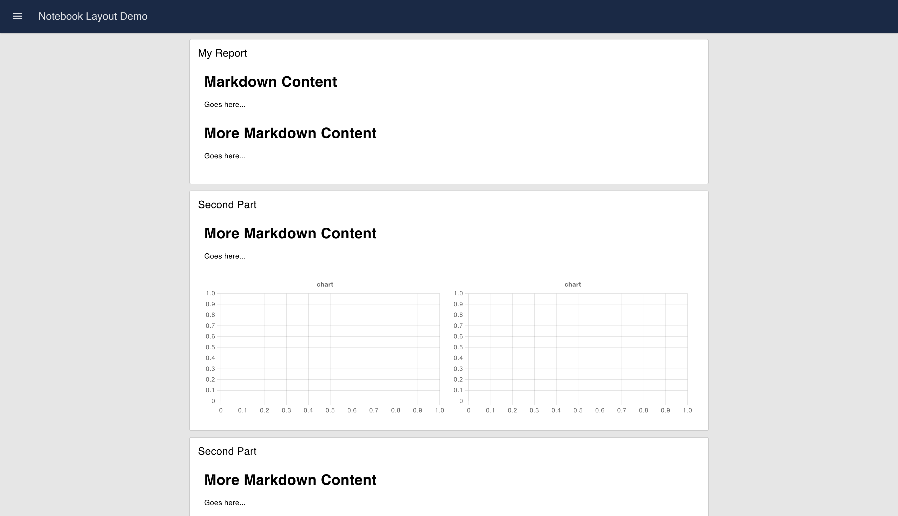{data-zoomable}

#### Fixed layout

In this layout, the horizontal (width) unit in the size property is fixed at 90px. For example, if you set the group width to 3 units, it will be 3 * 90 = 270px wide. Each widget size unit represents a column in the group's internal grid, following the same pattern as other layouts.

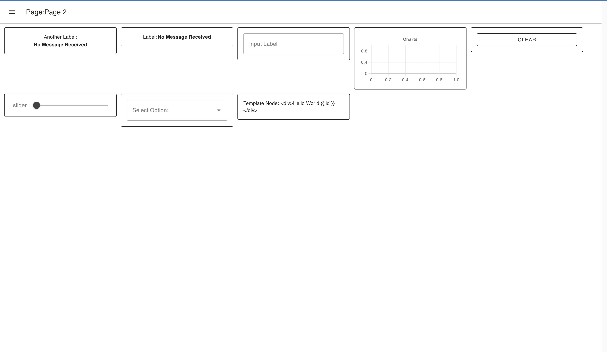{data-zoomable}

*Note: Currently this layout is not completely ready to use so it is recommended to use other layouts.*

### Setting page layout

1. Navigate to the page configuration by clicking on the **edit** button of your page in the Dashboard 2.0 sidebar.
2. In the page configuration, you can select the preferred layout for that page within the layout field.

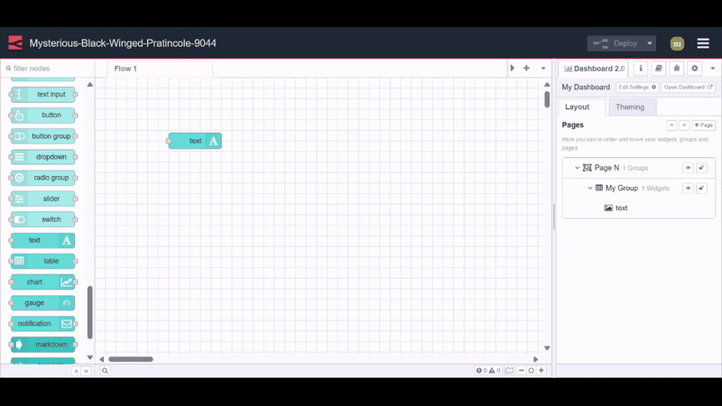{data-zoomable}

## Setting Dashboard 2.0 elements size

Setting the size for elements in Dashboard 2.0 is straightforward, but understanding the actual unit size in the size property can be a bit tricky. It's important to note that the size of a horizontal unit varies depending on the layout, while the vertical size is fixed at **48px** currently.

## Understanding unit size in different layouts

#### Grid Layout

In a grid layout, each unit specified in the size property represents a column, dividing the page evenly. When you assign columns to a group, it forms an internal grid with the same number of columns as the group. For example, if you have a group with 4 columns and two widgets inside it, each widget can be sized by considering those columns. If you set 1 column for the first widget and 3 columns for the second widget, the first widget will occupy 25% of the group's width, and the second widget will occupy 75%.

#### Notebook Layout

In the Notebook layout, As you know the width for the group is fixed at **1024px**. The size unit represents the number of columns that the group will create or represent in its internal grid, increasing size will increase the number of columns in group. For example, if you have one group with a size of 12 columns, that group will create an internal grid with 12 columns, and widgets can occupy those columns using the size property where each will also represent one column in group.

#### Fixed Layout

The fixed layout in Dashboard 2.0 employs a flexbox design with a single row of widgets. Each width unit in this layout is set at a fixed 90px. Groups follow the same internal grid pattern as other layouts. When a widget occupies the entire screen width, it shifts to the next row. However, this layout remains unchanged for varying screen sizes, potentially resulting in empty space on larger screens.

###  Setting element size 

To set the size of groups and widgets in Dashboard 2.0, follow these steps:

1. Go to the Dashboard 2.0 sidebar and click on the edit button next to the element you want to resize.
2. Adjust the size using the size property.

## Understanding Dashboard 2.0 Theme 

The theme is a collection of colors that control the look and feel of the widgets, groups, and other elements on the page.

In Dashboard 2.0, while adding a page ( ui-page ) we have to specify which theme it will use. By default, we have one default theme in dashboard 2.0. Additionally, we can add a new theme (ui-theme) where we need to specify colors and sizing.

### Understanding theme properties

In the theme (`ui-theme`) configuration, there are two main sections: colors and sizing. 

Within the color section, you'll need to specify colors for Navigation, primary elements, page background, group backgrounds, and outlines.

In the sizing section, you'll define the gaps between groups, page padding, group outline radius, and gaps between widgets, all in pixels.

For additional information on the `ui-theme` settings, please consult the [ui-theme documentation](https://dashboard.flowfuse.com/nodes/config/ui-theme.html).

### Setting a new page theme

1. Navigate to the Dashboard 2.0 sidebar and switch to the theme tab.
2. Click on the top-right “+theme” button to add a new theme.
3. After specifying colors and sizing click on the top right update button to save the theme.
4. Now switch to the layout tab and click on the edit button next to the page for which you want to set a new theme.
5. In the page config, select the newly added theme in the Theme field.

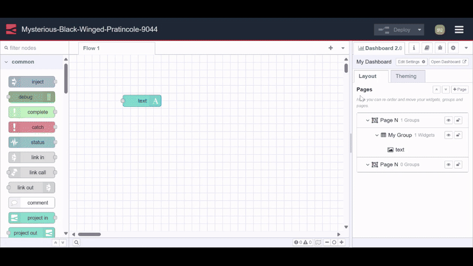{data-zoomable}

## Dashboard 2.0 Sidebar

In Dashboard 2.0, we have 5 different types of sidebars.

### Exploring different types of Dashboard 2.0 sidebar

#### Collapsing

This is the default sidebar, when it's opened, the page content adjusts to the width of the sidebar.

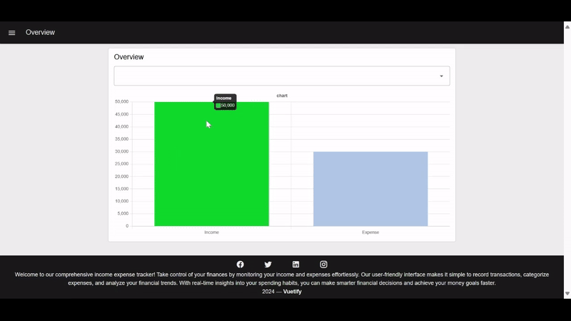{data-zoomable}

You can see in the image above how the page content automatically adjusts when the sidebar is opened.

#### Fixed

In this type, the sidebar is always visible and fixed on the left side, and the top menu icon is hidden. The page content adjusts to the width of the sidebar.

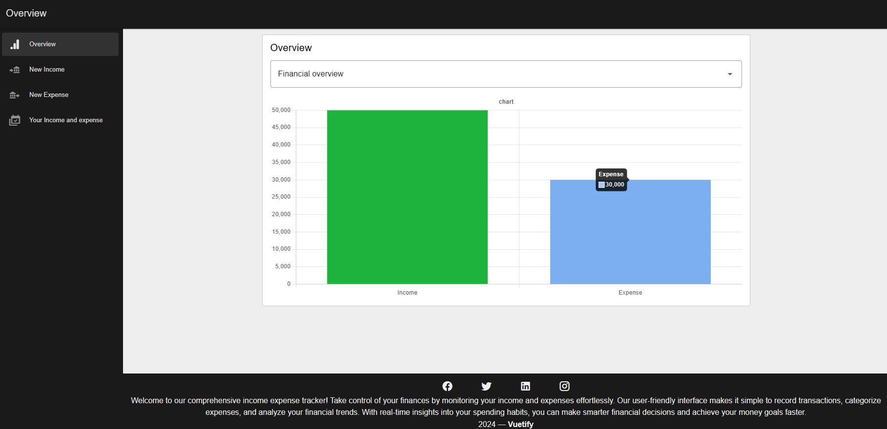{data-zoomable}

#### Collapse to icon

This type of sidebar is similar to the collapsible one, but when the sidebar is collapsed, you can still navigate through different pages as the page icons become visible.

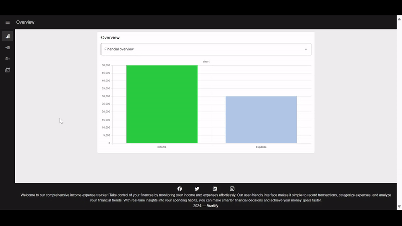{data-zoomable}

#### Apear over content 

When the sidebar is opened, the page is partially covered by a transparent layer, and the sidebar appears on top of this layer

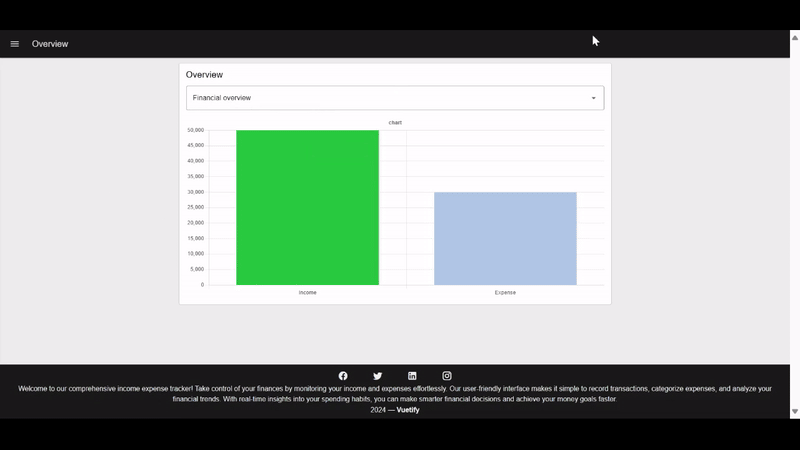{data-zoomable}

In this type of sidebar, you can notice how the sidebar opens without affecting the width of the page content

#### Always hide 

In this type, the sidebar is always hidden, and navigation between different pages can be achieved using the ui-control widget.

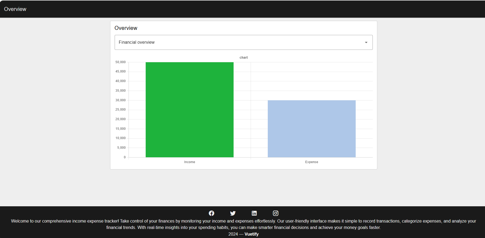{data-zoomable}

### Setting sidebar 

1. Navigate to the Dashboard 2.0 sidebar.
2. Click on the "Edit Settings" button located at the top left side of the Dashboard 2.0 sidebar.
3. Select your preferred sidebar style from the "Style" field in the sidebar options section.

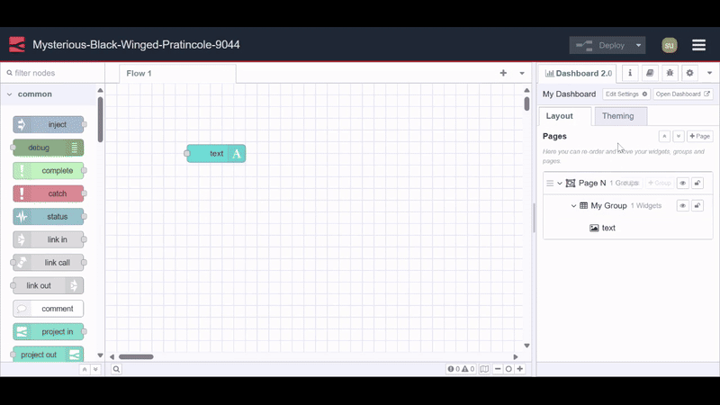{data-zoomable}

## Styling your Dashboard 2.0 elements
 
In Dashboard 2.0, we can add classes to almost all widgets, pages, and groups and style them using CSS. Applying styles to these classes will inject the CSS inline, giving them an inline scope. This means the specified styles will take precedence over any existing CSS rules.

### Adding classes

1. To add classes to your widget, page, or group, you'll need to open its configuration
2. Find the 'Class' field and enter your class.

### Writing custom CSS

In Dashboard 2.0, the ui-template allows you to write custom CSS for Dashboard 2.0 elements. In the ui-template, you can add CSS for two different scopes: Single page (selecting this allows you to specify CSS for all classes within the selected page) and All pages (selecting this allows you to specify CSS for classes across all pages in a ui-base).

1. Drag an ui-template widget onto the canvas.
2. Double-click on it and select the scope within the type field.
3. If you select the single-page scope, you'll need to select the page to which your element or class belongs for adding styling. If you select the all-page scope, then you'll need to select the ui-base that includes those pages to which you want to add styling.
4. Now you can write your custom CSS within the ui-template.

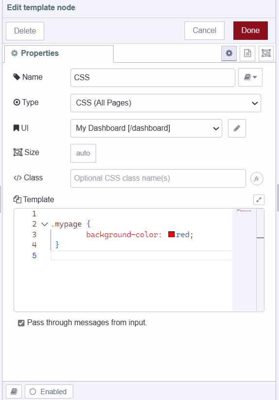{data-zoomable}

## Up next 

To delve deeper into Node-RED Dashboard 2.0, explore the following resources:

- [FlowFuse Dashboard Articles](https://flowfuse.com/blog/dashboard/) - Collection of examples and guides written by FlowFuse.
- [Node-RED Dashboard 2.0 Documentation](https://dashboard.flowfuse.com/) - Detailed information for each of the nodes available in Dashboard 2.0, as well as useful guides on building custom nodes and widgets of your own.
- [Node-RED Forums - Dashboard 2.0](https://discourse.nodered.org/tag/dashboard-2) - The Node-RED forums is a great place to ask questions, share your projects and get help from the community.
- [Beginner Guide to a Professional Node-RED](https://flowfuse.com/ebooks/beginner-guide-to-a-professional-nodered/) - A free guide to an enterprise-ready Node-RED. Learn all about Node-RED history, securing your flows and dashboard data visualization.
