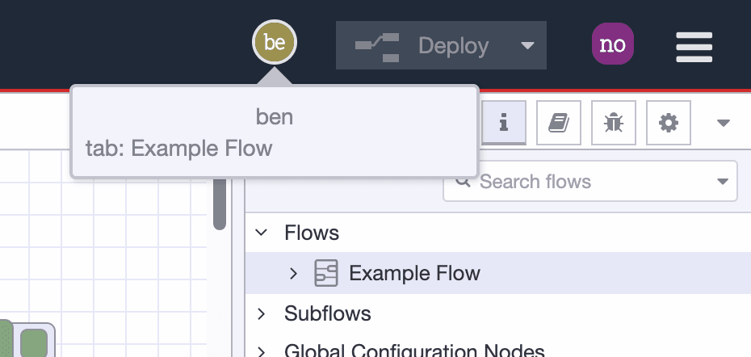

Last month I [wrote](/blog/2024/03/looking-towards-node-red-4/) about what users
can expect with Node-RED 4.0. One of the features I highlighted was improving the
concurrent editing experience. With the recent [beta release](https://discourse.nodered.org/t/node-red-4-0-0-beta-2-released/87026) of Node-RED, the first
steps on that journey are now available to try.

In this post, I'll cover what has been done so far and what we've got planned.

<!--more-->

Full concurrent editing within Node-RED is not a small task, so naturally we're breaking it up into a series of iterations that each bring us a step closer to the eventual goal.

The natural first step was to add some basic awareness of who else has the editor open. On the surface, this may sound like a simple step, but it required laying lots of groundwork to achieve such as designing how the editor and runtime communicate this state in real-time.

It also meant starting to figure out the visual language we'll use in the editor to represent users. I spent time researching how other applications handle this - seeing what would work in the Node-RED context.

With Node-RED v4-beta.2, we have made these first steps available to the community. When the feature is enabled, you will now see icons in the header for all of the other users that have the editor open. 

<figcaption>Screenshot of Node-RED with additional user icons in the header</figcaption>

Clicking on their icon will show a little information box about *where* they are in the editor. Now, for this iteration, that information is fairly crude - it will tell you the name of the flow they have open and which node they are currently editing, but that's it. Which leads me on to what we have planned next.

### Next steps

The next iteration will be to improve how we indicate where a user is in the editor. Adding mini-icons to the editor tabs, or as annotations on individual nodes will allow us to more seamlessly indicate where a user is.

After that, one possible option will be to show the user's mouse cursor movement in real-time within the flow tab, and start to layer up the feedback we can provide as they make changes.

### Trying it out on FlowFuse Cloud

I mentioned earlier this feature has to be enabled. For a local install, details on how to do this are in the [release forum post](https://discourse.nodered.org/t/node-red-4-0-0-beta-2-released/87026#introducing-multiplayer-mode-2).

If you want to give it a go now, we already have Node-RED v4-beta.2 available to [try on FlowFuse Cloud](https://app.flowfuse.com/) - where the multiplayer feature is pre-enabled whilst it's in beta mode.

